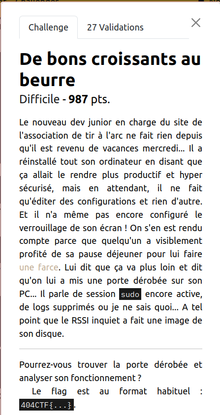
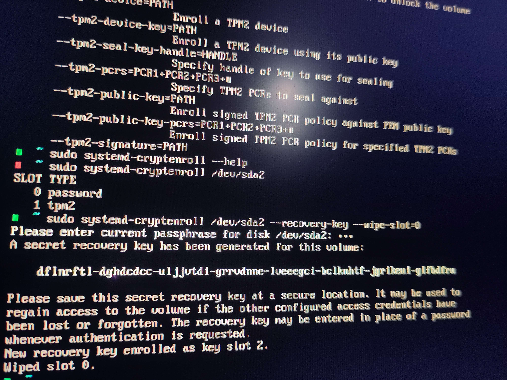
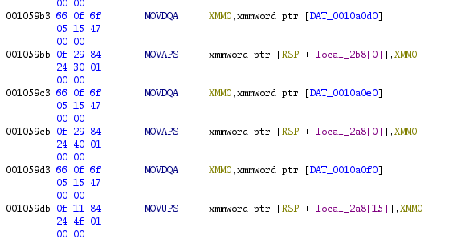

# 404CTF 2024 - Write-Up for the challenge *De bons croissants au beurre* (Forensics)

**TL;DR:** Investigation of a LUKS-encrypted disk image, exploitation of Timeshift snapshots, reverse of a backdoored version of Linux PAM.



**Description (in French):** Le nouveau dev junior en charge du site
de l'association de tir à l'arc ne fait rien depuis qu'il est revenu
de vacances mercredi... Il a réinstallé tout son ordinateur en disant
que ça allait le rendre plus productif et hyper sécurisé, mais en
attendant, il ne fait qu'éditer des configurations et rien d'autre. Et
il n'a même pas encore configuré le verrouillage de son écran ! On
s'en est rendu compte parce que quelqu'un a visiblement profité de sa
pause déjeuner pour lui faire [une farce](https://github.com/AlexisGerard98/AlexisGerard98/tree/b67a78189b89be29390ddd0197878905adeebeec). Lui dit que ça va plus loin
et dit qu'on lui a mis une porte dérobée sur son PC... Il parle de
session `sudo` encore active, de logs supprimés ou je ne sais quoi... A
tel point que le RSSI inquiet a fait une image de son disque.
Pourrez-vous trouver la porte dérobée et analyser son fonctionnement ?

**Approximate translation:** The new junior dev who maintains the
website of the archery club does nothing since he came back from
holidays on Wednesday... He reseted his computer saying that doing so
will make it more productive and super secure, but in the meantime, he
only edits configurations and do nothing else. Moreover, he didn't
even configure the screen locking! We figured out that because
somebody apparently took advantage of his lunch break to [prank
him](https://github.com/AlexisGerard98/AlexisGerard98/tree/b67a78189b89be29390ddd0197878905adeebeec). He
says that it's more serious than that and that someone installed a
backdoor on his PC... He talks about a `sudo` session still active,
deleted logs or I don't know what... At the point that the worried
CISO captured an image of his hard disk.  Could you find the backdoor
and analyze how it works?

## Introduction

We are given a 8GB archive, `AlexisLaptop.7z`. This archive contains:
- 16 files `AlexisLaptop.s01`, `AlexisLaptop.s02`, `AlexisLaptop.s03`, ..., `AlexisLaptop.s16`, 512MB each, which contains parts of the disk image
```
$ file AlexisLaptop.s01
AlexisLaptop.s01: EWF/Expert Witness/EnCase image file format
$ file AlexisLaptop.s02
AlexisLaptop.s02: EWF/Expert Witness/EnCase image file format
```
- a text file `AlexisLaptop.s01.txt` which gives additional info on the image (mostly useless)
- a screenshot `IMG_20240213_002754.jpg`:


We must investigate the contents of the 16 parts, thus we have to find a way to mount the image.

## Mounting the Image

We have to deal with parts of the image under the EWF image format.

I used the tool `ewfexport` to export the 16 parts to a single raw file.
```
$ ewfexport AlexisLaptop.s01
ewfexport 20140608

Information for export required, please provide the necessary input
Export to format (raw, files, ewf, smart, ftk, encase1, encase2, encase3, encase4, encase5, encase6, encase7, encase7-v2, linen5, linen6, linen7, ewfx) [raw]:
Target path and filename without extension or - for stdout: AlexisLaptop
Evidence segment file size in bytes (0 is unlimited) (0 B <= value <= 7.9 EiB) [0 B]:
Start export at offset (0 <= value <= 8589934592) [0]:
Number of bytes to export (0 <= value <= 8589934592) [8589934592]:

Export started at: May 13, 2024 22:54:36
This could take a while.

[...]

Export completed at: May 13, 2024 22:55:06

Written: 8.0 GiB (8589934592 bytes) in 30 second(s) with 273 MiB/s (286331153 bytes/second).
MD5 hash calculated over data:		4fd408d74719c9f17d8a2e5115d8856e
ewfexport: SUCCESS
```

The next step is to identify the structure/partition layout of the disk.

```
$ file AlexisLaptop.raw
AlexisLaptop.raw: DOS/MBR boot sector; partition 1 : ID=0xee, start-CHS (0x0,0,2), end-CHS (0x3ff,255,63), startsector 1, 16777215 sectors, extended partition table (last)
$ fdisk -l AlexisLaptop.raw
Disk AlexisLaptop.raw: 8 GiB, 8589934592 bytes, 16777216 sectors
Units: sectors of 1 * 512 = 512 bytes
Sector size (logical/physical): 512 bytes / 512 bytes
I/O size (minimum/optimal): 512 bytes / 512 bytes
Disklabel type: gpt
Disk identifier: 2B6C28A6-405D-473E-969F-3641F114702A

Device             Start      End  Sectors  Size Type
AlexisLaptop.raw1   2048   616447   614400  300M EFI System
AlexisLaptop.raw2 616448 16775167 16158720  7.7G Linux root (x86-64)
```

The first partition is the one for the bootloader, the second partition (Linux root) is the interesting one.

To mount it, we first have to create a loop device.
```
sudo losetup -fP AlexisLaptop.raw
```

But if we attempt to mount the loop partition just created, we have a problem:

```
$ sudo mount /dev/loop0p2 mntpoint
mount: /mnt/mntpoint: unknown filesystem type 'crypto_LUKS'.
       dmesg(1) may have more information after failed mount system call.
```

The hard drive is encrypted with LUKS. Seems like the junior dev did
care at least a little about security. :-)

But... remember the screenshot, the passphrase for LUKS encryption is
all given!
(`dflnrftl-dghdcdcc-uljjvtdi-grrvdnne-lveeegci-bclknhtf-jgrikeui-glfbdfru`)

The tool `cryptsetup` allows us to setup a new device with the
decrypted data.

```
$ sudo cryptsetup luksOpen /dev/loop0p2 mydata
WARNING:esys:src/tss2-esys/api/Esys_Load.c:324:Esys_Load_Finish() Received TPM Error
ERROR:esys:src/tss2-esys/api/Esys_Load.c:112:Esys_Load() Esys Finish ErrorCode (0x000001df)
Failed to unseal secret using TPM2: State not recoverable
Enter passphrase for /dev/loop0p2: <ENTER PASSPHRASE HERE>
```

And finally,
```
$ sudo mount /dev/mapper/mydata mntpoint/
```

We then have access to the hard disk data in `mntpoint`. We can start the challenge!

## What Happened?

First of all, in the description of the challenge, the words "une
farce" ("a prank") lead to a dummy github repository containing the
following sarcastic message:


(in English: Hello to mates who get there! Apparently, I don't lock my
PC, so, if you see me, don't hesitate to remind me to bring croissants
(and, with butter please)!)

Searching some keywords in the files from the disk gives nothing, the
repository has probably been directly created from the browser of the
victim. This repository is almost useless. But it gives us a small
piece of information according to the commits: the prank has been made
around **February 21st, 1:48PM**. 

Now, let's dive into the contents of the drive. 
There are 5 main directories:
- `@` with the contents of the Linux root filesystem
- `@cache`
- `@home`
- `@logs`
- Last but not least, `timeshift-btrfs` which contains snapshots of
  the root filesystem made with the Timeshift utility. 

We quickly find that the PC runs Arch Linux or a derivative (AUR,
pacman, etc...).

Then, we find a commonly interesting file: `@home/.zsh_history`. It
contains all the command history of the victim. Most commands are
good old Arch-user config shenanigans, but the last commands are
the following:
  
```
: 1708515387:0;swayidle
: 1708519185:0;sudo pacman -Sy pavucontrol
: 1708519211:0;pavucontrol
: 1708519405:0;sudo
: 1708519406:0;sudo id
: 1708519408:0;sudo -l
: 1708519411:0;sudo -s
: 1708519585:0;reset
: 1708519587:0;pav
: 1708519589:0;pavucontrol
: 1708519888:0;history
: 1708519911:0;shutdown now
```

According to an [epoch converter](https://www.epochconverter.com/),
1708519185 (the timestamp of `sudo pacman -Sy pavucontrol`)
corresponds to February 21st, 1:40PM. Very close to the prank time!
It's probably when the "still active sudo session" was opened.

A few minutes later, at 1708519405, somebody reused the open sudo
session, especially to spawn a root shell (`sudo -s`). The attacker
then did something, and resetted the terminal to hide their traces.

Further suspicious activity can be detected in `@logs/pacman.log`: the
logs of `pacman`, the package manager of Arch-based distributions.

```
[2024-02-21T13:39:58+0100] [PACMAN] Running 'pacman -Sy pavucontrol'
[2024-02-21T13:39:58+0100] [PACMAN] synchronizing package lists
[2024-02-21T13:40:04+0100] [ALPM] transaction started
[...]
[2024-02-21T13:40:04+0100] [ALPM] running 'update-desktop-database.hook'...
[2024-02-21T13:44:32+0100] [PACMAN] Running 'pacman -S wget'
[2024-02-21T13:44:33+0100] [ALPM] transaction started
[2024-02-21T13:44:33+0100] [ALPM] installed wget (1.21.4-1)
[2024-02-21T13:44:33+0100] [ALPM] transaction completed
[2024-02-21T13:44:33+0100] [ALPM] running '30-systemd-update.hook'...
[2024-02-21T13:44:33+0100] [ALPM] running 'texinfo-install.hook'...
[2024-02-21T13:45:31+0100] [PACMAN] Running 'pacman -U 1QoOr'
[2024-02-21T13:45:33+0100] [ALPM] running '00-timeshift-autosnap.hook'...
[2024-02-21T13:45:33+0100] [ALPM-SCRIPTLET] Using system disk as snapshot device for creating snapshots in BTRFS mode
[...]
[2024-02-21T13:45:33+0100] [ALPM-SCRIPTLET] BTRFS Snapshot saved successfully (0s)
[2024-02-21T13:45:33+0100] [ALPM-SCRIPTLET] Tagged snapshot '2024-02-21_13-45-33': ondemand
[2024-02-21T13:45:33+0100] [ALPM-SCRIPTLET] ------------------------------------------------------------------------------
[2024-02-21T13:45:34+0100] [ALPM] transaction started
[2024-02-21T13:45:34+0100] [ALPM] reinstalled pam (1.6.0-3)
[2024-02-21T13:45:34+0100] [ALPM] transaction completed
[2024-02-21T13:45:34+0100] [ALPM] running '30-systemd-daemon-reload-system.hook'...
[2024-02-21T13:45:35+0100] [ALPM] running '30-systemd-tmpfiles.hook'...
[2024-02-21T13:45:35+0100] [ALPM] running '30-systemd-update.hook'...
```

After the legitimate installation of `pavucontrol`, 
- `wget` was installed on the system
- a more than strange package `1QoOr` was installed, at 1:45PM, 3
  minutes before the prank commit.
  
The scenario of the attack is now clear:
- The victim opened a sudo session to install `pavucontrol`
- He left his computer, and a few minutes later, the attacker
  - Spawned a root shell with `sudo -s`,
  - Installed `wget` to download a malicious package `1QoOr`,
  - Installed the downloaded package.
  
We then have to investigate the contents of this malicious package.

## The Package

Can we find back the package somewhere? Looking at the root directory
`@` leads to nothing. The attacker hid its traces...

If we look carefully at the pacman logs, we can see that there is a
hook `00-timeshift-autosnap.hook` that runs Timeshift each time a
package is upgraded. It's a common strategy for Arch users to keep a
snapshot in case something breaks after an update. When the malicious
package was installed, the package `pam` seems to have been updated
and thus a snapshot was made.

That's very good news, since the snapshot was captured just after
installation, the package should still be present somewhere in the
filesystem!

Indeed, in `timeshift-btrfs`, there is a snapshot from February 21st
1:45PM. Thanks to this snapshot, we can indeed find the package in the
`root/` directory
(`timeshift-btrfs/snapshots/2024-02-21_13-45-33/@/root`).

After decompression:
```
mv 1QoOr 1QoOr.zst
zstd -d 1QoOr.zst
tar xf 1QoOr
```

We obtain a `etc/` and a `usr/` directory containing the files
installed with the package. Most of them are just part of the clean
`pam` package. If we compare the checksums of the binaries and the
libraries to the ones of those previously installed, they are all
identical, except one.

```
$ sha1sum ../usr/lib/security/pam_unix.so
4990da64c0761bda87db6b77cc632f5eec34f650  ../usr/lib/security/pam_unix.so
$ sha1sum usr/lib/security/pam_unix.so
0974416320a0538b3591b75ad9996c49f2efdef2  usr/lib/security/pam_unix.so
```

**The library `pam_unix.so` has probably been backdoored.**

## The Backdoor

To find the flag, we will have to investigate how the backdoor works.

First of all, what is PAM? Linux PAM (Pluggable Authentication
Modules) is the part of the system that manages authentication. For
instance, to check that user's passwords are correct when they want to
log in or to use `sudo`. A pretty critical target to install a
backdoor!

Let's gather the clean and the backdoored versions of `pam_unix.so` and compare their contents with Ghidra.

The first remarkable detail is that the backdoored version contains
extra data in the `.rodata` section. To find where it is used, a good
reflex is to find all references to it (in Ghidra, right-click ->
References -> Show references to address).

It leads us to the following piece of code:
```c
  local_328 = 0x6f5f4577;
  uStack_324 = 0x9688907c;
  uStack_320 = 0x4705b114;
  uStack_31c = 0x1b4e8e33;
  local_318 = 0x1032828b8af8070a;
  uStack_310 = 0x5fbb2a55;
  uStack_30c = 0x1c3fc671;
  local_2c8 = 0xf2f3d6282c6b7543;
  uStack_2c0 = 0x770fd15d7631dc27;
  local_2b8 = 0x7654b2d4bf917f39;
  uStack_2b0 = 0x2ce44f27;
  uStack_2ac = 0x6c60881e;
  local_2a8 = 0x11f3644;
  uStack_2a4 = 0xf3cccf08;
  uStack_2a0 = 0x7777d24b;
  uStack_29c = 0x7a3dfd5a;
  uStack_298 = 0x6dd7ead58b3044;
  uStack_291 = 0xbb342dc95f6672;
  lVar10 = 0;
  do {
    if (param_3[lVar10] == 0) break;
    lVar15 = lVar10 + 1;
    bVar23 = bVar23 | param_3[lVar10] ^ *(byte *)((long)&local_2c8 + lVar10) ^
                      *(byte *)((long)&local_328 + (ulong)((uint)lVar10 & 0x1f));
    lVar10 = lVar15;
  } while (lVar15 != 0x3e);
```

We guess that `param_3` is the user-provided password to check for
authentication. Instead of the usual routine to check the password in
function of the user which requests authentication, the backdoored
library just perform a static simple check on the password. This
allows the attacker to log as any user using the same static password.

The password (at `local 2c8`) is actually simply xored with the key at
`local_328`. But there is a little trap. The password length seems to
be 0x3e while there are 0x3f bytes in `.rodata`. When looking carefully,
one character in the middle is actually "skipped" when loading data
into `local_2c8`.



The last chunk of data is wrote at `local_2a8[15]` instead of
`local_298` which overwrites the last byte of the previous chunk. I
just removed the corresponding byte from the data in my solve script.

```python
data = b'\x77\x45\x5f\x6f\x7c\x90\x88\x96\x14\xb1\x05\x47\x33\x8e\x4e\x1b\x0a\x07\xf8\x8a\x8b\x82\x32\x10\x55\x2a\xbb\x5f\x71\xc6\x3f\x1c\x43\x75\x6b\x2c\x28\xd6\xf3\xf2\x27\xdc\x31\x76\x5d\xd1\x0f\x77\x39\x7f\x91\xbf\xd4\xb2\x54\x76\x27\x4f\xe4\x2c\x1e\x88\x60\x6c\x44\x36\x1f\x01\x08\xcf\xcc\xf3\x4b\xd2\x77\x77\x5a\xfd\x3d\x7a\x44\x30\x8b\xd5\xea\xd7\x6d\x72\x66\x5f\xc9\x2d\x34\xbb'

flag = b''

key = data[:32]
cipher = data[32:]

for i in range(len(cipher)):
    flag += int.to_bytes(key[i%32]^cipher[i],1)

print("FLAG: %s" % flag)
```

**FLAG:** `404CTF{d3m41n_Al3xi5_0ffre_soN_p3s@nt_De_cr0issaN7s_aU_b3urrE}`

## Conclusion

A great thanks to the author. This chall was one of my favorites in this CTF.
