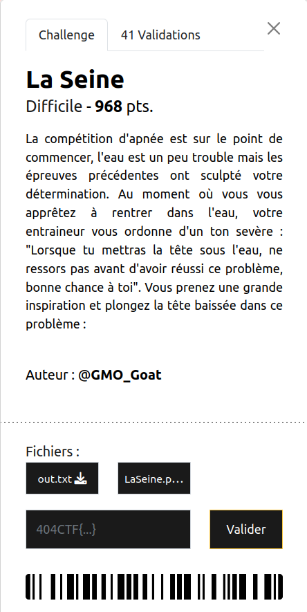

# 404CTF 2024 - Write-Up for the challenge *La Seine* (Crypto)

**TL;DR:** Custom signature algorithm, based on 2x2-matrix
operations. Sum of two squares theorem.



**Description (in French):** La compétition d'apnée est sur le point
de commencer, l'eau est un peu trouble mais les épreuves précédentes
ont sculpté votre détermination. Au moment où vous vous apprêtez à
rentrer dans l'eau, votre entraineur vous ordonne d'un ton sevère :
"Lorsque tu mettras la tête sous l'eau, ne ressors pas avant d'avoir
réussi ce problème, bonne chance à toi". Vous prenez une grande
inspiration et plongez la tête baissée dans ce problème.

**Approximate translation:** The free diving competition is about to
start, the water is not very clean but previous challenges made you
full of determination. When you are about to enter in the water, your
coach order you severely: "When you will put your head under water, do
not get out until you solved this problem, good luck". You take a good
breath and dive, your head down, in this problem.

## Introduction

For this challenge, we are given

- the following Python script `LaSeine.py`
```python
from Crypto.Util.number import *
import os
from secret import flag

class LaSeine:
    def __init__(self, size):
        self.l = 20
        self.p = getStrongPrime(size)

        self.a = getRandomNBitInteger(size // 16)
        self.b = getRandomNBitInteger(size // 16)

    def split(self, f):
        if len(f) & 1:
            f += b"\x00"
        h = len(f) // 2
        return (bytes_to_long(f[:h]), bytes_to_long(f[h:]))

    def sign(self, m, b):
        xn, yn = self.split(m)
        k = (getRandomNBitInteger(self.l - 1) << 1) + b

        for _ in range(k):
            xnp1 = (self.a*xn + self.b*yn) % self.p
            ynp1 = (self.b*xn - self.a*yn) % self.p
            xn, yn = xnp1, ynp1
        return (k, xn, yn)

seine = LaSeine(1024)

_, xf, yf = seine.sign(flag, 1)
s2 = seine.sign(b"L'eau est vraiment froide par ici (et pas tres propre)", 0)

f = open("out.txt", "w")

f.write(str(seine.p) + "\n")
f.write(str((xf, yf)) + "\n")
f.write(str(s2))

f.close()
```

- its output `out.txt`
```
179358513830906148619403250482250880334528756349120678091666297907253922185623290723862265402777434007178297319701286775733620488613530869850160450412929764046707392082705800333548316425165863556480623955587411083384086805686199851628022437853672200835000268893800610064747558825805271528526924659142504913631
(151683403543233106224623577311980037274441590153911847119566701699367001537936290730922138442040542620222943385810242081949211326676472369180020899628646165132503185978510932501521730827126356422842852151275382840062708701174847422687809816503983740455064453231285796998931373590630224653066573035583863902921, 76688287388975729010764722746414768266232185597001389966088556498895611351239273625106383329192109917896575986761053032041287081527278426860237114874927478625771306887851752909713110684616229318569024945188998933167888234990912716799093707141023542980852524005127986940863843004517549295449194995101172400759)
(929382, 118454610237220659897316062413105144789761952332893713333891996727204456010112572423850661749643268291339194773488138402728325770671625196790011560475297285424138262812704729573910897903628228179414627406601128765472041473647769084599481166191241495167773352105622894240398746332477947478817552973851804951566, 65891615565820497528921288257089595342791556688007325193257144738940922602117787746412089423500836495505254334866586155889060897532850381510520943387446058037766901712521471259853536310481267471645770625452422081411718151580380288380630522313377397166067417623947500542258985636659962524606869196898543973764)
```

The algorithm is a custom signature algorithm. Its parameters are
initialized as follows  (function `__init__`):
- $p$ is a random 1024-bit prime number
- $a$ and $b$ are random 64-bit numbers

To sign a given message (function `sign`), it performs the following operations:
- Split the message in two parts, convert the corresponding bytes to
  numbers $x$ and $y$
- Choose a random 20-bit number of iterations $k$
- At each iteration, $x$ and $y$ are updated respectively with the values $ax + by$ and $bx - ay$.
- Return the final values of $x$ and $y$, along with $k$.

The known data is:
- the value of $p$,
- the signature of a known message "L'eau est vraiment froide par ici (et pas tres propre)" (in English: "The water is really cold there (and not very clean)") **with $k$ even**,
- part of the signature of the flag **with $k$ odd** (the final $x$ and $y$ are given but not $k$). 

However, **we do not know the values of $a$ and $b$**.

## The Problem

Let's formalize the algorithm in mathematical terms.

Let $x_m,y_m$ be the initial values of $x$ and $y$ corresponding to
the message to sign, and $x_s,y_s$ the final values corresponding to
the returned signature.

Let $x_0,\ldots,x_k$ and $y_0,\ldots,y_k$ the successive values of $x$
and $y$ through the iterations. We have $x_0 = x_m$, $y_0 = y_m$, $x_k = x_s$ and $y_k = y_s$

Their values can be described by the following recurrence relations:
```math
\begin{cases}
x_{n+1} = ax_n + by_n \mod p\\
y_{n+1} = bx_n - ay_n \mod p
\end{cases}
```

In the algorithm, all the operations are done modulo $p$ (in the
finite field $\mathbb{Z}/p\mathbb{Z}$). Thus, for the sake of
simplicity, we will omit to precise "$\mod p$" when there is no
ambiguity.

We can straightforwardly rewrite these recurrence relations in terms
of matrices. 

Let 
```math
X_n = \begin{pmatrix} x_n \\ y_n \end{pmatrix}
```

and 
```math
A = \begin{pmatrix} a & b \\ b & -a \end{pmatrix}
```

Then we have for all $n \in [|0,k-1|]$, $X_{n+1} = AX_n$. By a trivial recurrence, we finally have, for all $n\in [|0,k|]$, $X_n = A^nX_0$.

Moreover, we can remark that $A^2 = (a^2 + b^2)I_2$ where $I_2$ is the
identity matrix.

As a result, if $k = 2k'$ is even,
$$X_k = A^{2k'}X_0 = (A^2)^{k'}X_0 = (a^2 + b^2)^{k'}X_0$$

and finally,
```math
\begin{cases}
x_s = (a^2 + b^2)^{k'}x_m\\
y_s = (a^2 + b^2)^{k'}y_m
\end{cases}
```

Since the known message has been signed with a known even $k$, we can
immediately recover the value of $(a^2 + b^2)$ from $x_s$ and $x_m$:
$(a^2 + b^2)$ is the $k'$th-root of $\dfrac{x_s}{x_m}$. Don't forget
that we perform operations in the finite field
$\mathbb{Z}/p\mathbb{Z}$. The division by $x_m$ is thus actually
equivalent to multiplying by the inverse of $x_m$ modulo $p$.

The constant $a^2+b^2$ will be very important in the following. We will denote it by $C$.

If $k = 2k'+1$ is odd, 
$$X_k = A^{2k'+1}X_0 = (A^2)^{k'}AX_0 = C^{k'}AX_0$$

As a result, since the flag has been signed with an odd $k$, the
knowledge of $C$ is **not sufficient** to retrieve $X_0$ given
$X_k$. We need to know $a$ and $b$. Moreover, we do not know
explicitly $k$ (and hence $k'$).

*Remark.* We can be sure that we can get no more information than
$a^2 + b^2$ from the known message/signature pair. Indeed, the
signature **only depends on $a^2 + b^2$.** With different $a$ and $b$
that give the same value for $a^2 + b^2$, the signature would be
exactly the same.

## The Solution

### Recovering $k$

This step is not absolutely necessary, but will greatly help since we
will see later that there are several possible candidates $a$ and $b$
and thus a little bruteforce will be needed. Recovering $k$ first
allows us to avoid bruteforcing both $k$, $a$ and $b$ at the same
time.

We can first solve the equation system with unknowns $a$ and $b$ given $x_n$,$y_n$,$x_{n+1}$ and $y_{n+1}$:
```math
\begin{cases}
x_{n+1} = ax_n + by_n \mod p\\
y_{n+1} = bx_n - ay_n \mod p
\end{cases}
```

```math
\begin{cases}
x_nx_{n+1}-y_ny_{n+1} = a(x_n^2+y_n^2)\\
y_nx_{n+1}+x_ny_{n+1} = b(x_n^2+y_n^2)
\end{cases}
```

Hence,
```math
\begin{cases}
a = \dfrac{x_nx_{n+1}-y_ny_{n+1}}{x_n^2+y_n^2}\\
b = \dfrac{y_nx_{n+1}+x_ny_{n+1}}{x_n^2+y_n^2}
\end{cases}
```

And finally, playing with the remarkable identities,
$$C = \dfrac{(x_nx_{n+1}-y_ny_{n+1})^2 + (y_nx_{n+1}+x_ny_{n+1})^2}{(x_n^2+y_n^2)^2}$$
$$C = \dfrac{(x_n^2 + y_n^2)x_{n+1}^2 + (x_n^2 + y_n^2)y_{n+1}^2}{(x_n^2+y_n^2)^2}$$
$$C = \dfrac{x_{n+1}^2 + y_{n+1}^2}{x_n^2+y_n^2}$$

At each iteration of the algorithm, 
$$x_{n+1}^2 + y_{n+1}^2 = C(x_n^2+y_n^2)$$

And thus, $x_m^2 + y_m^2 = \dfrac{1}{C^k}(x_s^2+y_s^2)$

**Little guess:** the initial value $x_m^2 + y_m^2$ is very inferior
to $p$. Since $p$ is 1024 bit-long, it would imply that $x_m$ and
$y_m$ have less than $\sim$ 512 bits each and thus that the flag is
shorter than 128 characters. Seems reasonable. :-)

We will then start from $(x_s^2+y_s^2)$, and divide this value by $C$
until we reach a "small" value.  Indeed, intermediate values are
almost random values in $\mathbb{Z}/p\mathbb{Z}$ and will thus be
around 1024 bit-long in general. $k$ is 20-bit long, so there would be
at most about a million values to test. Easy peasy.

The number of needed iterations to reach the "smallest" value is
exactly $k$. At the same time, we get back
- the value of $x_0^2 + y_0^2 = \dfrac{1}{C^k}(x_s^2+y_s^2)$. We will denote this constant by $S_0$.
- the values of $x_1 = \dfrac{1}{C^{\lfloor\frac{k}{2}\rfloor}}x_s$ and $y_1 = \dfrac{1}{C^{\lfloor\frac{k}{2}\rfloor}}y_s$

### Recovering the Flag - Failed Attempt

To recap, we have knowledge of
- $S_0 = x_0^2 + y_0^2$,
- $x_1$ and $y_1$,
- $C = a^2 + b^2$.

Moreover, we have the following equations:
```math
\begin{cases}
ax_0 + by_0 = x_1\\
bx_0 - ay_0 = y_1\\
a^2 + b^2 = C\\
x_0^2 + y_0^2 = S_0
\end{cases}
```

My first intuition was: it's 4 equations with 4 unknowns ($x_0$,
$y_0$, $a$ and $b$), they should be solvable.

However, systems of non-linear Diophantine equations (polynomial
equations where we search integer solutions) are far from easy to
solve. At least, with a proof that fits in the margin of this blog. (:

This track didn't lead me to anywhere. Maybe there was an easy way to
solve the system? I would be curious if it was the case.

### Recovering the Flag - Successful Attempt

What I missed in my first analysis of the problem, is that $a$ and $b$
are not random values in $\mathbb{Z}/p\mathbb{Z}$ but only 64-bit
random numbers.

As a result, there are far less solutions than I expected to the
equation $x^2 + y^2 = C$.

By doing some researches on how to write an integer as a sum of two
squares, I discovered [Fermat's theorem on sums of two squares](https://en.wikipedia.org/wiki/Fermat%27s_theorem_on_sums_of_two_squares).

This theorem states that a prime number $p > 2$ such that $p \equiv 1 [4]$ has a unique decomposition as a sum of two squares. It can be generalized to any integer $n$ thanks to Jacobi's two-square theorem. Jacobi's theorem states that the number of representations of $n$ as a sum of two squares is $4(d_1(n)-d_3(n))$ where $d_k(n)$ is the number of divisors of $n$ congruent to $k$ modulo 4.

Note that Jacobi's theorem includes negative solutions. If we only search positive solutions, there are only $d_1(n)-d_3(n)$ possible decompositions.

Here, with $C = 388070793197506567215490364778692980485$, $d_1(C) = 128$ and $d_3(C) = 64$.
```
sage: len([x for x in divisors(388070793197506567215490364778692980485) if x%4 == 1])
128
sage: len([x for x in divisors(388070793197506567215490364778692980485) if x%4 == 3])
64
```

As a result, there should only be 64 possible decompositions. But how
can we obtain these decompositions?

That's when I found this marvelous blogpost:
https://codeforces.com/topic/117143/en7

It details a way, with intermediate complex numbers, to compute all
the possible decompositions of $n$ from the decompositions of the
prime factors of $n$ that are congruent to 1 modulo 4 (thanks to
Fermat's two-squares theorem).

Essentially, the method is the following:
- Factorize $C = 2^{k_0}p_1^{k_1}\ldots
  p_j^{k_j}p_{j+1}^{k_{j+1}}\ldots p_m^{k_m}$ where for all $i \in
  [|1,j|]$, $p_i\equiv 1 [4]$ and for all $i \in [|j+1,m|]$, $p_i\equiv
  3[4]$.
  
  $k_{j+1},\ldots,k_m$ should be even, otherwise there are no
  solutions.
- Decompose separately the $p_i$ for $i \in [|1,j|]$ in sums of two
  squares $x_i^2 + y_i^2$
- Compute 
  $$x+iy = (1+i)^{k_0}(x_1 + iy_1)^{k_1}\ldots (x_j + iy_j)^{k_j}p_{j+1}^{\frac{k_{j+1}}{2}}\ldots p_{m}^{\frac{k_m}{2}}$$
  Then, $(x,y)$ is a solution.
- All the possible solutions can be obtained by switching the
  positions of the $x_i$ and the $y_i$ in the previous value.
  
Indeed, there are 6 prime factors congruent to 1 modulo 4 for our
value of $C$, thus there are $2^6 = 64$ possible decompositions.

I used the function `two_squares` of Sage to decompose each prime
factor in a sum of two squares.

Now that we drastically restricted the potential candidates for $a$
and $b$, let's get back to our problem.

We can remark that $A^{-1} = \dfrac{1}{C}A$ thus $X_0 = \dfrac{1}{C}AX_1$.

And finally, 
```math
\begin{cases}
x_{0} = \dfrac{a}{C}x_1 + \dfrac{b}{C}y_1 \mod p\\
y_{0} = \dfrac{b}{C}x_1 - \dfrac{a}{C}y_1 \mod p
\end{cases}
```

Given $a$ and $b$, we have formulas to get back $x_0$ and $y_0$ from
$x_1$ and $y_1$. We can finally try our 64 candidates until we obtain
"small" values for $x_0$ and $y_0$ such that $x_0^2 + y_0^2 = S_0$. 
Such values are likely to correspond to the initial splitted flag.

Once $x_0$ and $y_0$ are recovered, it suffices to decode them as hex
values to get the flag.

Here is my full Sage solve script:
```python
from Crypto.Util.number import bytes_to_long, long_to_bytes

p = 179358513830906148619403250482250880334528756349120678091666297907253922185623290723862265402777434007178297319701286775733620488613530869850160450412929764046707392082705800333548316425165863556480623955587411083384086805686199851628022437853672200835000268893800610064747558825805271528526924659142504913631

# Flag signature
(xsf, ysf) = (151683403543233106224623577311980037274441590153911847119566701699367001537936290730922138442040542620222943385810242081949211326676472369180020899628646165132503185978510932501521730827126356422842852151275382840062708701174847422687809816503983740455064453231285796998931373590630224653066573035583863902921, 76688287388975729010764722746414768266232185597001389966088556498895611351239273625106383329192109917896575986761053032041287081527278426860237114874927478625771306887851752909713110684616229318569024945188998933167888234990912716799093707141023542980852524005127986940863843004517549295449194995101172400759)

# Known signature
known = b"L'eau est vraiment froide par ici (et pas tres propre)"
(kk, xsk, ysk) = (929382, 118454610237220659897316062413105144789761952332893713333891996727204456010112572423850661749643268291339194773488138402728325770671625196790011560475297285424138262812704729573910897903628228179414627406601128765472041473647769084599481166191241495167773352105622894240398746332477947478817552973851804951566, 65891615565820497528921288257089595342791556688007325193257144738940922602117787746412089423500836495505254334866586155889060897532850381510520943387446058037766901712521471259853536310481267471645770625452422081411718151580380288380630522313377397166067417623947500542258985636659962524606869196898543973764)

def split(f):
    if len(f) & 1:
        f += b"\x00"
    h = len(f) // 2
    return (bytes_to_long(f[:h]), bytes_to_long(f[h:]))

F = GF(p)

# Step 1: Exploit the known signature to retrieve C

(k1, k2) = split(known)

C = (F(xsk)/F(k1)).nth_root(kk/2)

assert (F(xsk)/F(k1) == C**(kk/2))
assert (F(ysk)/F(k2) == C**(kk/2))

print("[+] C = a^2 + b^2 = %s" % C)

# Step 2: Recover k

S = F(xsf)**2 + F(ysf)**2

print("[+] xs^2 + ys^2 = %s" % S)
kf_cands = []

print("[*] Recovering k...")

for kf_cand in range(2**20):
    l = len(str(S/(C**kf_cand)))
    if l < 300:
        kf_cands.append(kf_cand)

kf = kf_cands[-1]
# kf = 691699

print("[+] Recovered k: %d" % kf)

# We can deduce x0² + y0², x1 and y1

S0 = S/(C**kf)
print("[+] x0^2 + y0^2 = %s" % S0)

(xfp1, yfp1) = F(xsf)/(C**(kf//2)), F(ysf)/(C**(kf//2))

assert ((F(xfp1)**2 + F(yfp1)**2) == C*S0)

print("[+] x1 = %s, y1 = %s" % (xfp1, yfp1))

# Step 3: List the candidates for a and b

factors = list(factor(int(C)))
print("[+] Factors of C: %s" % factors)

f1 = []
f3 = []

for (p,k) in factors:
    if p%4 == 3:
        f3.append((p,k))
    else:
        f1.append((p,k))

squares = []
        
for (p,k) in f1:
    squares.append((two_squares(p), k))

print("[+] Square decompositions: %s" % squares)

a_b_cands = []

for l in range(2**(len(squares)-1)):
    z = 3
    for j in range(len(squares)):
        ((x,y),k) = squares[j]
        if (l >> j) & 1 == 0:
            z *= (x+i*y)**k
        else:
            z *= (y+i*x)**k
    # we only keep positive candidates
    a_cand,b_cand = (abs(real(z)),abs(imag(z)))
    assert(F(a_cand)**2 + F(b_cand)**2 == C)
    a_b_cands.append((a_cand,b_cand))
    a_b_cands.append((b_cand,a_cand))

for (a,b) in a_b_cands:
    xf = (F(a)*xfp1 + F(b)*yfp1)/C
    yf = (F(b)*xfp1 - F(a)*yfp1)/C
    if xf**2 + yf**2 == S0 and len(str(xf)) < 300:
        print("[+] Recovered x0 = %s, y0 = %s" % (xf, yf))
        break

print("[+] FLAG: %s" % (bytes.fromhex(hex(xf)[2:]) + bytes.fromhex(hex(yf)[2:])))
```

**FLAG:** `404CTF{F4u7_p4S_80iR3_l4_t4ss3...}`

## Conclusion

Congratulations to the author of this nice chall, which reminded me some
math from French preparatory classes.

**Bonus:** The song that haunted me while I was solving the chall and
writing this writeup. I swear,
[this](https://www.youtube.com/watch?v=9Z-NbQvhzKM) is not a
rickroll. https://www.youtube.com/watch?v=dQw4w9WgXcQ
