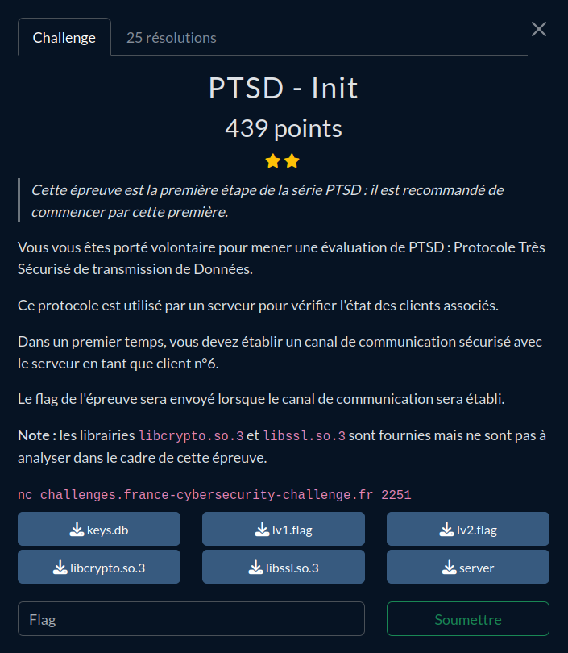
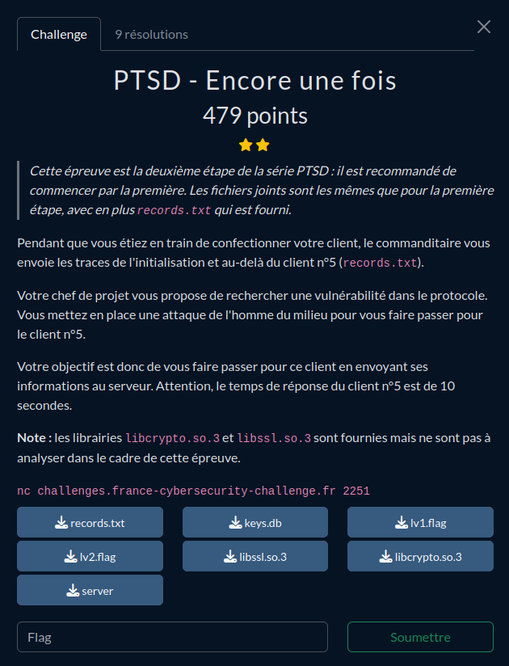

# FCSC 2024 - Write-Up for the challenge PTSD (Reverse, 2 parts)

**TL;DR:** Reverse of a custom network protocol based on a Elliptic Curve Diffie-Hellman (ECDH) key exchange with AES-GCM encryption + exploitation of an integer overflow in the implementation of the protocol.

## First part: PTSD - Init



**Description (in French):** 
Vous vous êtes porté volontaire pour mener une évaluation de PTSD : Protocole Très Sécurisé de transmission de Données.
Ce protocole est utilisé par un serveur pour vérifier l'état des clients associés.
Dans un premier temps, vous devez établir un canal de communication sécurisé avec le serveur en tant que client n°6.
Le flag de l'épreuve sera envoyé lorsque le canal de communication sera établi.
Note : les librairies libcrypto.so.3 et libssl.so.3 sont fournies mais ne sont pas à analyser dans le cadre de cette épreuve.

**Approximate translation:** 
You volunteered to evaluate PTSD: Protocole Très Sécurisé de transmission de Données (Very Secure Protocol for Data Transmission).
This protocol is used by a server to check the status of the associated clients.
In the first place, you have to establish a secure communication channel with the server as the client number 6.
The flag of the challenge will be sent when the communication channel will be established.
Note: the libraries libcrypto.so.3 and libssl.so.3 are provided but they are out-of-scope of this challenge.

### Introduction

For this challenge, we are given:
- a file `keys.db` containing the following:
```
05:0040:12121212121212121212121212121212
06:FFFF:FFFFFFFFFFFFFFFFFFFFFFFFFFFFFFFF
```
- two files containing fake flags: `lv1.flag` and `lv2.flag` (the second one will be for the second part of the challenge),
- the libraries `libcrypto.so.3` and `libssl.so.3`,
- a file `records.txt` for the second part of the challenge containing a capture of some exchanges between client 5 and the server:
```
SEND: 0500010441046A3D5BB1422D914E7F9EADEDAD0F2AFBE0F8CCCD41D97AE89DE40E081C7CF623A528F770985E319B63805C59B267DC67F9712CF7284A6E496F2BBD185F58ED26
RECV: 050002020101
RECV: 050003044104CE16547B40B5CDBE7B4211C371B09F3B09C5BB4811CDFB3A787941B5B1E1B487A461928EB2167B7233EA4E61E0F51F580ADF080F7B709F7C0BB857A5B8801654
SEND: 050004020101
SEND: 05000509BF451252B5BC306E4E7B7BD192D7C261BC0C9C73A8F25C87DF50B0DE08F564A77A57BADA34
RECV: 050006020101
RECV: 05000709780E623D3DFA61E9565F58A991D331CC8024D1BB213B34E5BA99AA8D08FAF6AFA9E18935C4
SEND: 050008020101
SEND: 050009118226534CF1B81165981130FDBD44CF60ED046B7116D6836B65DF6CE246E0C63E6A4B748224F4958838A8852480864E4E12D5307A18BD1BDAD20800127E927C5B63FE579B47B399A5EFBA09B97ABD060AC330ADC18CE826388A2FD03087621C7B370948
RECV: 05000A033A16B0CF2CA0DFA9C3F856365BC41DE3DFAB62E8FCA6D51A69226A2901FA
SEND: 05000B2153F7BC6C0614B8EF4732B055D833658E08CC29B89602BC9E9589498008F73F71CD5A4173AC
RECV: 05000C036C4D63FC7F5FE25094D84F86157D7F1783EEAD297538B97C9F1C31BC0194
SEND: 05000D4168EA4C0EFBC5B6CB5113BF2BDE37386615AD65D77AD90992DDA8881803F621A4
RECV: 05000E03D5263BBB06616AF317B444049C2EAFA93DF4B11358A9D9E9A8612BBB01E4
RECV: 05000F81EA7140C5616837D0698F733A801FC4CB08180703E17AE332FB4997F4105FEA343BCB979948100C387DF2A1A070
SEND: 05001003A0BD2E66B65B053DC12AE07667FC6BF930A54279F487FF29438ADE2F01F7
```
- the remote binary `server`.

When we run the binary, the server performs some internal operations, sends us a packet, and wait for an answer.
```
[rlaspina@ARCH-RLS ptsd] $ ./server
INFO -- release -- --- PTSD Server v1.54 ---
INFO -- release -- Loading clients...
INFO -- release -- Initializing secure channels...
INFO -- release -- Secure channel already done for 5
SEND: 060001044104F7D2F1CCFBF6ACA90E0168F0B45DFE275DC54D0919A2007E1CE32674C2620EB73F0821E05FF3D6AA97FC0049FDD2CA7C7F0F6BDA2BA77FE528B4D4600D8A6A5F
RECV:

```

Let's dive in the code of the binary to understand what happens.

After decompilation and variable renaming, we can identify the main parts of the program.

The `main` function performs in an endless loop various operations depending on the status of the server.

```c
__int64 __fastcall main(int a1, char **a2, char **a3, __int64 a4, __int64 a5, __int64 a6)
{
  __int64 p_num_keys; // rsi
  void **v7; // rdi
  __int64 v8; // rdx
  __int64 v9; // rcx
  __int64 v10; // r8
  __int64 v11; // r9
  unsigned int num_keys; // [rsp+8h] [rbp-18h] BYREF
  unsigned int status; // [rsp+Ch] [rbp-14h]
  void *keys[2]; // [rsp+10h] [rbp-10h] BYREF

  keys[1] = (void *)__readfsqword(0x28u);
  keys[0] = 0LL;
  num_keys = 0;
  status = 2;
  p_num_keys = (__int64)"--- PTSD Server v1.54 ---";
  v7 = (void **)"release";
  log("release", "--- PTSD Server v1.54 ---", (__int64)a3, a4, a5, a6);
  while ( status > 1 )
  {
    switch ( status )
    {
      case 2u:
        log("release", "Loading clients...", v8, v9, v10, v11);
        p_num_keys = (__int64)&num_keys;
        v7 = keys;
        status = load_clients((__int64)keys, (__int64)&num_keys);
        break;
      case 3u:
        log("release", "Initializing secure channels...", v8, v9, v10, v11);
        p_num_keys = num_keys;
        v7 = (void **)keys[0];
        status = init_channels((__int64)keys[0], num_keys);
        break;
      case 4u:
        log("release", "Checking clients health...", v8, v9, v10, v11);
        p_num_keys = num_keys;
        v7 = (void **)keys[0];
        status = get_health((__int64)keys[0], num_keys);
        break;
      case 5u:
        log("release", "Getting clients info...", v8, v9, v10, v11);
        p_num_keys = num_keys;
        v7 = (void **)keys[0];
        status = get_info((__int64)keys[0], num_keys);
        break;
      case 6u:
        status = attack_detected((__int64)v7, p_num_keys, v8, v9, v10, v11);
        break;
      default:
        status = 0;
        break;
    }
  }
  if ( keys[0] )
  {
    free(keys[0]);
    keys[0] = 0LL;
  }
  return 0LL;
}
```

We can identify four steps: loading clients (status 2), establishing secure channels (status 3), checking clients health (status 4) and getting clients info (status 5). Status 6 should not be reached. Other statuses stops the server.

### Status 2 - Loading clients 

When the server "loads the clients", it basically reads the file `keys.db` and parses it. This file contains, for each client, a line
```
NN:XXXX:YYYYYYYYYYYYYYYYYYYYYYYYYYYYYYYY
```
where NN is the client number. We will see later what correspond to XXXX and YYYYYYYYYYYYYYYYYYYYYYYYYYYYYYYY.
```c
__int64 __fastcall load_clients(void **keys, int *num_keys)
{
  if ( !keys || (unsigned __int8)load_keys(keys, num_keys) != 1 )
    return 1LL;
  else
    return 3LL;
}
```
Upon success, this function returns 3 so the server will go forward to the next step.

### Status 3 - Establishing secure channels

Interesting things start as the server establish communication channels with the clients.

```c
__int64 __fastcall init_channels(__int64 keys, int num_keys)
{
  [...]
  if ( gen_keypair((__int64)&id_server) && retrieve_pub_server(id_server, &pub_server, &len_pub_server) == 1 )
  {
    for ( i = 0; i < num_keys && *(_BYTE *)(41LL * i + keys) != 0xFF; ++i )
    {
      if ( !memcmp((const void *)(41LL * i + keys + 8), &str_0xfffffff, 0x10uLL) )
      {
        *(_WORD *)(41LL * i + keys + 3) = 0;
        if ( (unsigned __int8)send_pub(41LL * i + keys, pub_server, len_pub_server) != 1
          || recv_ack(keys + 41LL * i, &packet) != 1
          || *((_BYTE *)packet + 6) != 1 )
        {
          goto LABEL_42;
        }
        if ( packet )
        {
          free(packet);
          packet = 0LL;
        }
        if ( recv_pub(keys + 41LL * i, &packet) != 1
          || send_ack(41LL * i + keys, 1) != 1
          || !retrieve_pub_client((__int64)packet + 6, *((_BYTE *)packet + 5), (__int64)&pub_client)
          || derive_skey(id_server, pub_client, &skey) != 1 )
        {
          goto LABEL_42;
        }
        v5 = (_QWORD *)(41LL * i + keys + 8);
        v6 = *(_QWORD *)((char *)skey + 9);
        *v5 = *(_QWORD *)((char *)skey + 1);
        v5[1] = v6;
        if ( packet )
        {
          free(packet);
          packet = 0LL;
        }
        if ( send_heloehlo(41LL * i + keys) != 1
          || recv_ack(keys + 41LL * i, &packet) != 1
          || *((_BYTE *)packet + 6) != 1 )
        {
          goto LABEL_42;
        }
        if ( packet )
        {
          free(packet);
          packet = 0LL;
        }
        if ( recv_msg(keys + 41LL * i, &packet) != 1 || send_ack(41LL * i + keys, 1) != 1 )
          goto LABEL_42;
        if ( packet )
        {
          free(packet);
          packet = 0LL;
        }
        if ( read_flag1((void **)a2) != 1
          || send_flag(41LL * i + keys, a2[0]) != 1
          || recv_encrypted_ack(keys + 41LL * i, &packet) != 1
          || *((_BYTE *)packet + 6) != 1 )
        {
          goto LABEL_42;
        }
        if ( packet )
        {
          free(packet);
          packet = 0LL;
        }
        log(
          "release",
          "Succeeded in mounting the secure channel with %d",
          *(unsigned __int8 *)(41LL * i + keys),
          v7,
          v8,
          v9);
        if ( skey )
        {
          free(skey);
          skey = 0LL;
        }
        if ( a2[0] )
        {
          free(a2[0]);
          a2[0] = 0LL;
        }
        if ( pub_client )
        {
          EVP_PKEY_free(pub_client);
          pub_client = 0LL;
        }
      }
      else
      {
        log("release", "Secure channel already done for %d", *(unsigned __int8 *)(41LL * i + keys), v2, v3, v4);
      }
    }
    new_status = 4;
  }
LABEL_42:
  [some cleaning...]
  return new_status;
}
```

First of all, for each key `k`, the server checks if memory at `k + 8` is equal to 16 bytes 0xFF. Actually, `k + 8` corresponds to the field "YYYYYYYYYYYYYYYYYYYYYYYYYYYYYYYY" from the file `keys.db`. If this field is equal to FFFFFFFFFFFFFFFFFFFFFFFFFFFFFFFF, it means that a channel must be established between the server and the client. The client 5 have already been initialized (that is why we have a message "Secure channel already done for 5" when running the server) but the channel has to be established for client 6.


#### Format of the packets

But how are the exchanged packets formatted?

If we take a look at the file `records.txt`, we can guess for the first packets that:
- The packets all have a header containing:
  - the client number N,
  - a kind of "packet counter" C,
  - a "packet type" T,
  - the length of the transmitted data L.
  For instance, the first packet is 
  05 0001 04 41 046A3D5BB1422D914E7F9EADEDAD0F2AFBE0F8CCCD41D97AE89DE40E081C7CF623A528F770985E319B63805C59B267DC67F9712CF7284A6E496F2BBD185F58ED26
[N] [ C ] [T] [L] [data]
- Some packets just carry the byte "01", they are probably acknowledgement (ACK) packets.

This can be verified looking at the code of the functions `recv_*` and `send_*` which we will dissect later. Moreover, for each client, the "packet counter" is stored at "key + 3", which is loaded from the "XXXX" parts of the file `keys.db`.


#### Elliptic Curve Diffie-Hellman (ECDH) key agreement

The first exchanged messages consist in a basic Elliptic Curve Diffie-Hellman (ECDH) key agreement. To sum up:
- The server generates a private/public key pair (functions `gen_keypair` and `retrieve_pub_server`)
- The server sends its public key and waits for an ACK from the client (functions `send_pub` and `recv_ack`)
- The client sends back its public key to the server, the server replies with an ACK (functions `recv_pub` and `send_ack`)
- Both derive the same shared secret: the server derives the secret from its private key and the public key of the client, and the client derives it from its private key and the public key of the server (server-side functions `retrieve_pub_client` and `derive_skey`).
- They both derive the same AES key to exchange encrypted messages (function `derive_skey`).

If we look at the code of the function `gen_keypair` called at the beginning, we can know that the elliptic curve used is `SECP256R1`, also known as `prime256v1`, which corresponds to `nid = 415` in `EVP_PKEY_CTX_set_ec_paramgen_curve_nid`. (https://source.chromium.org/chromium/chromium/src/+/main:third_party/boringssl/src/include/openssl/nid.h)

```c
v4 = EVP_PKEY_CTX_new_id(408LL, 0LL);
if ( v4 )
{
  if ( (unsigned int)EVP_PKEY_paramgen_init(v4) == 1
    && (unsigned int)EVP_PKEY_CTX_set_ec_paramgen_curve_nid(v4, 415LL) == 1
    && (unsigned int)EVP_PKEY_paramgen(v4, &v3) == 1 )
  {
    v5 = EVP_PKEY_CTX_new(v3, 0LL);
    if ( v5 )
    {
      if ( (unsigned int)EVP_PKEY_keygen_init(v5) == 1 )
        v2 = (unsigned int)EVP_PKEY_keygen() == 1;
    }
  }
}
```

The shared secret is basically a point on the elliptic curve, represented as bytes. The AES key is generated from the 16 first bytes of the SHA-1 of this secret: see the function `derive_skey`:
```c
__int8 __fastcall derive_skey(__int64 id_server, __int64 pub_client, void **a3)
{
	[...]
    ctx = EVP_PKEY_CTX_new(id_server, 0LL);
    if ( ctx )
    {
      if ( (unsigned int)EVP_PKEY_derive_init(ctx) == 1
        && (unsigned int)EVP_PKEY_derive_set_peer(ctx, pub_client) == 1
        && (unsigned int)EVP_PKEY_derive(ctx, 0LL, &v6) == 1 )
      {
        *(_BYTE *)ptr = v6;
        ptr = realloc(ptr, *(unsigned __int8 *)ptr + 1LL);
        if ( ptr )
        {
          if ( (unsigned int)EVP_PKEY_derive(ctx, (char *)ptr + 1, &v6) == 1 )
          {
            *(_BYTE *)ptr = v6;
            if ( SHA1((char *)ptr + 1, *(unsigned __int8 *)ptr, src) )
            {
              *(_BYTE *)ptr = 16;
              ptr = realloc(ptr, *(unsigned __int8 *)ptr + 1LL);
              if ( ptr )
              {
                memcpy((char *)ptr + 1, src, *(unsigned __int8 *)ptr);
                *a3 = ptr;
                v5 = 1;
              }
            }
          }
        }
      }
	}
	[...]
	return v5
}
```

#### Encrypted messages

After the key agreement phase, both parts send messages encrypted with AES-GCM using the shared key. AES-GCM (Galois/Counter mode) is an operation mode with authentication: the encryption takes as input a random nonce, the plain message and public authentication data (AD). It returns the ciphertext along with a *tag* which depends on the ciphertext, the AD and the key. On decryption, the tag is checked with respect to ciphertext and AD and an error is triggered if it isn't the case: it means that AD or ciphertext has been tampered with. It theoretically guarantees the integrity of authentication data, since a man-in-the-middle attacker who does not know the key cannot forge a valid tag for corrupted AD or ciphertext.

The encrypted packets are formatted a bit differently: instead of the length and the data, we have:
- the nonce used for encryption
- the authentication tag
- the length of the ciphertext
- the ciphertext.

For example, 
05000509BF451252B5BC306E4E7B7BD192D7C261BC0C9C73A8F25C87DF50B0DE 08 F564A77A57BADA34
[header][        nonce        ][              tag              ][LL][    data      ]

But where is the authentication data here?

If we take a look at the function that sends encrypted messages, we can figure out that it is actually the packet counter:
```c
  if ( packet
    && (unsigned __int8)alloc_copy(packet + 2, 2, &ptr) == 1
    && (unsigned __int8)aes_encrypt(key + 8, packet + 5, (unsigned __int8 *)ptr, aes) == 1 )
```

The counter, stored at `&packet + 2`, is copied into a new location `ptr`, and used as authentication data in `aes_encrypt` (first `EVP_EncryptUpdate`):

```
__int64 __fastcall aes_encrypt(__int64 skey, unsigned __int8 *a2, unsigned __int8 *a3, void **a4)
{
	[...]
	nonce = malloc(*a2 + 29LL);
    if ( nonce )
    {
      ctx = EVP_CIPHER_CTX_new();
      if ( ctx )
      {
        v4 = EVP_aes_128_gcm();
        if ( (unsigned int)EVP_EncryptInit_ex(ctx, v4, 0LL, 0LL, 0LL) == 1
          && (unsigned int)RAND_bytes(nonce, 12LL) == 1
          && (unsigned int)EVP_EncryptInit_ex(ctx, 0LL, 0LL, skey, nonce) == 1
          && (unsigned int)EVP_EncryptUpdate(ctx, 0LL, &v9, a3 + 1, *a3) == 1
          && (unsigned int)EVP_EncryptUpdate(ctx, (char *)nonce + 29, &v9, a2 + 1, *a2) == 1
          && *a2 <= v9 )
        {
          *((_BYTE *)nonce + 28) = v9;
          if ( (unsigned int)EVP_EncryptFinal_ex(ctx, (char *)nonce + v9 + 29, &v9) == 1
            && *a2 <= *((unsigned __int8 *)nonce + 28) + v9 )
          {
            *((_BYTE *)nonce + 28) += v9;
            if ( (unsigned int)EVP_CIPHER_CTX_ctrl(ctx, 16LL, 16LL, (char *)nonce + 12) == 1 )
            {
              *a4 = nonce;
              v8 = 1;
            }
          }
        }
      }
    }
	[...]
    return v8;
}
```

#### Establishment of the communication channel

After sharing the AES key, the communication channel is established as follows:
- The server sends the message "HELOEHLO" (sic), the client replies with an ACK (functions `send_heloehlo` and `recv_ack`)
- The client sends back any encrypted message with a valid tag, the server replies with an ACK (functions `recv_msg` and `send_ack`).
- If the server-side decryption succeeds, the first flag is sent to the client (encrypted).

From now it is quite straightforward to get the flag of the first part: the goal is to implement a PTSD client.

#### The flag!

I implemented my client in Python + pwntools, with the libraries `ec` and `AESGCM` `cryptography.hazmat.primitives` to work with elliptic curves and AES-GCM encryption.

It just consists in following the protocol: here is the main part of my script. The full script is available [here](src/exploit_part1.py). The functions `send_msg` and `recv_msg` respectively send and receive encrypted messages with the provided AES key.

```python
io = start()        

# Get raw public key from server
io.recvuntil(b'SEND: ')
io.recv(10)
raw_pub_server = bytes.fromhex(io.recvuntil(b'\n')[:-1].decode('utf-8'))
pwn.debug("Server public key: %s" % raw_pub_server.hex())

# Convert it to an ec public key object
x_server = int.from_bytes(raw_pub_server[1:33], 'big')
y_server = int.from_bytes(raw_pub_server[33:65], 'big')
vals = ec.EllipticCurvePublicNumbers(x_server, y_server, ec.SECP256R1())
pub_server = vals.public_key()

# Generate a client private/public key pair
id_client = ec.generate_private_key(ec.SECP256R1())
x = id_client.public_key().public_numbers().x
y = id_client.public_key().public_numbers().y
pub_client = '04' + hex(x)[2:].rjust(64, '0') + hex(y)[2:].rjust(64, '0')

# Send it back to the server and derive locally the AES key
send_ack(io, 6, 2)
io.sendlineafter(b'RECV:\n', b'0600030441' + pub_client.upper().encode('utf-8')

shared_key = id_client.exchange(ec.ECDH(), pub_server)
aes_key = hashlib.sha1(shared_key).digest()[:16]
pwn.success("Derived AES key: %s" % aes_key.hex())

# Receive 'HELOHELO' and send back a dummy encrypted message
recv_ack(io)
recv_msg(io, aes_key, 5) # HELOEHLO
send_ack(io, 6, 6)
send_msg(io, 6, 9, aes_key, b'spikeroot', 7)

# Receive the flag!
recv_ack(io)
recv_msg(io, aes_key, 9) # flag 1

io.close()
```

**FLAG:** `FCSC{13c68c00895af039603fdaeefe36e3c5c4d6a40e76a256193c24391fa76f92d7}`

## Second part: PTSD - Encore une fois (PTSD - One more time)



**Description (in French):**
Pendant que vous étiez en train de confectionner votre client, le commanditaire vous envoie les traces de l'initialisation et au-delà du client n°5 (`records.txt`).
Votre chef de projet vous propose de rechercher une vulnérabilité dans le protocole. Vous mettez en place une attaque de l'homme du milieu pour vous faire passer pour le client n°5.
Votre objectif est donc de vous faire passer pour ce client en envoyant ses informations au serveur. Attention, le temps de réponse du client n°5 est de 10 secondes.

**Approximate translation:**
While you were developing your client, the sponsor sends you a log of the initialization of the client 5, as well as a few following packets (`records.txt`).
Your boss suggests you to find a vulnerability in the protocol. You set up a man-in-the-middle attack to impersonate the client number 5.
Your goal is to impersonate this client by sending their information to the server. Warning, the response delay of client 5 is 10 seconds.

### Status 4 - Checking clients health

After establishing successfully the communication channels, the function `init_channels` (status 3) returns 4. Thus, the server gets forward to status 4: checking clients health.

```c
__int64 __fastcall get_health(__int64 a1, int a2)
{
  unsigned int v3; // [rsp+18h] [rbp-18h]
  int i; // [rsp+1Ch] [rbp-14h]
  void *ptr[2]; // [rsp+20h] [rbp-10h] BYREF

  ptr[1] = (void *)__readfsqword(0x28u);
  v3 = 4;
  ptr[0] = 0LL;
  if ( a1 )
  {
    for ( i = 0; i < a2 && *(_BYTE *)(41LL * i + a1) != 0xFF; ++i )
    {
      if ( (unsigned __int8)send_pullpull(41LL * i + a1) != 1 )
        goto LABEL_12;
      alarm(0xAu);
      if ( (unsigned __int8)recv_encrypted_ack(a1 + 41LL * i, ptr) != 1 || *((_BYTE *)ptr[0] + 6) != 1 )
        goto LABEL_12;
      if ( ptr[0] )
      {
        free(ptr[0]);
        ptr[0] = 0LL;
      }
      alarm(0);
    }
    v3 = 5;
  }
LABEL_12:
  alarm(0);
  if ( ptr[0] )
  {
    free(ptr[0]);
    ptr[0] = 0LL;
  }
  return v3;
}
```

During this phase, for each registered client, the server sends the encrypted message "PULLPULL" (function `send_pullpull`) and waits for the client to send back an encrypted ACK (namely, an encrypted message containing the byte "01"). After checking each clients' health, the server resumes to status 5. 

When the server receives a packet, it checks that the value of the packet counter in the packet is greater than the current server-side counter value. Since the packet counter of the client 5 is equal to 0x40 according to `keys.db`, we cannot simply send back the logged packets from `records.txt`, because their packet counter is lower. This should in theory prevent replay attacks. 

```c
if ( *(_WORD *)(key + 3) < *((_WORD *)packet + 1) )
{
  *(_WORD *)(key + 3) = *((_WORD *)packet + 1);
  [...]
}
```

However, there is no upper bound on the counter received from the client, and the counter is updated to the value sent by the client. For example, if the current server-side counter is 42,
- If the client sends a packet with counter value 41, the reception fails
- If the client sends a packet with counter value 43, the reception succeeds and the new counter value is 43 
- If the client sends a packet with counter value 666, the reception succeeds and the new counter value is 666

Moreover, when the server sends a message, it simply increments the current counter value (which is stored on 2 bytes). The server never performs any checks for integer overflow. Thus, if we send a packet with counter value FFFF, the next counter value from the server will be 0000! As a result, we will be able to replay intercepted packets since their counter value are obviously greater than 0.

Last but not least, if the decryption of the received ACK fails (`recv_encrypted_ack` returns a value not equal to 1), the server do not stop, but instead the status remains equal to 4 and the phase "Getting health clients" is executed again. As a result, we can reply with invalid messages, the server will keep sending us "PULLPULL" messages.

The attack scenario will then be the following:
- We receive a PULLPULL message from the server, we ignore it
- We send an ACK with a dummy nonce/tag and with counter value FFFF. The decryption will fail, but the server will continue sending packets...
- The server sends a PULLPULL message with a counter equal to 0000
- We send back the first intercepted packet: `05000C036C4D63FC7F5FE25094D84F86157D7F1783EEAD297538B97C9F1C31BC0194`. We managed to impersonate client 5.

Finally, we must not forget to answer the health check as client 6 too, since the server iterates on all the clients. This is not a problem since we know the AES key for client 6.

### Status 5 - Getting clients info

```
__int64 __fastcall get_info(__int64 a1, int a2)
{
  unsigned int v3; // [rsp+18h] [rbp-28h]
  int i; // [rsp+1Ch] [rbp-24h]
  void *ptr; // [rsp+20h] [rbp-20h] BYREF
  void *v6; // [rsp+28h] [rbp-18h] BYREF
  __int64 v7; // [rsp+30h] [rbp-10h]
  unsigned __int64 v8; // [rsp+38h] [rbp-8h]

  v8 = __readfsqword(0x28u);
  v3 = 4;
  ptr = 0LL;
  v6 = 0LL;
  v7 = 0LL;
  for ( i = 0; i < a2 && *(_BYTE *)(41LL * i + a1) != 0xFF; ++i )
  {
    if ( *(_BYTE *)(41LL * i + a1) == 6 )
      v7 = 41LL * i + a1;
    if ( (unsigned __int8)send_0xface(41LL * i + a1, 0xFACE, 16) != 1
      || (unsigned __int8)recv_encrypted_ack(a1 + 41LL * i, &ptr) != 1
      || *((_BYTE *)ptr + 6) != 1 )
    {
      goto LABEL_27;
    }
    if ( ptr )
    {
      free(ptr);
      ptr = 0LL;
    }
    if ( (unsigned __int8)recv_even(a1 + 41LL * i, &ptr) != 1
      || (unsigned __int8)send_encrypted_ack(41LL * i + a1, 1LL) != 1 )
    {
      goto LABEL_27;
    }
    if ( (unsigned __int8)check_even((unsigned __int8 *)ptr + 5) != 1 )
    {
      v3 = 6;
      goto LABEL_27;
    }
    if ( ptr )
    {
      free(ptr);
      ptr = 0LL;
    }
    if ( v6 )
    {
      free(v6);
      v6 = 0LL;
    }
  }
  if ( (unsigned __int8)read_flag2(&v6) == 1
    && (unsigned __int8)send_flag(v7, (unsigned __int8 *)v6) == 1
    && (unsigned __int8)recv_encrypted_ack(v7, &ptr) == 1
    && *((_BYTE *)ptr + 6) == 1 )
  {
    if ( ptr )
    {
      free(ptr);
      ptr = 0LL;
    }
    v3 = 0;
  }
LABEL_27:
  [...]
  return v3;
}
```

In this last phase, for each registered client:
- The server sends the (encrypted) bytes `\xce\xfa\x10`, the client answers with an encrypted ACK (functions `send_0xface` and `recv_encrypted_ack`)
- The client sends back an encrypted message such that the plaintext only contains even bytes (why not?). If decryption succeeds and the client message indeed contains only even bytes (functions `recv_even` and `send_encrypted_ack`), the server replies with an encrypted ACK. Otherwise, it gets to status 6, which just prints the messages "Event raised: system under attacks" and "Action: active protection measures activated 'pew pew pew'" :-)
- Finally, the server sends the second flag to the client

The attack can be continued straightforwardly since we have successfully tampered with the packet counter: in `records.txt`, we have all the packets exchanged with client 5 up to the moment the second flag was sent.

*But... the flag will be sent encrypted with AES key for client 5... how do I do...*

It is not a problem: after successfully getting info for client 5, the server will get info for client 6. We can send back encrypted ACKs and even bytes without any difficulty since we know the AES key for client 6. And finally, the flag will be sent encrypted with the key for client 6. It's a win!

The second part of the script (full script available [here](src/exploit_part2.py)):
```python
# Send dummy packet to trigger integer overflow on the packet counter
recv_encrypted_msg(io) # PULLPULL (encrypted)
io.sendlineafter(b'RECV:\n', b'05FFFF03' + b'00'*28 + b'0100')

# Replay response from records.txt
recv_encrypted_msg(io) # PULLPULL (encrypted)
io.sendlineafter(b'RECV:\n', b'05000C036C4D63FC7F5FE25094D84F86157D7F1783EEAD297538B97C9F1C31BC0194')

# Answer the health check for client 6
recv_msg(io, aes_key, 11) # PULLPULL
send_encrypted_ack(io, 6, aes_key, 12)

# Replay responses from records.txt
io.sendlineafter(b'RECV:\n', b'05000E03D5263BBB06616AF317B444049C2EAFA93DF4B11358A9D9E9A8612BBB01E4')
io.sendlineafter(b'RECV:\n', b'05000F81EA7140C5616837D0698F733A801FC4CB08180703E17AE332FB4997F4105FEA343BCB979948100C387DF2A1A070')
io.recvuntil(b'\n') # Encrypted flag for client 5

# Send back correct information for client 6
recv_msg(io, aes_key, 13)
send_encrypted_ack(io, 6, aes_key, 14)
send_msg(io, 6, 0x81, aes_key, b'\x20', 15)

# Receive the flag! (again)
recv_ack(io)
recv_msg(io, aes_key, 17) # flag 2
```

**FLAG:** `FCSC{e22bf8e131d553b7c80a2358f2d52b424d6b349581c893f6904806fe5b379ed6}`
