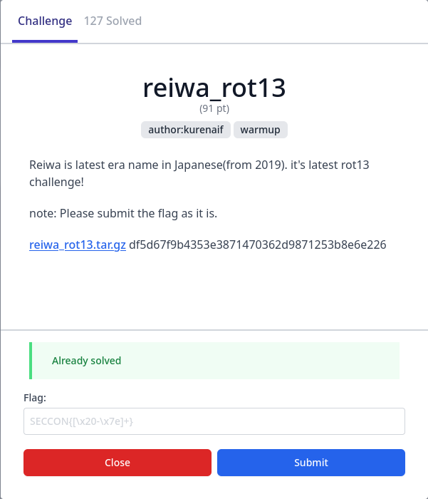

# SECCON CTF 13 - Write-Up for the challenge reiwa_rot13 (Crypto)

**TL;DR:** Franklin-Reiter related-message attack.

## First part: PTSD - Init



**Description:** Reiwa is latest era name in Japanese(from 2019). it's latest rot13 challenge!

### Introduction

For this challenge, we are given an archive containing:
- a Python script `chall.py`:
```python
from Crypto.Util.number import *
import codecs
import string
import random
import hashlib
from Crypto.Cipher import AES
from Crypto.Random import get_random_bytes
from flag import flag

p = getStrongPrime(512)
q = getStrongPrime(512)
n = p*q
e = 137

key = ''.join(random.sample(string.ascii_lowercase, 10))
rot13_key = codecs.encode(key, 'rot13')

key = key.encode()
rot13_key = rot13_key.encode()

print("n =", n)
print("e =", e)
print("c1 =", pow(bytes_to_long(key), e, n))
print("c2 =", pow(bytes_to_long(rot13_key), e, n))

key = hashlib.sha256(key).digest()
cipher = AES.new(key, AES.MODE_ECB)
print("encyprted_flag = ", cipher.encrypt(flag))
```

- the output of the script `output.txt`:
```
n = 105270965659728963158005445847489568338624133794432049687688451306125971661031124713900002127418051522303660944175125387034394970179832138699578691141567745433869339567075081508781037210053642143165403433797282755555668756795483577896703080883972479419729546081868838801222887486792028810888791562604036658927
e = 137
c1 = 16725879353360743225730316963034204726319861040005120594887234855326369831320755783193769090051590949825166249781272646922803585636193915974651774390260491016720214140633640783231543045598365485211028668510203305809438787364463227009966174262553328694926283315238194084123468757122106412580182773221207234679
c2 = 54707765286024193032187360617061494734604811486186903189763791054142827180860557148652470696909890077875431762633703093692649645204708548602818564932535214931099060428833400560189627416590019522535730804324469881327808667775412214400027813470331712844449900828912439270590227229668374597433444897899112329233
encyprted_flag =  b"\xdb'\x0bL\x0f\xca\x16\xf5\x17>\xad\xfc\xe2\x10$(DVsDS~\xd3v\xe2\x86T\xb1{xL\xe53s\x90\x14\xfd\xe7\xdb\xddf\x1fx\xa3\xfc3\xcb\xb5~\x01\x9c\x91w\xa6\x03\x80&\xdb\x19xu\xedh\xe4"
```

A random key made of 10 lowercase chars is encrypted using RSA and printed, as well as its ROT13 encoding. The flag is then encrypted using AES with the sha256 of the key.

Basically, to recover the flag, we should recover the plain key given its RSA-ciphertext and the RSA-ciphertext of its ROT13-encoding. We are also given the RSA public parameters $n$ and $e$.

### The Attack

We can easily guess that we should exploit the fact that the key and its ROT13 encoding are quite strongly related. Moreover, the public exponent used for RSA encryption is small (137, instead of 65537 usually).

This leads us to consider applying Franklin-Reiter attack.

Franklin-Reiter attack consists in recovering a message $m$ given the ciphertexts for both $m$ and $P(m)$ where $P$ is a known linear polynomial. It is especially efficient when the exponent $e$ is small.

This attack mainly consists in computing the polynomial GCD between $X^e - c1$ and $P(X)^e - c2$ in the ring $\mathbb{Z}_n[X]$: indeed, $m$ is a root of both, thus $(X-m)$ is a common divisor.

### Solving the Challenge

Here, we do not know precisely how both messages are related: we only know that ROT13 performs a -13 or +13 operation on each character.

But there are only 2 possibilities for each character, and the key is 10-char long. Thus, there are only $2^{10} = 1024$ possible differences between the messages.

The polynomial $P$ such that $ROT13(key) = P(key)$ is thus $X-d$ where there are 1024 possible values for $d$. We can try to apply Franklin-Reiter with each of them until the recovered message is lower than $256^{11}$: it should then correspond to the 10-char key.

From there, it is easy to recover the flag: we just have to decrypt it using AES with the sha256 of the recovered key. 

I mainly reused this implementation of Franklin-Reiter to solve the challenge: https://github.com/ValarDragon/CTF-Crypto/blob/master/RSA/FranklinReiter.sage. Here is my final Sage solve script:

```sage
import hashlib
from Crypto.Cipher import AES

def franklinReiter(n,e,r,c1,c2):
    R.<X> = Zmod(n)[]
    f1 = X^e - c1
    f2 = (X + r)^e - c2
    # coefficient 0 = -m, which is what we wanted!
    return Integer(n-(compositeModulusGCD(f1,f2)).coefficients()[0])
    
# GCD is not implemented for rings over composite modulus in Sage
# so we do our own implementation. Its the exact same as standard GCD, but with
# the polynomials monic representation
def compositeModulusGCD(a, b):
    if(b == 0):
        return a.monic()
    else:
        return compositeModulusGCD(b, a % b)
            
n = 105270965659728963158005445847489568338624133794432049687688451306125971661031124713900002127418051522303660944175125387034394970179832138699578691141567745433869339567075081508781037210053642143165403433797282755555668756795483577896703080883972479419729546081868838801222887486792028810888791562604036658927
e = 137
c1 = 16725879353360743225730316963034204726319861040005120594887234855326369831320755783193769090051590949825166249781272646922803585636193915974651774390260491016720214140633640783231543045598365485211028668510203305809438787364463227009966174262553328694926283315238194084123468757122106412580182773221207234679
c2 = 54707765286024193032187360617061494734604811486186903189763791054142827180860557148652470696909890077875431762633703093692649645204708548602818564932535214931099060428833400560189627416590019522535730804324469881327808667775412214400027813470331712844449900828912439270590227229668374597433444897899112329233

encyprted_flag =  b"\xdb'\x0bL\x0f\xca\x16\xf5\x17>\xad\xfc\xe2\x10$(DVsDS~\xd3v\xe2\x86T\xb1{xL\xe53s\x90\x14\xfd\xe7\xdb\xddf\x1fx\xa3\xfc3\xcb\xb5~\x01\x9c\x91w\xa6\x03\x80&\xdb\x19xu\xedh\xe4"
    
for i in range(1024):
    diff = 0
    for b in range(10):
        diff *= 256
        if (i >> b) & 1:
            diff -= 13
        else:
            diff += 13
            
    key_cand = franklinReiter(n,e,diff,c1,c2)
    if key_cand < 256**11:
        key = key_cand.to_bytes(10)
        print("Key: %s" % key.decode())
        break

key = hashlib.sha256(key).digest()
cipher = AES.new(key, AES.MODE_ECB)
print("FLAG: %s" % cipher.decrypt(encyprted_flag).decode())
```

**FLAG:** `SECCON{Vim_has_a_command_to_do_rot13._g?_is_possible_to_do_so!!}`
