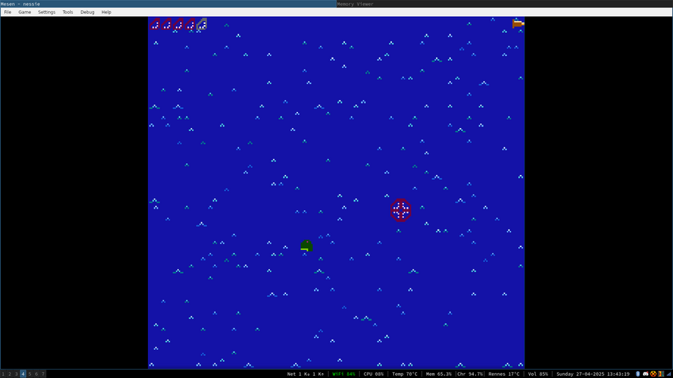
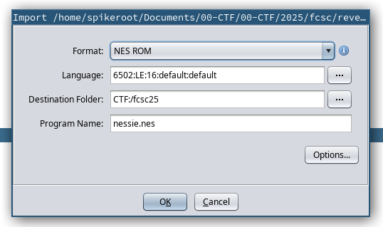
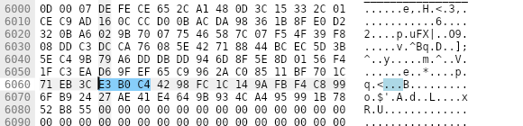

# FCSC 2025 - Write-Up for the challenge Nessie (Reverse)

**TL;DR:** Reverse engineering of a NES (Nintendo Entertainment System) ROM.


**Description:**
> A friend of yours, in his forties, spent his carefree youth playing a game called Nessie. He never managed to finish the game despite having spent long hours in front of his NES.
>
> Will you be able to do better than him and win his undying gratefulness?
>
> The game has been tested successfully on the last versions of:
> - Mesen,
> - Nintendulator,
> - puNES,
> - fceux/fceumm (for a better rendering, in the video config, the drawing area must be expanded to the maximum limits).

## Introduction and Game Hacking

A NES ROM `nessie.nes` is given for this challenge.

```
$ file nessie.nes
nessie.nes: NES ROM image (iNES) (NES 2.0): 68x16k PRG, 64x8k CHR [H-mirror] [NTSC]
```

First of all, we can try to play a bit to know what should be the goal
of the challenge. The first emulator in the list, Mesen, works
well. Moreover, it is shipped with a very nice and useful debugger.




The goal of the game seems to be to catch the dinosaurs that appear
successively randomly on the screen. To do so, we must be at the same
position as the dinosaurs and shoot at them. Moreover we are allowed
to teleport 5 times immediately to the position of the dinosaur. The
problem is that they appear too fast and cannot always be caught in
time, and moreover the game seems to be endless...

Before diving into the code, we can try to do some game hacking with
the debugger and the memory viewer of Mesen. We can try to look for
memory locations that change in function of the position of the player
/ the enemies, or to change the scene number...

Such locations are present at the very beginning of the memory. After
playing around for a while, we can map the locations to the
corresponding information concerning the status of the game.


In particular, one byte appears to encode the "status" of the game: it
is equal to 1 when there is no dinosaur on the screen, 3 when a
dinosaur is present and 6 after a dinosaur has been killed. But what
happens if we set it to something else, for instance 2?


Oh, wtf?? But... the challenge was not supposed to be rated as 3-star
difficulty, which is the hardest level of difficulty at FCSC? Anyway,
we try to submit it, and it obviously does not work. So, we guess the
flag is computed dynamically and is wrong if we do not terminate the
game properly. Indeed, if we set the status to 2 after killing a
dinosaur, the hash is different. And if we set it to 2 after letting a
dinosaur disappear without killing it, we get a different screen.


The byte at address 0xF is a boolean value, initially set to 0, which
is set to 1 when we fail to kill a dinosaur (and thus we have lost the
game): we get the win screen only if it has not been set to 1. The
"remaining enemies" value is decreased each time an enemy is spawned
and the game ends when it reaches 0. We can thus figure out that to
win the game properly, we have to kill 0x1e8480 (2 million) enemies in
a row! Each time the player shoots (at an enemy or not), the
"remaining bullets" value is decreased as well. We have exactly as
many bullets as enemies to kill, so we must not miss any shoot. We
will see later the role of the 5 last bytes.

Actually, I figured out the meaning of part of these variables while
doing static reversing later, but I sum up the meaning of all the
variables there for the sake of clarity.

Now, that's enough playing, it's time to do actual reversing.

## Overview of the ROM

As a (good) reverser, I have first tried to see if we can open the ROM
in Ghidra. And, we are lucky, there exists a plugin to add support for
the architecture of the NES processor:
https://github.com/kylewlacy/GhidraNes. Great, we open our ROM,
and... bad news appear :'(




After some investigation, taking a look at the code of GhidraNes, we
identify the header as the culprit. For some reason, it does not seem
to comply with the specification of the iNES ROM format, but it did
not bother Mesen. Maybe there was a mismatch between the version
expected by GhidraNes and the actual version of the ROM?

| Bytes | Description                                                                                    |
|-------|------------------------------------------------------------------------------------------------|
| 0-3   | Constant $4E $45 $53 $1A (ASCII "NES" followed by MS-DOS end-of-file)                          |
| 4     | Size of PRG ROM in 16 KB units                                                                 |
| 5     | Size of CHR ROM in 8 KB units (value 0 means the board uses CHR RAM)                           |
| 6     | Flags 6 – Mapper, mirroring, battery, trainer                                                  |
| 7     | Flags 7 – Mapper, VS/Playchoice, NES 2.0                                                       |
| 8     | Flags 8 – PRG-RAM size (rarely used extension)                                                 |
| 9     | Flags 9 – TV system (rarely used extension)                                                    |
| 10    | Flags 10 – TV system, PRG-RAM presence (unofficial, rarely used extension)                     |
| 11-15 | Unused padding (should be filled with zero, but some rippers put their name across bytes 7-15) |

```
$ xxd nessie.nes | head
00000000: 4e45 531a 4440 1008 00ff 0700 0000 0100  NES.D@..........
00000010: a901 8503 a503 d0fc 60a5 02c5 02f0 fc60  ........`......`
00000020: a902 8503 a503 d0fc 60ad 0220 984a 4a4a  ........`.. .JJJ
00000030: 0920 8d06 2098 0a0a 0a0a 0a85 1f8a 051f  . .. ...........
00000040: 8d06 2060 488a 48a6 0498 4a4a 4a09 209d  .. `H.H...JJJ. .
00000050: 0003 e898 0a0a 0a0a 0a85 1f68 051f 9d00  ...........h....
00000060: 03e8 689d 0003 e885 218a babc 0301 841f  ..h.....!.......
00000070: bc04 0184 20aa a000 b11f 9d00 03e8 c8c6  .... ...........
00000080: 21d0 f586 0460 488a a604 9d00 03e8 989d  !....`H.........
00000090: 0003 e868 9d00 03e8 8521 8aba bc03 0184  ...h.....!......
```

Indeed the size field (byte 4) should probably not be that high, the
file is about 48kB, far from being 44*16kB. Fortunately, there is a
functionality in Mesen (Debug -> NES Header Editor) that allows to
edit the headers and moreover, to export the game with the new
headers. Mesen appears to read correctly the ROM, so it just suffices
to export the game back (the size fields are set to `08 08`). We can
finally import the game in Ghidra.


A NES ROM is constituted of program (PRG) chips and graphics (CHR)
chips. In the ROM of Nessie, we have 8 PRG chips: the chips 3-6 are
unused. The chip 0 contains the main part of the program. The chip 1
seems to concern sounds: we can observe that some variables and data
related to sound are affected in this part of the code.


The chip 2 contains big obscure functions. We will come back later to
this part. Finally, the chip 7 contains additional code that looks
like kind of relocations to call some function of a chip from another
chip (I figured out this by debugging dynamically with Mesen).


For each chip, the code is mapped at the address `8000`.

## Reversing the main program

After doing some renaming, we can identify the main functions of the
program (the code is simplified and some non-essential parts are
omitted for the sake of brevity):

```c
void entry()

{
  start_menu();
  main();
  if (lost == 0) {
    print_flag();
  }
  print_lost();
  return;
}
```

```c
void main()

{
  x_player = 0x80;
  y_player = 0x78;
  remaining_enemies = 0x1e8480;
  remaining_bullets = remaining_enemies;
  rand_seed = init_seed;
  teleports = 5;
  state = 0;
  render();
  wait();
  time_left = 1;
  state = 6;
  while( true ) {
    input = get_input();
    // start
    if ((input & 8) != 0) {
      reset();
    }
	
	// move controls
    if ((input & 0x10) != 0) {
      move_up();
    }
    if ((input & 0x20) != 0) {
      move_down();
    }
    if ((input & 0x40) != 0) {
      move_left();
    }
    if ((input & 0x80) != 0) {
      move_right();
    }
	
	// select
    if ((input & 4) != 0) {
      pause();
    }
	
	// A button
    if ((input & 2) != 0) {
      teleport();
    }
	
	// B button
    if ((input & 1) != 0) {
      shoot();
    }
    if (!tick()) break;
    render();
    wait();
  }
  render();
  return;
}
```

`start_menu` corresponds to the initial scene waiting for the player
to press the start button. The `main` function corresponds to the main
scene of the game. When the game is finished, the game checks if we
have lost. If it is not the case, we get the win screen with the flag
(`print_flag`), otherwise we get the "bad hunter" screen.

The `main` function performs the following operations:
- Initialize a buffer used for random number generation (we will get
  back to this part later).
- Initialize the global variables, such as the player position,
  number of teleports remaining, number of enemies...
- Set the current state to 6 (as if we had just killed an enemy) and
  the time left to 1 (at the next frame, we get back to the state 1)

Then, it waits for user inputs in an endless loop. The control
functions (`move`, `teleport`, `shoot`, ...) are self-explanatory. At
each frame, after getting the user input, we call the `tick`
function. This function is detailed below and updates the game
status. Finally, the graphics are rendered. The loop stops when the
`tick` function returns 0: it means that the game is over.

```c
byte tick()

{
  if (state != 0) {
    if (state == 1) {
      time_left = time_left - 1;
      if (time_left == 0) {
        remaining_enemies = remaining_enemies - 1;
        x_enemy = rand() & 0xf8;
        if (x_enemy == 0) {
          x_enemy = 8;
        }
        if (x_enemy == 0xf8) {
          x_enemy = -(x_enemy < 0xf8) - 0x10;
        }
        y_enemy = rand() & 0xf8;
        if (0xf >= y_enemy) {
          y_enemy = y_enemy + 0x10 + (0xf < y_enemy);
        }
        if (0xdf < y_enemy) {
          y_enemy = y_enemy & 0x7f;
        }
        time_left = rand();
        if (0x4f >= time_left) {
          time_left = time_left + 0x50 + (0x4f < time_left);
        }
        play_sound(2,0xf);
        state = 3;
      }
    }
	else if (state == 3) {
      time_left = time_left - 1;
      if (time_left == 0) {
        lost = 1;
        play_sound(4,0xf);
	    if (remaining_enemies == 0) {
          state = 0;
          return 0;
        }
	  }
    }
    else if (state == 6) {
      time_left = time_left - 1;
      if (time_left == 0) {
        play_sound(3,0xf);
        if (remaining_enemies == 0) {
          state = 0;
          return 0;
        }
        time_left = rand();
        if (0x2f >= time_left) {
          time_left = time_left + 0x30 + (0x2f < time_left);
        }
      }
    }
	else {
	  state = 0;
      return 0;
    }
  }
  return state;
}
```

Basically, if we are in the state 1 and `time_left` reaches 0, a
dinosaur is spawned at a random position and `time_left` is also set
to a random value. The new state is 3. If we run out of time in the
state 3 (when there is a dinosaur on screen), we have lost the game:
the variable `lost` is set. Finally, when we are in the state 6 (we
have just killed a dinosaur), either there are no more enemies to
spawn and the game is over (the return value is 0), or the game waits
again a random amount of time before spawning a new dinosaur. We can
conclude that to complete the game without cheating, the player
actually has to kill 2 million dinosaurs in a row.

Okay, nice, but let's get back to our main quest: the flag.

## Where flag?

Before starting to do static reversing, we can try to find the
computed flag in memory. We modify the state value on-the-fly to
trigger the win screen, and we look for the bytes "e3b0c4" with Search
-> Find... in the Memory Viewer of Mesen. And, we find them, around
`6000`.



We can first try a dynamic approach to see at which point this data is
computed.  After doing some careful dichotomy and single-stepping with
the debugger, we reach this instruction `STA $ec5c`: the whole area
starting from `6000` is empty before and... the flag magically appears
just after! Despite the instruction having apparently nothing to do
with this area... 


I guess this is because of some cache flushing dark magic and it seems
to make the computation way more tricky to debug. After some moments
of despair, I switched the "Memory Type" in the memory viewer to "Work
RAM". And I realized that the data was here as well.


Moreover, after re-running the game, I noticed something
crucial. First, there is some initial data at the end of this buffer
in the work RAM when we start the game (at the location of the final
hash). In addition, some data is written to this buffer in the work
RAM each time we shoot, no matter if we kill an enemy or not. Finally,
there is a counter for the number of bytes written to the buffer.


When the buffer is full, it is "scrambled" (hashed maybe?), the
counter is reset and another counter, a kind of "block counter", is
incremented. The last 32 bytes are displayed on the win screen when we
reach the end of the game. The goal is now clear: we need to know what
would be the state of the buffer after killing the 2 million
dinosaurs.


Since the player has exactly as many bullets as enemies to kill, the
only shoots should target the successive positions of the dinosaurs
in a winning game. It remains now two quests to complete our mission:
- Predict the successive positions of the dinosaurs.
- Figure out how is hashed the buffer after being filled up.

## Hash Computation

The first quest is easy: the "random" values actually come from a
pseudo-random number generator initialized with a fixed seed at the
beginning of `main`. That is actually the purpose of the five bytes at
0x1B (denoted previously as "???", after the number of teleports)

```c
void rand()
{
  byte bVar1;
  
  bVar1 = rand_seed[0] >> 1 ^ rand_seed[0];
  out_rand = bVar1 << 1 ^ bVar1;
  rand_seed[0] = rand_seed[1];
  rand_seed[1] = rand_seed[2];
  rand_seed[2] = rand_seed[3];
  rand_seed[3] = rand_seed[3] >> 3 ^ rand_seed[3] ^ out_rand;
  return rand_seed[3];
}
```

However, figuring out which computation is done when the buffer is
filled up does not seem obvious at first sight. 

The performing operations are performed in the function `shoot`:

```c
void shoot()

{
  if ((state & 1) != 0) {
    if (remaining_bullets == 0) {
      remaining_bullets = 0;
      play_sound(1,0);
      return;
    }
    remaining_bullets = remaining_bullets - 1;
    play_sound(0,0);
    call_to_write_buffer(7,0xd,0);
    if (((state == 3) && (x_player == x_enemy)) && (y_player == y_enemy)) {
      time_left = 0x5a;
      state = 6;
    }
  }
  return;
}
```

After decreasing the number of remaining bullets, the program calls
some function (we will name it `call_to_write_buffer`) located at the
end of the memory (the kind of "relocations"). This function itself
calls the function at address `8000` in the chip 2, we will call the
latter function `write_buffer`. The simplified code of `write_buffer`
is shown below. Essentially, this function takes as arguments a number
of bytes `n` and a source buffer `src` and write `n` bytes from `src`
to the buffer at `6000`. The arguments are passed through the
registers `A`, `X` and `Y`, as shown below. The offset `0xd`
corresponds to the position of the player, followed by the `lost`
variable and the number of remaining enemies. (7 bytes in total)


It updates the byte counter accordingly. When the byte count reach 64,
the buffer is hashed (`do_hash`), the byte counter is reset and the
block counter is incremented.

```c
void write_buffer(byte n, byte* src)
{
  for (i = 0; i < n; i = i + 1) {
    buf[byte_count] = src[i];
    byte_count = byte_count + 1;
    if ((byte_count & 0x3f) == 0) {
      do_hash();
      byte_count = 0;
	  block_count = block_count + 1;
    }
  }
  return;
}
```

We can as well the notice the presence of the function that
initializes the buffer in the chip 2. `buf_hash` corresponds here to
the 32 last bytes just before the counter, that will be displayed in
the win screen. `hash_init` is some constant value.

```c
void init_buffer(void)
{
  for (i = 0; i < 0x20; i = i + 1)
    buf_hash[i] = hash_init[i];
  } 
  block_count = 0
  byte_count = 0
  return;
}
```

Though, the `do_hash` function looks pretty awful: here is an extract.


At this point we have no choice but to start doing single stepping in
this function, hoping to identify something familiar. We put a
breakpoint, kill some enemies and get started.


First of all, the 32 last bytes get rotated left by 1 bit and copied
to the previous 32 bytes. Then an auxiliary function is called. Hmm,
it seems very complex...


Some bytes are copied rotated, once, twice, ... At some point we
finally take a look at the buffer. The first bytes processed are:
0x6a, 0x09, 0xe6, 0x67, 0xbb, 0x67, ... oh yes, it's our good old
friends the SHA256 constants!


**The hash function is actually SHA256.**

We can check that it is indeed the case by copying the contents of the
buffer to CyberChef and terminating the game, for instance, after
killing 10 enemies:


## Solve

At this point, we just have to write a script that writes the
successive positions (predicted by reimplementing the PRNG) and
numbers of enemies in a buffer and hashes it. The only difficulty
consists in paying attention to the edge cases when deriving the
positions from the output of the PRNG. In particular, I spent a while
debugging by killing manually the enemies and comparing the output to
the output of my script after a few iterations. The case where the
PRNG returns 0 for the y coordinate was particularly pernicious.

```python
import hashlib
from pwn import *

seed = 0x7b118535

def rand():
    global seed
    w = (seed >> 24)
    x = w >> 1 ^ w
    y = x << 1 ^ x
    z = seed & 0xff
    seed <<= 8
    seed += ((z >> 3 ^ z ^ y) & 0xff)
    seed &= 0xffffffff
    return seed & 0xff

to_hash = b''

def rand_pos():
    x = rand() & 0xf8
    y = rand() & 0xf8
    
    if x == 0xf8:
        x = 0xf0
    elif x == 0:
        x = 8

    if y == 0:
        y = 0x10
    elif y <= 0xf:
        y = 0x18
    elif y > 0xdf:
        y = y & 0x7f
        
    return (x,y)

nb_enemies = 0x1e8480
chunks = []

for i in range(nb_enemies):
    x,y = rand_pos()

    # to simulate the calls to rand() for the new remaining time
    rand()
    rand()

    # x, y, lost, remaining_enemies
    cur_to_hash = p8(x) + p8(y) + b'\x00' + p32(nb_enemies-i-1)
    chunks.append(cur_to_hash)
    
to_hash = b''.join(chunks)
    
h = hashlib.sha256()
h.update(to_hash)
print("FCSC{%s}" % h.hexdigest())
```

The flag appears after a few minutes.

```
$ time python solve.py
FCSC{2a178a4923c2303b85f99bbd5dcff4818d50ecf218c8e51d968a8eeab6e24f80}

real	3m10.941s
user	3m9.690s
sys	0m0.494s
```

**FLAG:** `FCSC{2a178a4923c2303b85f99bbd5dcff4818d50ecf218c8e51d968a8eeab6e24f80}`

## Conclusion

This challenge was really great. I do not always enjoy the reversing
challenges on exotic platforms due to the lack of tools that often
become more of a challenge than the reversing challenge itself, but
here it was absolutely not a difficulty. It was still not that easy to
solve in practice because of the poorly decompiled code given by
Ghidra on this architecture, and because it required particular
attention to the details in order to write a correct solve
script. Despite this I had a lot of fun solving this
challenge. Congratulations to the author!
