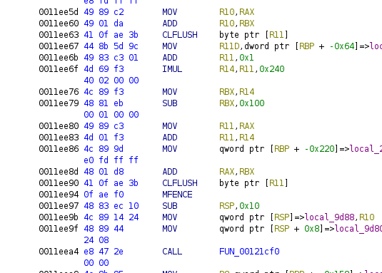

# FCSC 2025 - Write-Up for the challenge Transient Protector (Reverse)

**TL;DR:** Obfuscation of a logic circuit using Spectre-like
mechanisms based on speculative code execution.


**Description:**
> Our supplier claims he just developped a new and revolutionnary
> protector for our software's DRM.
>
> Here is a sample keygenme protected with its method.
>
> I heard that no DRM is unbreakable. Would you be able to provide us
> an input leading to the `0x1234567890abcdef` output?
>
> Example: if the valid input is `0xaaaabbbbccccdddd`, then the flag
> would be `FCSC{0xaaaabbbbccccdddd}` (hex string in lower case).

## Introduction

For this challenge we are given a x86 64-bit binary `protector`.

```
$ file protector
protector: ELF 64-bit LSB pie executable, x86-64, version 1 (SYSV), dynamically linked, interpreter /lib64/ld-linux-x86-64.so.2, BuildID[sha1]=8c4c181e1e7bdb33ec317cc92b97635c4de16a89, for GNU/Linux 3.2.0, stripped
```

We can run the binary with a 64-bit number as input. After spending a
while "checking the platform" then "computing", it outputs another
64-bit number as result.

```
$ ./protector 0xaaaabbbbccccdddd
Check platform...OK !
compute(0xaaaabbbbccccdddd) = ec1fa80c3e33fd87
```

At this point we already get strongly worried because... the result
slightly varies through the executions! Wtf is going on with this
binary?

```
$ ./protector 0xaaaabbbbccccdddd
Check platform...OK !
compute(0xaaaabbbbccccdddd) = ec1fa80c3eb3fd87
```

We can also see that the result is completely different even when we
only slightly change the input, we definitely cannot black-box it.

```
$ ./protector 0xaaaabbbbccccddde
Check platform...OK !
compute(0xaaaabbbbccccddde) = 890957e8ccfc79d
```

## Checking our Skills... OK !

The main function of the decompiled program is very simple and without
any surprise.

```c
int main(int argc,undefined8 *argv)
{
  if (argc == 2) {
    if (check_platform() != 0) {
      input = strtoull(argv[1], 0, 0x10);
      res = compute();
      printf("compute(0x%lx) = %lx\n", input, res);
      return 0;
    }
    return 1;
  }
  else {
    printf("Usage: %s <input>\n", *argv);
    return 1;
  }
}
```

The function `check_platform` is a bit more mysterious: here is its
(simplified) code.

```c
undefined8 check_platform(void)

{
  char expected;
  byte v1;
  byte v2;
  char buf_output [64];
  char result;
  char result2;
  byte[3] rand_buf;
  
  int n = 0;
  for (int k = 0; k < 100; k = k + 1) {
    memset(buf_output, 0, 0x40);
    int r = rand();
    rand_buf[0] = r & 0xff;
    rand_buf[1] = (r >> 8) & 0xff;
    rand_buf[2] = (r >> 0x10) & 0xff;
    expected = x_and_y_or_z(&rand_buf);
    do {
      v1 = weird_function(&rand_buf, &result, &result2);
      v2 = weird_function2(&result, &result2, buf_output);
      v1 = v1 & (v2 ^ 0xff);
    } while ((v1 & 1) != 0);
    encode_output(&result, buf_output);
    n = n + (result == expected);
  }
  if (0x32 < n) {
    puts("OK !");
  }
  else {
    puts("KO !");
  }
  return (0x32 < n);
}
```

What it does is essentially the following: for 100 random triplets of
bytes `(x, y, z)`, it first computes `(x & y | z)`. Then it calls some
function (we will call it `weird_function` for now) that takes the
random triplet as input and modifies two bytes, `result` and
`result2`. The return value is stored is a variable `x`. Some other
function `weird_function2` is called on the results and modifies a
buffer `buf_output` previously zeroed. Its return value is stored in
`y`. We repeat while `x = 1` and `y = 0`. Finally, we increment `n` if
`result` is equal to `(x & y | z)`. If we get at least 50 correct
values on 100 random tests, the platform is approved and the program
can continue. We can then guess that this "weird function" should
actually be equivalent to the function `(x,y,z) -> (x & y | z)` and if
it fails, our machine is not compatible with the binary.

Great, but what does this function actually looks like? Here is an
extract. Ugh. For such a simple bitwise operation?




### Hidden Secrets (or rather, *secrets cachés*...)

CLFLUSH? MFENCE? What are these mysterious instructions? We ask our
best friend Felix Cloutier:
([CLFLUSH](https://www.felixcloutier.com/x86/clflush),
[MFENCE](https://www.felixcloutier.com/x86/mfence)).

The first one is related to caching. Essentially, `CLFLUSH XXX` evict
the cache line containing the address `XXX` from the cache. The second
one waits for all load/store instructions to be effectively done
before resuming the execution. Indeed, because of
pipelining/optimizing shenanigans, even if we got past an instruction
that does a read/write access to memory, it might not be processed
immediately. But what does this have to do with our big function?

The answer lies in the last part of the function. After doing the
CLFLUSH mechanisms, some function that we will call `timed_read` is
call repeatedly on several memory locations.


This function essentially measures the time taken by a memory read at
the address in argument.

```
001200a0 0f 01 f9        RDTSCP
001200a3 48 c1 e2 20     SHL        RDX,0x20
001200a7 48 89 d6        MOV        RSI,RDX
001200aa 09 c6           OR         ESI,EAX
001200ac 8a 07           MOV        AL,byte ptr [RDI]
001200ae 0f 01 f9        RDTSCP
001200b1 48 c1 e2 20     SHL        RDX,0x20
001200b5 09 c2           OR         EDX,EAX
001200b7 48 29 f2        SUB        RDX,RSI
001200ba 48 89 d7        MOV        RDI,RDX
001200bd 48 89 7c        MOV        qword ptr [RSP + -0x8]=>local_8,RDI
         24 f8
001200c2 48 8b 44        MOV        RAX,qword ptr [RSP + -0x8]=>local_8
         24 f8
001200c7 c3              RET
```

The result is compared to the constant value `0xb5` and an output bit
is set in function of whether the memory read took less or more than
`0xb5` CPU cycles. If it took less, it means (in theory at least) that
the address was in cache (cache hit) ; otherwise, it was not in cache
and had to be accessed from RAM (cache miss). Hence, the logic of the
program is encoded by whether some memory locations end up in the
cache or not.

We can now focus on the first part of the computation.

First of all, a buffer with values from 0 to 0x43 is randomly shuffled.

```c
  seed = rand();
  for (int i = 0; i < 0x44; i = i+1) {
    rand_buf[i] = i;
  }
  _j = 0;
  do {
    local_16c = _j;
    local_168 = seed;
    _i = _j + seed % (0x44U - _j);
    seed = seed * 0x19660d + 0x3c6ef35f;
    tmp = rand_buf[_i];
    rand_buf[_i] = rand_buf[_j];
    rand_buf[_j] = tmp;
    _j = _j + 1;
  } while (_j != 0x43);
```

The interesting logic begins just after. Here, `big_buffer` is a
buffer of size 0x44*0x240 that was previously allocated. This is the
main basic block of the program, that looks a bit obscure at first
sight:

```c
  inp_byte = input[2];
  lVar8 = (rand_buf[0x24] + 1) * 0x240;
  lVar7 = (rand_buf[0x25] + 1) * 0x240;
  big_buffer[(inp_byte & 1) * (lVar7 + (rand_buf[0x24] + 1) * -0x240) + lVar8] = 0;
  clflush(big_buffer[(inp_byte & 1) * (lVar8 + (rand_buf[0x25] + 1) * -0x240) + lVar7]);
  inp_byte = input[1];
  lVar5 = (rand_buf[0x14] + 1) * 0x240;
  lVar10 = (rand_buf[0x15] + 1) * 0x240;
  big_buffer[(inp_byte & 1) * (lVar10 + (rand_buf[0x14] + 1) * -0x240) + lVar5] = 0;
  clflush(big_buffer[(inp_byte & 1) * (lVar5 + (rand_buf[0x15] + 1) * -0x240) + lVar10]);
  inp_byte = input[0];
  lVar14 = (rand_buf[4] + 1) * 0x240;
  lVar6 = (rand_buf[5] + 1) * 0x240;
  big_buffer[(inp_byte & 1) * (lVar6 + (rand_buf[4] + 1) * -0x240) + lVar14] = 0;
  clflush(big_buffer[(inp_byte & 1) * (lVar14 + (rand_buf[5] + 1) * -0x240) + lVar6]);
  
  lVar9 = (rand_buf[0x34] + 1) * 0x240;
  local_220 = big_buffer + lVar9;
  local_9d88 = big_buffer + lVar9 + -0x100;
  clflush(*local_220);
  lVar9 = (rand_buf[0x35] + 1) * 0x240;
  local_228 = big_buffer + lVar9;
  local_9d80 = big_buffer + lVar9 + -0x100;
  clflush(*local_228);
  wtf(big_buffer + lVar8,big_buffer + lVar7,big_buffer + lVar5,big_buffer + lVar10,
      big_buffer + lVar14,big_buffer + lVar6, local_9d88, local_9d80);
```

For the three bytes of the input (`input[i]` for `i = 0, 1, 2`), we
take the least significant bit. Depending on its value, one line (or
another) is deliberately put in the cache by doing a memory access,
and the other is evicted with `clflush`. The addresses are separated
by 0x240, I guess, to avoid any interferences between two cache
lines. I also guess that the randomization of the offsets at the
beginning is there to give more reliable results (we will see later why).

After doing that, two cache lines are evicted and some function,
called `wtf` for now, take as argument:
- the addresses processed for each input bit,
- the addresses whose cache lines were just evicted, shifted by
  0x100. These last two arguments are passed through the stack.

In addition, a `MFENCE` is executed before the call to ensure that the
operations on the cache have effectively been performed. The function
`wtf` is where the true dark magic happens. Its assembly code is the
following. It is not that frightening at first sight,
though. But... why all these NOPs?

```
00121cf0 41 57           PUSH       R15
00121cf2 41 56           PUSH       R14
00121cf4 53              PUSH       RBX
00121cf5 4c 89 cb        MOV        RBX,R9
00121cf8 4d 89 c3        MOV        R11,R8
00121cfb 49 89 c9        MOV        R9,RCX
00121cfe 49 89 d0        MOV        R8,RDX
00121d01 4c 8b 7c        MOV        R15,qword ptr [RSP + 0x28]=>Stack[0x10]
         24 28
00121d06 4c 8b 74        MOV        R14,qword ptr [RSP + 0x20]=>Stack[0x8]
         24 20
00121d0b e8 70 f4        CALL       jump_to_nops
         fd ff
         
00121d10 48 0f b6 3f     MOVZX      RDI,byte ptr [RDI]
00121d14 48 0f b6 36     MOVZX      RSI,byte ptr [RSI]
00121d18 4d 0f b6 00     MOVZX      R8,byte ptr [R8]
00121d1c 4d 0f b6 09     MOVZX      R9,byte ptr [R9]
00121d20 4d 0f b6 1b     MOVZX      R11,byte ptr [R11]
00121d24 48 0f b6 1b     MOVZX      RBX,byte ptr [RBX]
00121d28 4f 8d 14 0f     LEA        R10,[R15 + R9*0x1]
00121d2c 45 8a 94        MOV        R10B,byte ptr [R10 + RBX*0x1 + 0x100]
         1a 00 01 
         00 00
00121d34 45 8a 94        MOV        R10B,byte ptr [R15 + RSI*0x1 + 0x100]
         37 00 01 
         00 00
00121d3c 4d 8d 14 3e     LEA        R10,[R14 + RDI*0x1]
00121d40 47 8a 94        MOV        R10B,byte ptr [R10 + R11*0x1 + 0x100]
         1a 00 01 
         00 00
00121d48 4d 8d 14 3e     LEA        R10,[R14 + RDI*0x1]
00121d4c 47 8a 94        MOV        R10B,byte ptr [R10 + R8*0x1 + 0x100]
         02 00 01 
         00 00
00121d54 90              NOP
00121d55 90              NOP
00121d56 90              NOP
00121d57 90              NOP
[...]
[lots of NOP]
[...]
00121f4d 90              NOP
00121f4e 90              NOP
00121f4f 90              NOP
00121f50 90              NOP
00121f51 90              NOP
00121f52 90              NOP
00121f53 90              NOP
00121f54 5b              POP        RBX
00121f55 41 5e           POP        R14
00121f57 41 5f           POP        R15
00121f59 c3              RET
```

To understand, we have to take a look at the code of the function
`jump_to_nops`. It first do a strange computation (whose result is,
trust me, 0x200), and adds the result to the value pointed by RSP. By
RSP? The return address of the function? Yes... 

Hence, after the call to `jump_to_nops` in the previous function, we
never return to the following memory accesses, but we return 0x200
bytes farther (in the big NOPsled).

```
00101180 48 c7 c1        MOV        RCX,0x3a99
         99 3a 00 00
00101187 48 c7 c0        MOV        RAX,0x54d3
         d3 54 00 00
0010118e 48 c7 c2        MOV        RDX,0x1c98
         98 1c 00 00
00101195 66 f7 f1        DIV        CX
00101198 66 f7 f1        DIV        CX
0010119b 66 f7 f1        DIV        CX
0010119e 66 f7 f1        DIV        CX
001011a1 66 f7 f1        DIV        CX
001011a4 48 01 14 24     ADD        qword ptr [RSP]=>local_res0,RDX
001011a8 c3              RET
```

The code after the call to `jump_to_nops` **is actually never
executed**. Never? Really? But... why is it here?

Remember the purpose of the `weird_function`: it should compute the
result of `a & b | c`. If we fast-forward to the end of the function,
the least significant bit of the first output is equal to 1 if and
only if the address whose cache line has been evicted before the call
to `wtf` (`local_228` in the chunk of code above) is in the cache.

So, we guess that the cache line corresponding to `local_228` should
be in the cache if and only if the LSBs `a1`, `b1` and `c1` of the
inputs are such that `a & b | c`. There is definitely something
happening in the `wtf` function to put it in the cache when required.

### Speculative Execution

That's when speculative execution kicks in.


Actually, the processor cannot predict that the weird function
`jump_to_nops` will not return straight after the call. As a results,
for performance purposes, it begins to load and execute speculatively
the following instructions, before eventually backtracking if the
speculation is wrong. 

This mechanism is at the crux of the famous Spectre vulnerability. The
Spectre vulnerability is based on the fact that even if a speculation
fails, some effects (for instance, on the state of the cache) are
still observable. Thus, an attacker can gain knowledge about secret
information (by doing a Prime + Probe attack on the cache for example)
by knowing if some branch was taken or not during the execution of the
program.

Let's get back to the code of the `wtf` function.

```
00121cf0 41 57           PUSH       R15
00121cf2 41 56           PUSH       R14
00121cf4 53              PUSH       RBX
00121cf5 4c 89 cb        MOV        RBX,R9
00121cf8 4d 89 c3        MOV        R11,R8
00121cfb 49 89 c9        MOV        R9,RCX
00121cfe 49 89 d0        MOV        R8,RDX
00121d01 4c 8b 7c        MOV        R15,qword ptr [RSP + 0x28]=>Stack[0x10]
         24 28
00121d06 4c 8b 74        MOV        R14,qword ptr [RSP + 0x20]=>Stack[0x8]
         24 20
00121d0b e8 70 f4        CALL       jump_to_nops
         fd ff
         
00121d10 48 0f b6 3f     MOVZX      RDI,byte ptr [RDI]
00121d14 48 0f b6 36     MOVZX      RSI,byte ptr [RSI]
00121d18 4d 0f b6 00     MOVZX      R8,byte ptr [R8]
00121d1c 4d 0f b6 09     MOVZX      R9,byte ptr [R9]
00121d20 4d 0f b6 1b     MOVZX      R11,byte ptr [R11]
00121d24 48 0f b6 1b     MOVZX      RBX,byte ptr [RBX]
00121d28 4f 8d 14 0f     LEA        R10,[R15 + R9*0x1]
00121d2c 45 8a 94        MOV        R10B,byte ptr [R10 + RBX*0x1 + 0x100]
         1a 00 01 
         00 00
00121d34 45 8a 94        MOV        R10B,byte ptr [R15 + RSI*0x1 + 0x100]
         37 00 01 
         00 00
00121d3c 4d 8d 14 3e     LEA        R10,[R14 + RDI*0x1]
00121d40 47 8a 94        MOV        R10B,byte ptr [R10 + R11*0x1 + 0x100]
         1a 00 01 
         00 00
00121d48 4d 8d 14 3e     LEA        R10,[R14 + RDI*0x1]
00121d4c 47 8a 94        MOV        R10B,byte ptr [R10 + R8*0x1 + 0x100]
         02 00 01 
         00 00
```

We recall that the inputs are passed through the registers RDI, RSI,
RDX, RCX, R8, R9 (and thus are respectively moved to RDI, RSI, R8, R9,
R11, RBX). The outputs (the two lines previously evicted) are passed
through the stack and are moved respectively to R14 and R15.

We recall as well that if the bit of input[2] is set, then the address
at RSI is in cache and the address at RDI isn't. Otherwise, RDI is in
cache and not RSI. Similarly, R9 and RBX are in cache if the bits of
input[1] and input[0] are set, otherwise it is R8 and R11.

Here, before calling `jump_to_nops`, some accesses are done
speculatively:
- R15 + R9 + RBX + 0x100
- R15 + RSI + 0x100
- R14 + RDI + R11 + 0x100
- R14 + RDI + R8 + 0x100

We can infer that depending on whether the addresses pointed by the
input registers are in cache, the addresses at R14 and R15 will be set
in cache or not because of speculative execution. Actually, if all the
offsets are already available in cache, the resulting memory address
will be set in cache. Here for instance, if the addresses pointed by
R9 and RBX were both in the cache, then they will be speculatively
dereferenced (the `MOVZX` instruction) and the address at `R15 +
0x100` will result in cache. I guess, again, that this offset of 0x100
(previously substracted before the call), is there to force
speculative execution to happen.

It indeed corresponds to the logic of the program: R15 should be in
cache if and only if the output of `(a & b | c)` is 1 where `a, b, c`
are the bits of `input[0]`, `input[1]` and `input[2]`. Here R15 is set
in cache if `a` (RBX) and `b` (R9) are set to 1, or if `c` (RSI) is
set to 1. R14 is set in cache in the other case.

These operations are repeated for every bit of the inputs, to compute
the corresponding output bits.

Finally, why are there always two outputs?

Let's move on to the end of `weird_function` when the time measures
are done. We see that there are two types of time measures:

```c
  uVar1 = timed_read(local_228);
  local_178 = uVar1 < 0xb5;
  uVar1 = timed_read(local_220);
  bVar15 = uVar1 < 0xb5 ^ local_178 ^ 0xff;
```
 
The first one consists in checking if the first address is in the case
(to get the value of the value of the output bit) and the second one
actually consists in checking that the other output gives indeed an
opposite result. If the result is correct, the corresponding bit is
set to 0 with the XOR. This second check is required to ensure that
the output is reliable, since the time measures might be subject to
uncertainty. Still, it does not prevent the exceptional case where
both measures are wrong: in this case, we get a bit flip in the
results, hence the small variations we can observe in the
computations.

### After the Computation: Sanity Check

Let's get back to the `check_platform` function. The purpose of
`weird_function2`, applied to `result2`, is actually to check that the
result is reliable. If it is not the case, we execute again the
computation, and so on until we get a reliable result, when it should
be equal to the expected value. That's why the execution of the binary
takes time, because it might require lots of runs before getting a
correct result. The randomization of the memory locations (as
explained at the beginning of `weird_function` is probably there to
help the things a little bit).

Now, what if I say that all we have done so far is only a warmup?


## The Real Challenge

Now, let's move on to the main computation.

```c
ulong compute(ulong input)
{
  byte x;
  byte y;
  long local_80;
  ulong output;
  long i;
  char local_58 [64];
  char buf_check [8];
  byte buf_output [8];
  undefined1 buf_input [8];
  
  memset(local_58,0,0x40);
  for (int i = 0; i < 8; i = i + 1) {
    buf_input[i] = (input >> ((i << 3) & 0x3f));
  }
  do {
    x = big_computation(buf_input,buf_output,buf_check);
    y = sanity_check(buf_output,buf_check,local_58);
  } while ((x & (y ^ 0xff) & 1) != 0);
  encode_output(buf_output,local_58);
  output = 0;
  for (int i = 0; i < 8; i = i + 1) {
    output = buf_output[i] << ((i << 3) & 0x3f) | output;
  }
  return output;
}
```

The scheme is similar to `check_platform` except that the input and
the output are now on 8 bytes. This time, the computation
(`big_computation`) is really (really) big!


Hmm, Ghidra seems to be into trouble. But it finally gives us an
output.  Again, the scheme for the logic circuits is very similar to
the computation performed in `check_platform`. However, here, it is
much more complex. Instead of having a single circuit applied to all
the bits of the input and that directly gives the output bit, there
are several "sub-circuits" that are chained to form a very big circuit
with 64 inputs and 64 outputs. The outputs of some sub-circuits might
be used as inputs for other sub-circuits.

There are two main types of circuits: part of them take four inputs
and a single output, and the other part (`split_two` and
`split_three`) are splitters that take a single input and transfer it
to two or three outputs. We also have XOR and XNOR logic gates.
The bits of the input are not taken in order and are taken more or
less arbitrarily as inputs to the logic circuits.

In the screenshot below, for example, four bits of the input
`(param_1[3] & 1)`, `(param_1[0] >> 6 & 1)`, `(param_1[0] >> 7) & 1`
and `(param_1[0] & 1)`. are given as inputs to the circuit `formula6`.


`formula6` (as well as all its counterparts `formulaN`) is actually
equivalent to a logic formula expressed as a [disjunctive normal
form](https://en.wikipedia.org/wiki/Disjunctive_normal_form).

```
001200d0 41 57           PUSH       R15
001200d2 41 56           PUSH       R14
001200d4 41 55           PUSH       R13
001200d6 41 54           PUSH       R12
001200d8 53              PUSH       RBX
001200d9 4c 89 cb        MOV        RBX,R9
001200dc 4d 89 c3        MOV        R11,R8
001200df 49 89 c9        MOV        R9,RCX
001200e2 49 89 d0        MOV        R8,RDX
001200e5 4c 8b 6c        MOV        R13,qword ptr [RSP + 0x48]=>Stack[0x20]
         24 48
001200ea 4c 8b 64        MOV        R12,qword ptr [RSP + 0x40]=>Stack[0x18]
         24 40
001200ef 4c 8b 7c        MOV        R15,qword ptr [RSP + 0x38]=>Stack[0x10]
         24 38
001200f4 4c 8b 74        MOV        R14,qword ptr [RSP + 0x30]=>Stack[0x8]
         24 30
001200f9 e8 82 10        CALL       jump_to_nops
         fe ff
                     -- Flow Override: CALL_RETURN (CALL_TERMINATOR)
001200fe 48 0f b6 3f     MOVZX      RDI,byte ptr [RDI]
00120102 48 0f b6 36     MOVZX      RSI,byte ptr [RSI]
00120106 4d 0f b6 00     MOVZX      R8,byte ptr [R8]
0012010a 4d 0f b6 09     MOVZX      R9,byte ptr [R9]
0012010e 4d 0f b6 1b     MOVZX      R11,byte ptr [R11]
00120112 48 0f b6 1b     MOVZX      RBX,byte ptr [RBX]
00120116 4d 0f b6 36     MOVZX      R14,byte ptr [R14]
0012011a 4d 0f b6 3f     MOVZX      R15,byte ptr [R15]
0012011e 4d 8d 54        LEA        R10,[R13 + RDI*0x1]
         3d 00
00120123 4d 01 f2        ADD        R10,R14
00120126 47 8a 94        MOV        R10B,byte ptr [R10 + R8*0x1 + 0x100]
         02 00 01 
         00 00
0012012e 4d 8d 54        LEA        R10,[R13 + RDI*0x1]
         3d 00
00120133 4d 01 da        ADD        R10,R11
00120136 47 8a 94        MOV        R10B,byte ptr [R10 + R8*0x1 + 0x100]
         02 00 01 
         00 00
0012013e 4d 8d 54        LEA        R10,[R13 + RDI*0x1]
         3d 00
00120143 49 01 da        ADD        R10,RBX
00120146 4d 01 fa        ADD        R10,R15
00120149 47 8a 94        MOV        R10B,byte ptr [R10 + R9*0x1 + 0x100]
         0a 00 01 
         00 00
00120151 4d 8d 54        LEA        R10,[R13 + RSI*0x1]
         35 00
00120156 49 01 da        ADD        R10,RBX
00120159 4d 01 fa        ADD        R10,R15
0012015c 47 8a 94        MOV        R10B,byte ptr [R10 + R8*0x1 + 0x100]
         02 00 01 
         00 00
00120164 4d 8d 54        LEA        R10,[R13 + RSI*0x1]
         35 00
00120169 4d 01 f2        ADD        R10,R14
0012016c 47 8a 94        MOV        R10B,byte ptr [R10 + R9*0x1 + 0x100]
         0a 00 01 
         00 00
00120174 4d 8d 54        LEA        R10,[R13 + RSI*0x1]
         35 00
00120179 4d 01 da        ADD        R10,R11
0012017c 47 8a 94        MOV        R10B,byte ptr [R10 + R9*0x1 + 0x100]
         0a 00 01 
         00 00
00120184 4d 8d 14 3c     LEA        R10,[R12 + RDI*0x1]
00120188 49 01 da        ADD        R10,RBX
0012018b 4d 01 fa        ADD        R10,R15
0012018e 47 8a 94        MOV        R10B,byte ptr [R10 + R8*0x1 + 0x100]
         02 00 01 
         00 00
00120196 4d 8d 14 3c     LEA        R10,[R12 + RDI*0x1]
0012019a 4d 01 f2        ADD        R10,R14
0012019d 47 8a 94        MOV        R10B,byte ptr [R10 + R9*0x1 + 0x100]
         0a 00 01 
         00 00
001201a5 4d 8d 14 3c     LEA        R10,[R12 + RDI*0x1]
001201a9 4d 01 da        ADD        R10,R11
001201ac 47 8a 94        MOV        R10B,byte ptr [R10 + R9*0x1 + 0x100]
         0a 00 01 
         00 00
001201b4 4d 8d 14 34     LEA        R10,[R12 + RSI*0x1]
001201b8 4d 01 f2        ADD        R10,R14
001201bb 47 8a 94        MOV        R10B,byte ptr [R10 + R8*0x1 + 0x100]
         02 00 01 
         00 00
001201c3 4d 8d 14 34     LEA        R10,[R12 + RSI*0x1]
001201c7 4d 01 da        ADD        R10,R11
001201ca 47 8a 94        MOV        R10B,byte ptr [R10 + R8*0x1 + 0x100]
         02 00 01 
         00 00
001201d2 4d 8d 14 34     LEA        R10,[R12 + RSI*0x1]
001201d6 49 01 da        ADD        R10,RBX
001201d9 4d 01 fa        ADD        R10,R15
001201dc 47 8a 94        MOV        R10B,byte ptr [R10 + R9*0x1 + 0x100]
         0a 00 01 
         00 00
001201e4 90              NOP
```

Then we see that the outputs are splitted several times to be given as
input to the next circuits.


Even though I will not detail all the circuits for the sake of
brevity, here is the code of `split_two` as an exemple of circuit that
has several (two) outputs.

```
00120650 53              PUSH       RBX
00120651 4c 89 cb        MOV        RBX,R9
00120654 4d 89 c3        MOV        R11,R8
00120657 49 89 c9        MOV        R9,RCX
0012065a 49 89 d0        MOV        R8,RDX
0012065d e8 1e 0b        CALL       jump_to_nops
         fe ff
                     -- Flow Override: CALL_RETURN (CALL_TERMINATOR)
00120662 48 0f b6 3f     MOVZX      RDI,byte ptr [RDI]
00120666 48 0f b6 36     MOVZX      RSI,byte ptr [RSI]
0012066a 45 8a 94        MOV        R10B,byte ptr [R9 + RSI*0x1 + 0x100]
         31 00 01 
         00 00
00120672 45 8a 94        MOV        R10B,byte ptr [R8 + RDI*0x1 + 0x100]
         38 00 01 
         00 00
0012067a 44 8a 94        MOV        R10B,byte ptr [RBX + RSI*0x1 + 0x100]
         33 00 01 
         00 00
00120682 45 8a 94        MOV        R10B,byte ptr [R11 + RDI*0x1 + 0x100]
         3b 00 01 
         00 00
```

At this point, even if the goal is clear, a new challenge starts: we
have to extract the circuit to something executable, in a language
such as Python. It is clearly not easy to do so just by parsing the
assembly code because there are some caveats: some registers and
memory locations are optimized, reused a long time after they have
been assigned etc... Though, I managed to write a dirty parser of the
output of `objdump -d` in Python after some hours of hard work.

I also thought of doing some emulation of any kind to reproduce the
mechanisms with speculative execution. It would also have been far
from easy, but in retrospect, as I am writing this write-up, I realize
that it might have been more convenient and have led to a cleaner
solve. Essentially, my parser tracks the logic circuits as it parses
them, and for each circuit, it stores the memory locations it uses as
inputs and outputs. At the end, it looks like some poor emulation of
the circuit.

I also had to reimplement the logic formulas in Python, such as
`formula6` shown above.

```python
def formula6(inp, out, reg):
    res = 0
    res = res | (ev(inp["narg1"], out, reg) & ev(inp["narg2"], out, reg) & ev(inp["narg4"], out, reg))
    res = res | (ev(inp["narg1"], out, reg) & ev(inp["narg2"], out, reg) & ev(inp["narg3"], out, reg))
    res = res | (ev(inp["narg1"], out, reg) & ev(inp["arg2"], out, reg) & ev(inp["arg3"], out, reg) & ev(inp["arg4"], out, reg))
    res = res | (ev(inp["arg1"], out, reg) & ev(inp["narg2"], out, reg) & ev(inp["arg3"], out, reg) & ev(inp["arg4"], out, reg))
    res = res | (ev(inp["arg1"], out, reg) & ev(inp["arg2"], out, reg) & ev(inp["narg4"], out, reg))
    res = res | (ev(inp["arg1"], out, reg) & ev(inp["arg2"], out, reg) & ev(inp["narg3"], out, reg))
    return res
```

Once we have managed to re-implement the circuit in Python (after some
painful debugging), we can use Z3 to reverse it and find the input
corresponding to `0x1234567890abcdef`. I will not describe there the
details of the (tedious) parsing. Here is the main part of the solve.

```python
def assign_output(out, val):
    if isinstance(out,str):
        reg_values[out] = val
    else:
        out_values[out] = val
        
target = 0x1234567890abcdef
target_bits = [(target >> i) & 1 for i in range(64)]

flag_bits = [BitVec('flag%d'%i, 1) for i in range(64)]

# flag = 0xaaaabbbbccccdddd
# flag_bits = [(flag >> i) & 1 for i in range(64)]

out_values = {}
reg_values = {}

for (function, inputs, outputs) in parsed_blocks:
    if function == '211f0':
        assign_output(outputs[1], formula1(inputs, out_values, reg_values))
        assign_output(outputs[0], 1 - formula1(inputs, out_values, reg_values))
    elif function == '21510':
        assign_output(outputs[1], formula2(inputs, out_values, reg_values))
        assign_output(outputs[0], 1 - formula2(inputs, out_values, reg_values))
    elif function == '20ed0':
        assign_output(outputs[1], formula3(inputs, out_values, reg_values))
        assign_output(outputs[0], 1 - formula3(inputs, out_values, reg_values))
    elif function == '20bb0':
        assign_output(outputs[1], formula4(inputs, out_values, reg_values))
        assign_output(outputs[0], 1 - formula4(inputs, out_values, reg_values))
    elif function == '20890':
        assign_output(outputs[1], formula5(inputs, out_values, reg_values))
        assign_output(outputs[0], 1 - formula5(inputs, out_values, reg_values))
    elif function == '200d0':
        assign_output(outputs[1], formula6(inputs, out_values, reg_values))
        assign_output(outputs[0], 1 - formula6(inputs, out_values, reg_values))
    elif function == '21830':
        assign_output(outputs[1], nxor(inputs, out_values, reg_values))
        assign_output(outputs[0], 1 - nxor(inputs, out_values, reg_values))
    elif function == '21a90':
        assign_output(outputs[1], xor(inputs, out_values, reg_values))
        assign_output(outputs[0], 1 - xor(inputs, out_values, reg_values))
    elif function == '20650' or function == '203f0':
        # splitters
        for i in range(0,len(outputs)//2):
            assign_output(outputs[2*i], ev(inputs["narg1"], out_values, reg_values))
            assign_output(outputs[2*i+1], ev(inputs["arg1"], out_values, reg_values))
    else:
        print('Oops, I forgotten function %s' % function)

        
res_bits = [out_values[i] for i in final_outs]

s = Solver()

for i in range(64):
    s.add(res_bits[i] == target_bits[i])

s.check()
m = s.model()

flag = 0

for i in range(64):
    flag |= (m[flag_bits[i]].as_long() << i)

print(hex(flag))
```

The full solve script is available [here](./src/solve.py). We can do a
final check:

```
$ python solve.py
0x190414fe1bea3d51
```

```
$ ./protector 0x190414fe1bea3d51
Check platform...OK !
compute(0x190414fe1bea3d51) = 1234567890abcdef
```

**FLAG:** `FCSC{0x190414fe1bea3d51}`.

## Conclusion

The idea behind the technical aspects of this challenge is really
insane. I learnt a lot about speculative execution and cache
management in the processors. It was arguably the hardest reversing
challenge at FCSC 2025, in a different fashion from the challenge
Nessie. I could probably have solved it more efficiently and less
painfully. A great thanks to the author for this discovery!
